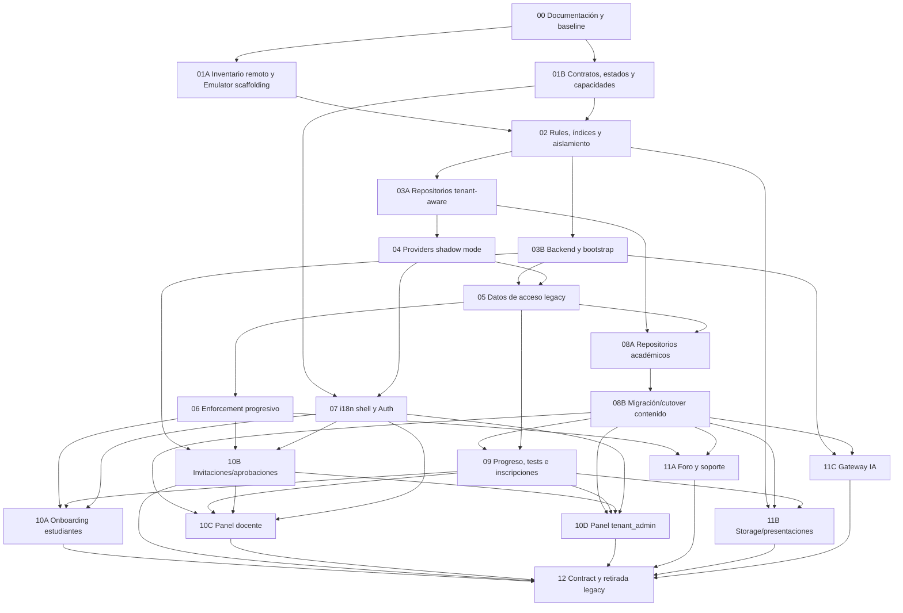
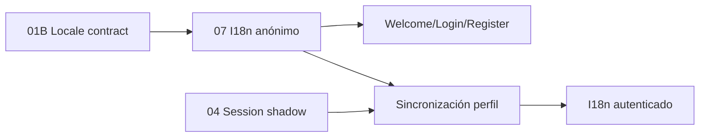
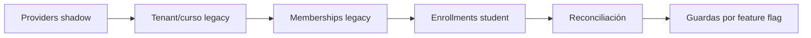
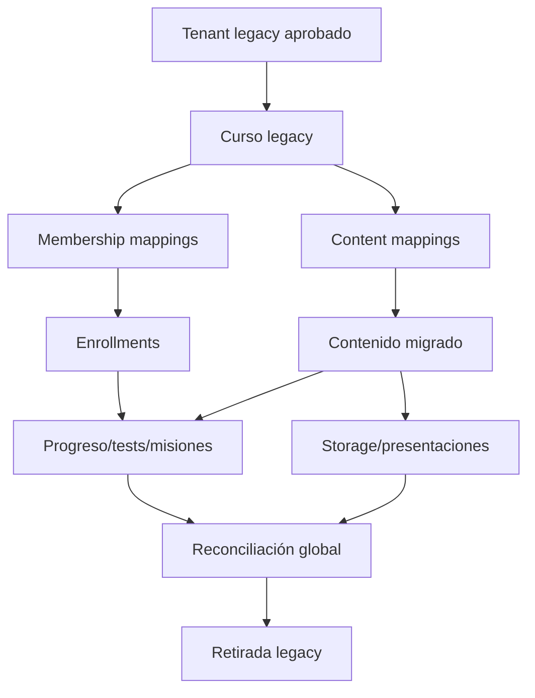
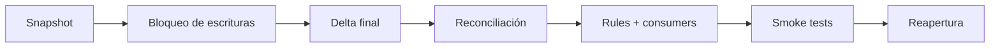

# Mapa de dependencias SaaS multi-tenant

## 1. Camino crítico corregido

No hay ciclo: toda arista avanza desde contratos/baseline hacia expand,
shadow, migración, enforcement y contract.

## 2. i18n y paralelismo inicial

El provider básico no depende de Session. Sólo la sincronización de
`interfaceLocale` autenticado depende de ella.

## 3. Secuencia de shadow mode y enforcement

Ninguna guarda nueva se activa antes de reconciliar memberships e inscripciones.

## 4. Dependencias de migración

Mappings de contenido preceden progreso. Reconciliación precede retirada.

## 5. Cutover por dominio

Dual-read sólo ofrece fallback. No captura escrituras concurrentes. Dual-write
idempotente o CDC son alternativas futuras si no se permite mantenimiento.

## 6. Dependencias fuertes

| Artefacto | Depende de | Bloquea |
|---|---|---|
| rules definitivas | contratos + baseline remoto | repositorios conectados |
| membership repository | schema + rules | Session |
| backend privilegiado | capabilities + rules | invitaciones/bootstrap |
| Session shadow | membership repository | migración acceso |
| enforcement | memberships/enrollments reconciliados | onboarding/paneles |
| course repository | tenant/course contracts | contenido |
| content mappings | repositorios académicos | progreso |
| enrollment | membership + course | progreso student |
| progreso | enrollment + mappings contenido | dashboard/cutover |
| Storage | tenant path + rules + references | retirada blobs |
| gateway IA | backend + course languages | retirada clave cliente |
| contract | todas las reconciliaciones | eliminación legacy |

## 7. Dependencias débiles

- I18n anónimo puede avanzar tras 01B sin Session.
- Branding puede diseñarse con tenant mock antes de persistencia.
- Extracción de textos puede avanzar sin migración de datos.
- UI de selector/estados puede desarrollarse con fixtures antes de enforcement.
- Scripts read-only de inventario pueden avanzar desde 01A.
- Auditoría CSS no bloquea el SaaS.

## 8. Trabajo paralelizable

### Después de 00

- 01A inventario/scaffolding;
- 01B contratos/capacidades.

### Después de 02

- 03A repositorios;
- 03B backend/bootstrap;
- tests de reglas adicionales;
- i18n base después del locale contract.

### Después de 05

- 06 enforcement;
- 08A repositorios académicos;
- integración i18n autenticada.

### Después de 10B/08B

- 10C panel docente;
- 10D panel tenant_admin.

### Después de 08B

- preparación 11A;
- preparación 11B;
- preparación 11C.

## 9. Cambios que jamás deben ejecutarse en paralelo

- activar guardas mientras se migran memberships/enrollments;
- cambiar reglas de un dominio mientras siguen escrituras sin freeze/delta;
- migrar progreso antes de estabilizar mappings de contenido;
- otorgar XP mientras se corta progreso sin idempotency;
- eliminar `DEFAULT_ADMINS` antes de verificar bootstrap y recuperación;
- borrar blobs legacy mientras se verifican referencias;
- retirar rutas legacy durante reconciliación;
- ejecutar dos migradores sobre el mismo documento objetivo sin lock/idempotency.

## 10. Acceso por rol

| Rol | Membership | Enrollment | Curso | Contexto |
|---|---|---|---|---|
| student | approved | activo requerido | activo requerido | tenant/course |
| teacher | approved | no requerido | seleccionado por operación | tenant |
| tenant_admin | approved | no requerido | opcional | tenant |
| platform_admin | no concede tenant | no requerido | no | plataforma |

`approved_without_enrollment` es un estado principalmente de student.
`tenant_selection_required` precede a evaluar un tenant concreto cuando hay
varias memberships aprobadas y ninguna selección válida.

## 11. Estado tenant por sesión

- `activeTenantId`: pestaña/sesión (`sessionStorage`);
- `lastActiveTenantId`: preferencia opcional;
- membership: autoridad revalidada;
- logout: limpia contexto;
- cambio tenant: limpia caches, curso, enrollment y capacidades;
- suspensión: invalida acceso aunque exista preferencia.

## 12. Datos tenant y datos globales

### Privados del tenant

- memberships;
- cursos, niveles internos, módulos y lecciones;
- tests y progreso;
- temas, misiones e intentos;
- foro institucional;
- archivos académicos;
- soporte académico contextual;
- auditoría tenant.

### Potencialmente globales de plataforma

- mensajes públicos pre-registro;
- contacto comercial;
- soporte general MiPyMeTIC;
- configuración técnica;
- auditoría de plataforma;
- identidad global.

Global no equivale a público. Rules/backend siguen limitando PII y operaciones.

## 13. Archivos y componentes por fase

### 01B/02 — Contratos y seguridad

- nuevos `src/domain/*`, `src/config/*`;
- `firestore.rules`, `storage.rules`, índices y tests.

### 03A/03B — Persistencia y backend

- extracción de `src/services/auth/firestoreService.js`;
- nuevos repositorios tenant/membership/course/enrollment/audit;
- backend privilegiado.

### 04/06 — Sesión y rutas

- `src/main.jsx`;
- `src/App.jsx`;
- `PrivateRoute.jsx`;
- `AdminRoute.jsx`;
- `RootRedirect.jsx`;
- Header/Login/Logout;
- providers, hooks y páginas de estado.

### 07 — i18n

- Welcome/Auth/Header/Footer;
- `index.html` y errores globales;
- perfiles y catálogos.

### 08A/08B — Académico

- `services/courses/*`;
- `services/test/*`;
- `services/missions/*`;
- Lessons, Curso, Nivel, Temas, TemaDetalle;
- componentes/admin académicos;
- MissionChat consumers de contenido.

### 09 — Estado académico

- `progressService.js`;
- `topicProgressService.js`;
- `topicMissionAttemptService.js`;
- Test, Home, Profile, MissionChatPage.

### 10A–10D — Flujos y paneles

- Welcome/Register/Login;
- administración membership;
- paneles teacher/tenant_admin;
- navegación por capacidades.

### 11A–11C — Superficies laterales

- Foro/support;
- Storage/presentations;
- `services/ai/*` y backend IA.

## 14. Refactorización obligatoria

- separar `firestoreService.js` por dominio durante 03A/08A/09/11B;
- retirar consultas globales desde Admin;
- separar persistencia/orquestación de Home, Test y MissionChat durante su
  migración;
- centralizar state machine/capabilities;
- centralizar idiomas del curso.

## 15. Refactorización opcional

- dividir normalizadores cohesivos sólo por tamaño;
- eliminar CSS legacy;
- reorganizar Footer/Header más allá de necesidades de i18n/tenant;
- cambios visuales no necesarios para seguridad.

## 16. Gates globales

1. Contratos antes de rules definitivas.
2. Rules antes de conectar repositorios.
3. Shadow antes de migrar acceso.
4. Migración de acceso antes de enforcement.
5. Mappings/contenido antes de progreso.
6. Reconciliación antes de reapertura/cutover definitivo.
7. Bootstrap verificado antes de retirar `DEFAULT_ADMINS`.
8. Blobs/referencias verificados antes de eliminar Storage legacy.
9. Todas las métricas legacy a cero antes de contract.

## 17. Bloqueantes

- rules remotas todavía no capturadas;
- tenant receptor legacy pendiente de decisión operativa;
- schema/capabilities pendiente de implementación;
- backend confiable inexistente;
- mappings de contenido no creados;
- datos de acceso legacy sin membership/enrollment;
- estrategia de mantenimiento pendiente de calendario por dominio.
