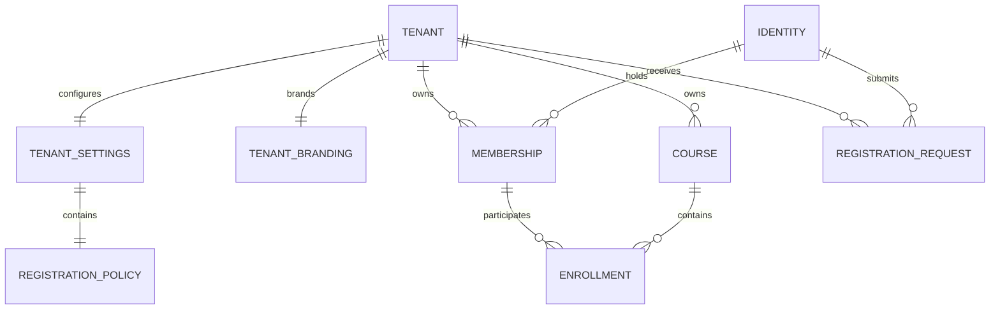
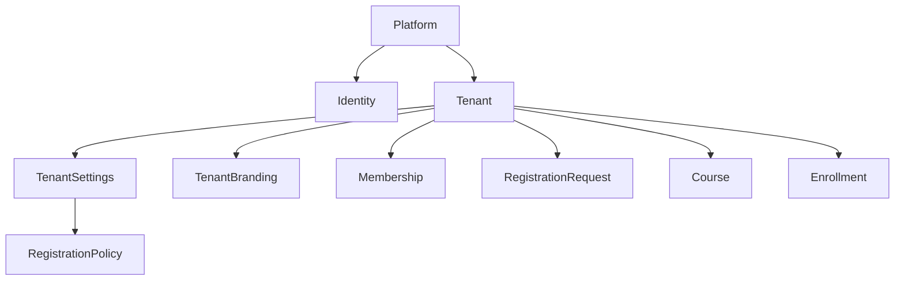
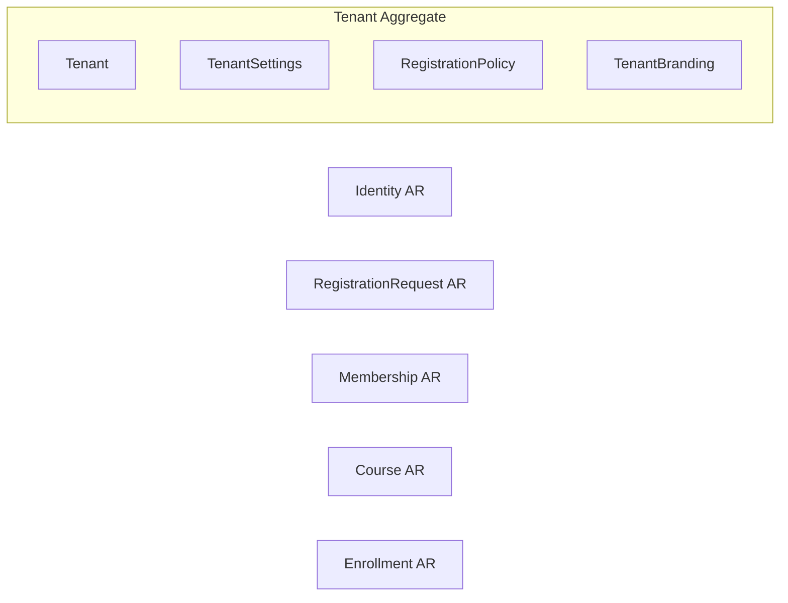
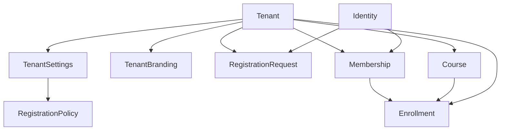

# Modelo relacional y estructural del dominio

## 1. Objetivo

Este documento define las relaciones lógicas entre las entidades aprobadas,
sin asumir Firestore, SQL, MongoDB ni otra tecnología. No define documentos,
colecciones, índices, consultas, reglas o borrados en cascada.

## 2. Entidades incluidas

- Tenant
- TenantSettings
- TenantBranding
- Identity
- RegistrationRequest
- Membership
- Course
- Enrollment

No se modelan todavía contenido pedagógico, progreso, certificados, media,
billing o notificaciones.

## 3. Relaciones canónicas

| Origen | Destino | Cardinalidad | Ownership | Dependencia | Tipo |
|---|---|---:|---|---|---|
| Tenant | TenantSettings | 1:1 | Tenant | Settings no existe sin Tenant | Composición |
| TenantSettings | RegistrationPolicy | 1:1 | Tenant mediante TenantSettings | Policy no existe sin TenantSettings | Composición |
| Tenant | TenantBranding | 1:1 | Tenant | Branding no existe sin Tenant | Composición |
| Tenant | Membership | 1:N | Tenant | Membership depende de Tenant e Identity | Agregación |
| Tenant | Course | 1:N | Tenant | Course no existe sin Tenant | Agregación |
| Tenant | RegistrationRequest | 1:N | Tenant | Request depende de Tenant e Identity | Agregación |
| Identity | Membership | 1:N | Tenant, no Identity | Membership referencia Identity global | Agregación |
| Identity | RegistrationRequest | 1:N | Tenant | Request referencia Identity solicitante | Agregación |
| Course | Enrollment | 1:N | Tenant | Enrollment depende de Course y Membership | Agregación |
| Membership | Enrollment | 1:N | Tenant | Enrollment depende de Membership y Course | Agregación |

### Relaciones N:M derivadas

- Tenant N:M Identity está representada por Membership.
- Membership N:M Course está representada por Enrollment.
- Identity N:M Course se deriva de una Membership tenant-scoped y Enrollment.

No se crean entidades intermedias adicionales.

## 4. Ownership

Tenant es propietario lógico de su configuración, branding, Memberships,
RegistrationRequests, Courses y Enrollments institucionales. Esta propiedad no
implica un único aggregate ni borrado físico en cascada.

RegistrationPolicy es un Value Object compuesto de TenantSettings. No es
Aggregate Root, no tiene identidad o lifecycle independiente y su ubicación en
el dominio de identidad no altera el ownership del Tenant.

Identity pertenece a la plataforma. No es propietaria de Tenant ni del
contenido institucional. Su relación con Tenant existe a través de
RegistrationRequest y Membership.

Membership depende simultáneamente de Tenant e Identity. Enrollment depende
simultáneamente de Membership y Course; ninguno es sustituible por Enrollment.
Membership se identifica canónicamente mediante `membershipId`; Enrollment
referencia ese mismo valor y comparte su `tenantId`.

La combinación `tenantId + uid` conserva una restricción lógica futura de
unicidad para Membership, pero no sustituye `membershipId`.

## 5. Dependencia y existencia

| Entidad | ¿Puede existir sola? | Dependencias obligatorias | Control conceptual del ciclo de vida |
|---|---|---|---|
| Tenant | Sí | Ninguna entidad de este modelo | PlatformRole autorizado |
| TenantSettings | No | Tenant | Tenant |
| TenantBranding | No | Tenant | Tenant |
| Identity | Sí | Ninguna entidad tenant | Plataforma/propia Identity según operación |
| RegistrationRequest | No | Tenant e Identity | Identity crea/cancela; Tenant revisa |
| Membership | No | Tenant, Identity y aprobación previa | Tenant; salida voluntaria según workflow |
| Course | No | Tenant | Tenant |
| Enrollment | No | Tenant, Membership y Course | Tenant; cancelación propia según workflow |

La dependencia expresa integridad lógica, no orden de escrituras ni mecanismo
de almacenamiento.

## 6. Aggregate Roots

### Tenant

Aggregate Root de identidad organizacional. Contiene por composición
TenantSettings y TenantBranding, que no tienen ciclo de vida independiente.
RegistrationPolicy está anidada por composición dentro de TenantSettings.
Membership, Course y RegistrationRequest pertenecen al tenant, pero permanecen
fuera de este aggregate para evitar una frontera transaccional ilimitada.

### Identity

Aggregate Root global. Su ciclo de vida no depende de un Tenant. Memberships y
RegistrationRequests la referencian, pero no forman parte de su aggregate.

### RegistrationRequest

Aggregate Root de la solicitud institucional porque posee ciclo de vida y
estados terminales propios, y debe conservarse independientemente de la
Membership que eventualmente origine.

### Membership

Aggregate Root de pertenencia institucional. Su suspensión o retirada no debe
reescribir Identity ni las Memberships de otros tenants.
`membershipId` es estable, inmutable y no reutilizable durante todo su ciclo de
vida.

### Course

Aggregate Root académico. Archivar Course no elimina Tenant ni reescribe
Enrollment automáticamente.

### Enrollment

Aggregate Root de la relación académica Membership-Course. Su ciclo de vida
propio evita acoplar transiciones de Course y Membership en un único aggregate.

## 7. Composición y agregación

### Composición

- Tenant → TenantSettings.
- TenantSettings → RegistrationPolicy.
- Tenant → TenantBranding.

Ambas entidades pierden sentido sin Tenant y comparten su identidad
organizacional. Una eliminación lógica conserva snapshots históricos si la
política futura lo exige; composición no significa borrado físico inmediato.

### Agregación

- Tenant → Membership.
- Tenant → Course.
- Tenant → RegistrationRequest.
- Identity → Membership.
- Identity → RegistrationRequest.
- Course → Enrollment.
- Membership → Enrollment.

Son relaciones entre aggregates con ciclos de vida separados. Los estados se
coordinan conceptualmente, no se propagan automáticamente.

## 8. Ciclo de vida relacional

### Tenant eliminado lógicamente

El estado conceptual corresponde a `archived`. Settings y Branding permanecen
asociados; Memberships, Courses, RegistrationRequests y Enrollments se
conservan para historial. No se ejecuta cascade ni cambio masivo de estados.

### Tenant suspendido

Se suprime el acceso efectivo a sus recursos. Los estados internos de
Membership, Course y Enrollment permanecen intactos. Una reactivación vuelve a
evaluar cada entidad según su propio estado.

### Membership eliminada

`removed` termina la pertenencia y deja de conceder acceso. Sus Enrollments se
conservan como historia y no se reasignan a otra Identity o Membership.

### Course archivado

El Course deja de estar disponible para operación ordinaria. Sus Enrollments
se conservan; la política sobre Enrollments todavía activos queda aplazada y
no provoca transición automática.

## 9. Diagramas Mermaid

### 9.1 Dominio general



### 9.2 Ownership



### 9.3 Aggregate Roots



### 9.4 Dependencias



## 10. Decisiones tomadas

- Tenant es propietario lógico, pero no un aggregate gigante.
- Settings y Branding usan composición.
- Las relaciones cross-aggregate usan agregación.
- Enrollment representa Membership N:M Course.
- Membership representa Tenant N:M Identity.
- No existen propagaciones automáticas ni cascadas técnicas.
- Archivado y suspensión preservan historia.
- `membershipId` es la referencia canónica desde Enrollment.
- Aprobar RegistrationRequest y crear Membership constituye una frontera de
  consistencia cross-aggregate identificada idempotentemente por `requestId`.

## 11. Decisiones pendientes

- formato físico y generación de identificadores;
- política de integridad cuando una referencia no esté disponible;
- tratamiento de Enrollments activos al archivar Course;
- retención tras archivar Tenant;
- eliminación/anonimización de Identity;
- fronteras transaccionales e idempotencia;
- consistencia eventual entre aggregates.

## 12. Architecture Review Backlog

| ID | Archivo afectado | Descripción | Impacto | Fase sugerida |
|---|---|---|---|---|
| ARB-REL-001 | `organization/membership.js`, `academic/enrollment.js` | Membership y Enrollment comparten `membershipId`; `tenantId + uid` queda como unicidad lógica | Resuelto contractualmente, pendiente de reauditoría | SaaS-01B.7B |
| ARB-REL-002 | `identity/registrationPolicy.js`, `organization/tenantSettings.js` | RegistrationPolicy es un único Value Object compuesto en TenantSettings | Resuelto declarativamente, pendiente de reauditoría final | SaaS-01B.7D |
| ARB-REL-003 | `workflow/courseWorkflow.js` | Política de Enrollment activo cuando Course se archiva | Medio: experiencia y acceso académico | Modelo de progreso/inscripción |

## 13. Contradicciones observadas

Las ambigüedades de `membershipId` y RegistrationPolicy fueron reconciliadas.
Permanece abierta la elección tecnológica de atomicidad para
`ApproveRegistrationRequest`.

## 14. Frontera cross-aggregate de aprobación

`ApproveRegistrationRequest` afecta RegistrationRequest y Membership, valida
Identity y Tenant, y usa `requestId` como clave conceptual de idempotencia.

Una aprobación válida produce conjuntamente:

```text
RegistrationRequest.status = approved
exactamente una Membership.status = approved
```

No se define todavía transaction, batch, backend, repositorio o ruta física.
