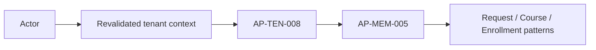
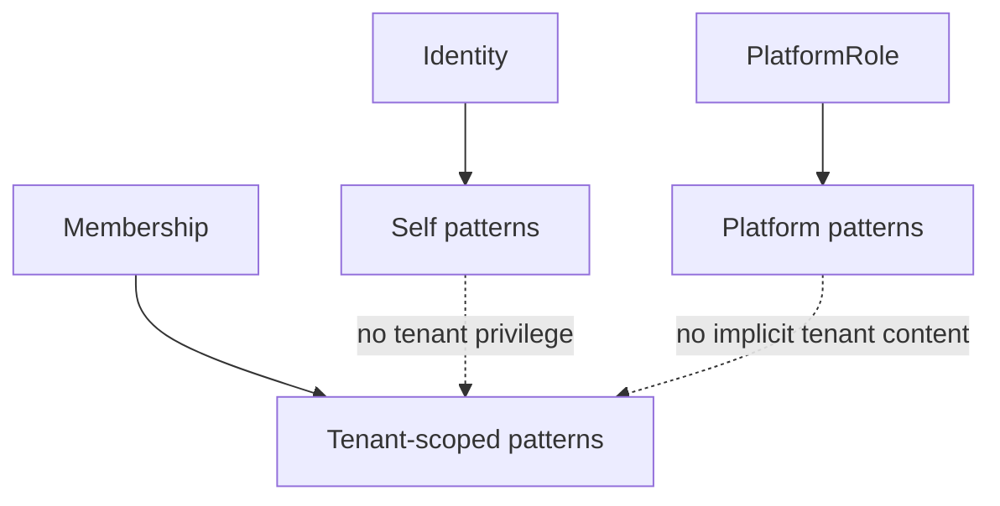
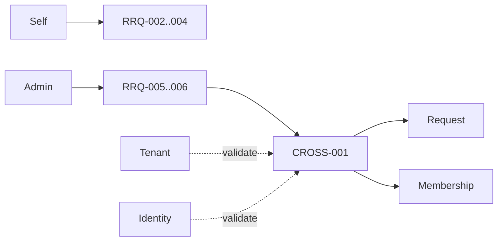
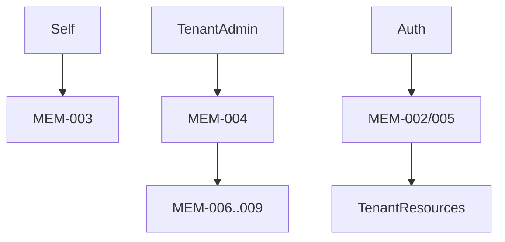
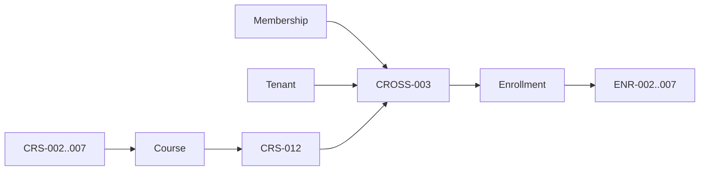
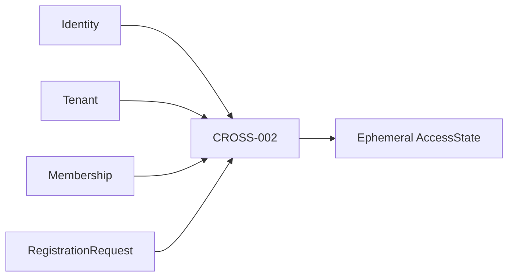
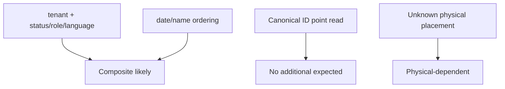
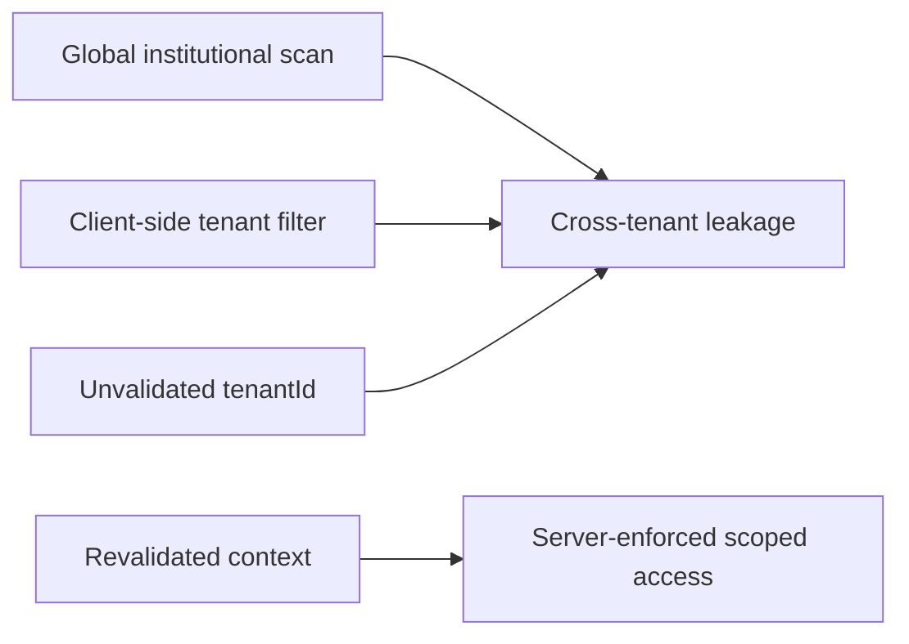

# Catálogo de patrones de acceso para Firestore

## 1. Alcance y principios

SaaS-02B.1 identifica los accesos que el modelo físico de Firestore deberá
soportar para Domain 1.0.0 y el modelo lógico de SaaS-02A. No define colecciones,
documentos, paths, IDs físicos, índices, reglas, queries ejecutables ni
desnormalizaciones definitivas.

Principios:

- el diseño físico se derivará de patrones, no de `Entidad → colección`;
- todo acceso institucional recibe un `tenantId` confiable y valida pertenencia;
- los listados son acotados por scope antes de paginar, nunca filtrados en cliente;
- Identity es global, pero una referencia a Identity no concede acceso global;
- los Value Objects se leen y escriben con su Persistence Root propietario;
- AccessState se deriva y nunca se persiste como autoridad;
- toda necesidad de índice o proyección indicada aquí es potencial hasta 02B.2.

## 2. Fuentes normativas

Se contrastaron `DOMAIN_VERSION.md`, `PERSISTENCE_MODEL.md`,
`PERSISTENCE_INVARIANTS_AND_OPERATIONS.md`, los modelos Organization, Academic,
Identity y Authorization, `DOMAIN_WORKFLOW.md`, `DOMAIN_RELATIONSHIP_MODEL.md`,
`ARCHITECTURE_FREEZE_REVIEW.md`, `SAAS_01A_FIREBASE_BASELINE.md`, el orden de
implementación y todos los contratos bajo `src/domain/`.

## 3. Actores, contextos y scopes

| Actor | Contexto | Scope permitido en este catálogo |
|---|---|---|
| anonymous | Público/pre-membership | Sólo Tenant/branding/oferta que una política futura declare públicos |
| identity_self | Global Identity o self dentro de Tenant | Perfil propio, Requests propias, Memberships propias y Enrollments propios |
| tenant_member | Tenant activo | Lecturas académicas accesibles y datos propios |
| tenant_admin | Administración del Tenant activo | Roots tenant-scoped según capacidades |
| platform_admin | Plataforma global | Administración de Tenants e Identity; sin bypass automático a contenido tenant |
| platform_system | Sistema | Expiración y tareas técnicas futuras explícitas |

`tenantId` procede del contexto activo revalidado o del target público explícito;
nunca de un filtro cliente aceptado sin validación. Platform context no equivale
a tenant context.

## 4. Convenciones del catálogo

Las tablas de los apartados 5–11, junto con las matrices del apartado 13,
constituyen el registro completo de cada patrón. Abreviaturas:

- Cardinalidad: `One`, `Few`, `Many`, `Unbounded`.
- Frecuencia: `VH`, `H`, `M`, `L`, `E` (Very high a Exceptional).
- Consistencia: `strong`, `cross-root atomic`, `eventual projection`, `derived`.
- Índice: `none`, `single`, `composite`, `physical-dependent`.
- Paginación `required` para todo listado Many/Unbounded.
- Freshness es `current` para autorización/workflow y `bounded` para histórico.
- Historial `yes` significa que estados terminales forman parte del resultado.

## 5. Patrones Tenant

| ID | Nombre / actor / scope | Propósito, inputs y resultado | Filtros / orden / página | Card./freq./consistencia | Índice / seguridad / fallo / fuente |
|---|---|---|---|---|---|
| AP-TEN-001 | Tenant por ID; member/admin/platform; tenant | Obtener Tenant exacto; tenantId → Tenant | ID; n/a; no | One/H/strong | none; validar scope; not-found/forbidden; tenant.read |
| AP-TEN-002 | Tenant activo; tenant_member; tenant | Shell institucional mínima: nombre, status, locale/timezone | tenantId activo; n/a; no | One/VH/current | none; auth-critical; contexto inválido; session model |
| AP-TEN-003 | Bundle institucional; member/admin/public condicionado | Tenant + Settings + Branding + Policy sin decidir materialización | tenantId; n/a; no | One/H/strong | physical-dependent; no exponer settings privados; tenant.read |
| AP-TEN-004 | Listado platform; platform_admin; platform | Administrar Tenants | status/type y rango createdAt; createdAt o displayName; sí | Unbounded/L/bounded | composite likely; platform-only; capability platform.tenant_list |
| AP-TEN-005 | Update Settings; tenant_admin; tenant | tenantId + VO → Tenant actualizado | n/a | One/L/strong | none/physical-dependent; tenant.manage_settings; conflict/invalid |
| AP-TEN-006 | Update Branding; tenant_admin; tenant | tenantId + VO → Tenant actualizado | n/a | One/L/strong | none/physical-dependent; tenant.manage_branding; conflict/invalid |
| AP-TEN-007 | Suspend/restore/archive; platform_admin; platform | Cambiar TenantStatus mediante operaciones dedicadas e idempotentes | tenantId + target status | One/E/strong | none; platform capability específica; invalid transition/conflict |
| AP-TEN-008 | Validar Tenant operativo; system/tenant actor; tenant | Precondición de toda operación tenant-scoped | tenantId + expected status | One/VH/current | none; auth-critical; missing/suspended/archived |
| AP-TEN-009 | Update Tenant profile; tenant_admin; tenant | tenantId + patch permitido → Tenant actualizado | n/a | One/L/strong | none; `tenant.update`; same-tenant/field ownership/conflict |
| AP-TEN-010 | Platform update Tenant metadata; platform_admin; platform | tenantId + tenantType → Tenant actualizado | n/a | One/E/strong | none; `platform.tenant_update`; platform-only/field ownership/conflict |

No existe `slug` en Domain 1.0.0; AP-TEN-004 no lo usa. Búsqueda textual por
nombre queda dependiente de capacidades reales de 02B.2, sin inventar campos.

## 6. Patrones Identity

| ID | Nombre / actor / scope | Propósito, inputs y resultado | Filtros / orden / página | Card./freq./consistencia | Índice / seguridad / fallo / fuente |
|---|---|---|---|---|---|
| AP-IDN-001 | Self por uid; identity_self; self | Cargar perfil canónico | uid; n/a; no | One/VH/strong | none; ownership; identity.read_self |
| AP-IDN-002 | Update profile; identity_self; self | Actualizar campos permitidos, conservar uid | uid + patch | One/M/strong | none; ownership/validation; identity.update_self |
| AP-IDN-003 | Update locale; identity_self; self | Persistir interfaceLocale BCP 47 | uid + locale | One/M/strong | none; ownership; invalid locale |
| AP-IDN-004 | Resolve Identity admin; platform_admin; platform | Lectura administrativa exacta | uid; n/a; no | One/L/current | none; platform.identity_read; forbidden/not-found |
| AP-IDN-005 | Identity existence; system/admin; contextual | Validar uid para Request/Membership/auditor | uid | One/H/current | none; no revelar perfil; missing ref |
| AP-IDN-006 | Identity global directa; identity_self/system; global | Resolver una identidad sin recorrer tenants | uid | One/VH/strong | none; evita fan-out; wrong authority |
| AP-IDN-007 | Actor histórico; authorized auditor; tenant/platform | Resolver approvedBy/reviewedBy conservando minimización | uid | One/L/bounded historical | none/projection candidate; privacy; unavailable/anonymized |

## 7. Patrones RegistrationRequest

| ID | Nombre / actor / scope | Propósito, inputs y resultado | Filtros / orden / página | Card./freq./consistencia | Índice / seguridad / fallo / fuente |
|---|---|---|---|---|---|
| AP-RRQ-001 | Crear Request; identity_self; self+target tenant | Crear pending | requestId, tenantId, uid, role | One/L/strong | uniqueness physical-dependent; ownership/Tenant check; registration_request.create |
| AP-RRQ-002 | Self por ID; identity_self; self | Leer solicitud propia | requestId + uid ownership | One/M/current+historical | none; no leer terceros; registration_request.read_self |
| AP-RRQ-003 | Listado self; identity_self; self | Historial propio | uid, optional tenantId/status; requestedAt desc; sí | Many/L/bounded | composite likely; ownership; read_self |
| AP-RRQ-004 | Solicitud vigente Tenant+Identity; self/admin/system; tenant | Resolver pending o resolución vigente | tenantId+uid+status relevante; requestedAt desc; limit | Few/H/current | composite likely; tenant match; ambiguous duplicates |
| AP-RRQ-005 | Pendientes de Tenant; tenant_admin; tenant | Bandeja de revisión | tenantId+pending; requestedAt asc; sí | Unbounded/H/current | composite likely; high leakage risk; registration_request.list |
| AP-RRQ-006 | Resueltas de Tenant; tenant_admin; tenant | Auditoría institucional | tenantId+terminal status/date; reviewedAt/requestedAt desc; sí | Unbounded/L/historical | composite likely; tenant-only; list |
| AP-RRQ-007 | Aprobar; tenant_admin; tenant | Ejecutar frontera cross-root idempotente | requestId, tenantId, actor | One/E/cross-root atomic | uniqueness+atomicity dependent; review capability |
| AP-RRQ-008 | Rechazar; tenant_admin; tenant | pending→rejected | requestId, actor | One/E/strong | none; transition/actor; review capability |
| AP-RRQ-009 | Cancelar self; identity_self; self | pending→cancelled | requestId+uid | One/L/strong | none; ownership; invalid state |
| AP-RRQ-010 | Expirar; platform_system; system | pending→expired | requestId | One/L/strong | physical-dependent; authority pending; workflow |
| AP-RRQ-011 | Idempotencia approval; system; tenant | Resolver outcome previo | requestId → request + membershipId correlation | One/E/current | physical-dependent; no duplicate effect; persistence invariant |

## 8. Patrones Membership

| ID | Nombre / actor / scope | Propósito, inputs y resultado | Filtros / orden / página | Card./freq./consistencia | Índice / seguridad / fallo / fuente |
|---|---|---|---|---|---|
| AP-MEM-001 | Por membershipId; self/admin/system; tenant | Lectura exacta | membershipId + tenant context | One/H/current+historical | none; validate tenant; membership.read_self/list |
| AP-MEM-002 | Resolver Tenant+Identity; self/system; tenant | Membership contextual | tenantId+uid, nonterminal/current | One/VH/current | composite/uniqueness dependent; auth-critical |
| AP-MEM-003 | Contextos propios; identity_self; self | Listar Memberships del uid | uid, optional status; tenant/display order future; sí | Many/H/current | index physical-dependent; self only |
| AP-MEM-004 | Miembros de Tenant; tenant_admin; tenant | Administración institucional | tenantId + optional status/role; createdAt desc; sí | Unbounded/M/current+historical | composite likely; high leakage risk; membership.list |
| AP-MEM-005 | Validar approved/role; system; tenant | Autorizar operación tenant | tenantId+uid/membershipId + role/status | One/VH/current | none/composite dependent; auth-critical; stale context |
| AP-MEM-006 | Cambiar role; tenant_admin; tenant | Actualizar rol canónico | membershipId+tenantId+role | One/L/strong | none; concurrent suspension; membership.change_role |
| AP-MEM-007 | Suspend/restore; tenant_admin; tenant | Cambiar approved↔suspended | membershipId+tenantId+target | One/L/strong | none; conflict/idempotency; membership.suspend |
| AP-MEM-008 | Leave self; identity_self; self | approved/suspended→removed | membershipId+uid+tenantId | One/L/strong | none; ownership; membership.leave_self |
| AP-MEM-009 | Remove admin; tenant_admin; tenant | Terminación institucional | membershipId+tenantId | One/L/strong | none; actor/transition; membership.remove |
| AP-MEM-010 | Histórico; tenant_admin/self; scoped | Consultar suspended/removed | tenantId or uid + status; updatedAt desc; sí | Unbounded/L/historical | composite likely; minimize; list/read_self |
| AP-MEM-011 | Unicidad lógica; approval system; tenant | Impedir dos no terminales | tenantId+uid+status nonterminal | Few/E/current | physical-dependent; race critical; PM-003/005 |

## 9. Patrones Course

| ID | Nombre / actor / scope | Propósito, inputs y resultado | Filtros / orden / página | Card./freq./consistencia | Índice / seguridad / fallo / fuente |
|---|---|---|---|---|---|
| AP-CRS-001 | Course por ID; member/admin; tenant | Lectura exacta con VOs lingüísticos | courseId+tenantId | One/H/current+historical | none; tenant match; course.read |
| AP-CRS-002 | Courses del Tenant; member/admin; tenant | Catálogo tenant | tenantId; displayName/createdAt; sí | Unbounded/H/bounded | index likely; no global scan; course.list |
| AP-CRS-003 | Activos del Tenant; member; tenant | Oferta disponible | tenantId+active; displayName; sí | Many/VH/current | composite likely; UX-critical |
| AP-CRS-004 | Admin por status; tenant_admin; tenant | Gestionar draft/active/archived | tenantId+status; updatedAt desc; sí | Many/M/current+historical | composite likely; tenant-only |
| AP-CRS-005 | Por learning language; member; tenant | Filtrar oferta | tenantId+learningLanguage.languageCode(+active); displayName; sí | Many/H/bounded | composite likely |
| AP-CRS-006 | Por support language; member; tenant | Filtrar soporte pedagógico | tenantId+supportLanguageCode(+active); displayName; sí | Many/M/bounded | composite likely |
| AP-CRS-007 | Filtro lingüístico combinado; member/admin; tenant | Coincidencia learning+support+status | tenantId+2 idiomas+status; displayName; sí | Many/M/bounded | composite likely; model-sensitive |
| AP-CRS-008 | Crear; teacher/tenant_admin; tenant | Crear draft con VOs | courseId+tenantId+contract | One/L/strong | none; Tenant active/capability |
| AP-CRS-009 | Actualizar; teacher/admin; tenant | Editar root/VOs sin mover tenant | courseId+tenantId+patch | One/L/strong | none; conflict; course.update |
| AP-CRS-010 | Activar; tenant_admin; tenant | draft→active | courseId+tenantId | One/L/strong | none; course.activate |
| AP-CRS-011 | Archivar; tenant_admin; tenant | draft/active→archived | courseId+tenantId | One/L/strong | none; concurrent enrollment; course.archive |
| AP-CRS-012 | Validar active; enrollment system; tenant | Precondición de inscripción | courseId+tenantId+active | One/H/current | none; workflow-critical |
| AP-CRS-013 | Histórico archived; tenant_admin; tenant | Auditoría/catálogo histórico | tenantId+archived; updatedAt desc; sí | Many/L/historical | composite likely; no cascade |

## 10. Patrones Enrollment

| ID | Nombre / actor / scope | Propósito, inputs y resultado | Filtros / orden / página | Card./freq./consistencia | Índice / seguridad / fallo / fuente |
|---|---|---|---|---|---|
| AP-ENR-001 | Por enrollmentId; self/admin; tenant | Lectura exacta | enrollmentId+tenantId | One/H/current+historical | none; membership ownership/tenant; read_self/list |
| AP-ENR-002 | Por Membership; self/admin; self/tenant | Inscripciones de Membership | tenantId+membershipId; enrolledAt desc; sí | Many/H/current+historical | composite likely; ownership |
| AP-ENR-003 | Por Course; teacher/admin; tenant | Participantes del Course | tenantId+courseId; enrolledAt desc; sí | Unbounded/H/current | composite likely; tenant/course check |
| AP-ENR-004 | Del Tenant; tenant_admin; tenant | Administración global del Tenant | tenantId + optional status; updatedAt desc; sí | Unbounded/M/current+historical | composite likely; high leakage risk |
| AP-ENR-005 | Self multi-membership; identity_self; self | Inscripciones propias por contextos autorizados | memberships propias + tenantId por consulta | Many/H/current | physical-dependent/fan-out risk; nunca scan global |
| AP-ENR-006 | Por status; admin/self scoped | Filtrar lifecycle | tenantId+membership/course optional+status; updatedAt desc; sí | Many/M/current | composite likely |
| AP-ENR-007 | Course+status; teacher/admin; tenant | Cohorte operativa | tenantId+courseId+status; enrolledAt desc; sí | Unbounded/H/current | composite likely |
| AP-ENR-008 | Crear; tenant_admin/system futuro; tenant | Crear pending validando 3 roots | IDs + tenantId | One/L/cross-root validation + single write | physical-dependent; race/PIO-001; enrollment.create |
| AP-ENR-009 | Activar; tenant_admin; tenant | pending→active | enrollmentId+tenantId | One/L/strong | none; refs/status; update_status |
| AP-ENR-010 | Completar; tenant_admin; tenant | active→completed | enrollmentId+tenantId | One/L/strong | none; transition conflict |
| AP-ENR-011 | Cancelar; self/admin; self/tenant | pending/active→cancelled | enrollmentId+tenantId+ownership | One/L/strong | none; cancel_self/update_status |
| AP-ENR-012 | Histórico; self/admin; scoped | completed/cancelled | tenantId + owner/course + terminal status; updatedAt desc; sí | Unbounded/L/historical | composite likely |
| AP-ENR-013 | Inscripción equivalente; system; tenant | Detectar membershipId+courseId existentes | tenantId+membershipId+courseId | Few/L/current+historical | composite/physical-dependent; policy unresolved PIO-001 |

## 11. Patrones cross-root

| ID | Nombre / actor / scope | Lecturas y escrituras | Consistencia / riesgo / fuente |
|---|---|---|---|
| AP-CROSS-001 | ApproveRegistrationRequest; tenant_admin; tenant | Read Request, Tenant, Identity, Membership uniqueness; write Request+Membership | Cross-root atomic, requestId idempotent; highest workflow risk |
| AP-CROSS-002 | DeriveAccessState; identity/system; tenant | Read Identity, Tenant, applicable Membership/Request; no write | Read-only derivation; current freshness; never persist result |
| AP-CROSS-003 | CreateEnrollment validation; admin/system; tenant | Read Tenant, Membership, Course; write Enrollment | Consistent validation snapshot required; archive/suspend races |
| AP-CROSS-004 | Tenant suspension projection; tenant actors | Read Tenant status before tenant-scoped roots | Eventual UI projection but authorization check current; no cascades |
| AP-CROSS-005 | Course archival impact; member/admin | Read archived Course while preserving historical Enrollments | Physical handling deferred; ARB-REL-003/PM-009 |

**Total: 70 patrones canónicos** (10 Tenant, 7 Identity, 11 Request, 11
Membership, 13 Course, 13 Enrollment y 5 cross-root).

### 11.1 Frecuencia y criticidad

| Clasificación | Patrones principales |
|---|---|
| Authorization-critical | TEN-008, MEM-002/005, CROSS-002/004 |
| Workflow-critical | RRQ-004/007–011, MEM-006–009/011, CRS-010–012, ENR-008–011/013, CROSS-001/003/005 |
| User-experience-critical | TEN-002/003, IDN-001/003, MEM-003, CRS-001–003/005–007, ENR-001/002/005/006 |
| Administrative | TEN-004–007, IDN-004/005, RRQ-005/006/008, MEM-004/010, CRS-004/008/009/013, ENR-003/004/007 |
| Historical | IDN-007, RRQ-003/006, MEM-010, CRS-013, ENR-012 |
| Background | RRQ-010 y proyecciones futuras no autoritativas |

Los patrones Very high son TEN-002/008, IDN-001/006, MEM-002/005 y CRS-003.
Los listados marcados Unbounded son siempre paginados. Si un patrón no aparece
en la matriz de desnormalización, no tiene candidato justificado en esta fase.

## 12. Inventario del código actual

La búsqueda incluyó imports/uso de `getDoc`, `getDocs`, `doc`, `collection`,
`query`, `where`, `orderBy`, `limit`, `startAfter`, `onSnapshot`, `setDoc`,
`addDoc`, `updateDoc`, `deleteDoc`, `writeBatch`, `runTransaction` y
`collectionGroup`.

### 12.1 Hallazgos

- Relevantes como necesidad: perfil propio por uid, actualización de perfil,
  lectura puntual, listados ordenados/paginables, checks de existencia,
  transacciones idempotentes de progreso y administración de contenido.
- Legacy: `levels/modules/lessons`, `temas/missions`, progreso, tests,
  presentaciones, foro, soporte y contacto. Son dominios previos o aún no
  congelados; no determinan la topología SaaS actual.
- Incompatibles si se reutilizan literalmente: listados globales de `users`,
  `userTests`, reportes/foros y contenido sin tenant; perfil `users` que mezcla
  identidad, nivel, rol y progreso; filtros tenant realizados después de una
  lectura global; borrados físicos directos de datos históricos.
- No se halló uso de `startAfter`, `onSnapshot` ni `collectionGroup` en accesos
  funcionales inspeccionados. La paginación actual es insuficiente para SaaS.

## 13. Matrices obligatorias

### 13.1 Matriz maestra de patrones

| Pattern IDs | Actor | Scope | Primary Root | Operation | Filters / ordering | Cardinality | Frequency | Consistency | Potential Index |
|---|---|---|---|---|---|---|---|---|---|
| TEN-001–003,008 | member/admin/system | tenant | Tenant | reads/validation | tenantId | One | VH–H | current | none/physical-dependent |
| TEN-004 | platform_admin | platform | Tenant | paginated list | status/type/date; date/name | Unbounded | L | bounded | composite likely |
| TEN-005–007,009–010 | admin/platform | tenant/platform | Tenant | writes | ID/status/allowed fields | One | L–E | strong | none |
| IDN-001–007 | self/platform/auditor | self/platform | Identity | point/write/history | uid | One | VH–L | strong/bounded | none |
| RRQ-001–011 | self/admin/system | self/tenant | Request | create/read/list/review | tenantId/uid/status/date | One–Unbounded | H–E | strong/cross-root | composite/physical-dependent |
| MEM-001–011 | self/admin/system | self/tenant | Membership | read/list/write/check | tenantId/uid/role/status | One–Unbounded | VH–L | current/strong | composite/physical-dependent |
| CRS-001–013 | member/teacher/admin | tenant | Course | read/list/write/check | tenant/status/languages | One–Unbounded | VH–L | current/strong | composite likely |
| ENR-001–013 | self/teacher/admin | self/tenant | Enrollment | read/list/write/check | tenant/member/course/status | One–Unbounded | H–L | current/strong | composite/physical-dependent |
| CROSS-001–005 | admin/system/member | tenant | Multiple | atomic/derived/validation | canonical IDs/status | Few | H–E | atomic/derived/eventual | physical-dependent |

### 13.2 Matriz de lecturas

| Pattern IDs | Point/List | Required Inputs | Returned Data | Pagination | Freshness | Historical |
|---|---|---|---|---|---|---|
| TEN-001–003,008; IDN-001,004–007 | Point/bundle | canonical ID + scope | root/VO or minimal validation | No | Current | Actor refs may be historical |
| TEN-004 | List | platform filters | Tenant summaries | Required | Bounded | Yes |
| RRQ-002–006,011 | Point/list/check | requestId or tenantId/uid/status | Requests/outcome | Lists required | Current for workflow | Yes |
| MEM-001–005,010–011 | Point/list/check | tenantId + membershipId/uid | Memberships | Lists required | Current for auth | Yes |
| CRS-001–007,012–013 | Point/list/check | tenantId + ID/status/languages | Courses+VOs | Lists required | Current for eligibility | Yes |
| ENR-001–007,012–013 | Point/list/check | tenantId + owner/course/status | Enrollments | Lists required | Current for workflow | Yes |
| CROSS-002,004–005 | Derived/coordinated | tenantId + canonical refs | derived access/visibility | No | Current for auth | Course/Enrollment yes |

### 13.3 Matriz de escrituras

| Pattern IDs | Primary Root | Related Roots | Preconditions | Consistency | Idempotency | Concurrency Risk |
|---|---|---|---|---|---|---|
| TEN-005–007,009–010 | Tenant | VOs/dependent projections | Exists, actor, transition/field ownership | Single-root | state targets/command replay | concurrent writes/archive |
| IDN-002–003 | Identity | None | self ownership, valid data | Single-root | command key future | lost update |
| RRQ-001,008–010 | Request | Tenant/Identity/reviewer | refs, ownership, pending | Single-root | terminal replay | concurrent resolution |
| RRQ-007/CROSS-001 | Request | Membership; validates Tenant/Identity | all approval invariants | Cross-root atomic | requestId | duplicate/partial approval |
| MEM-006–009 | Membership | Tenant/Identity | current state, actor | Single-root | target-state replay | role vs suspension |
| CRS-008–011 | Course | Tenant + VOs | Tenant active, state, actor | Single-root | transitions yes | archive vs enrollment |
| ENR-008–011/CROSS-003 | Enrollment | Tenant/Membership/Course | same tenant, operative refs | Validated single-root write | transitions yes; create pending | duplicate/archive races |

### 13.4 Matriz de aislamiento Tenant

| Pattern IDs | Tenant Context Required | Tenant Source | Cross-tenant Risk | Authorization Scope | Required Validation |
|---|---|---|---|---|---|
| TEN-001–003,005–006,008–009 | Sí | active context/explicit public target | High | tenant/public | target equals authorized tenant; field visibility |
| TEN-004,007,010 | No tenant activo; platform context | verified platform authority | High | platform | platform capability; no tenant-content bypass |
| IDN self | No | authenticated uid | Medium | self | uid ownership |
| RRQ all | Sí salvo self list global | request target + active context | High | self/tenant/system | uid ownership and tenant equality |
| MEM all | Sí por Membership; self list spans scoped contexts | Membership + revalidated context | Critical | self/tenant | tenantId, uid, role, status |
| CRS all | Sí | active tenant context | Critical | tenant | Course.tenantId equality and Membership approval |
| ENR all | Sí | active context + all refs | Critical | self/tenant | Tenant/Membership/Course equality |
| CROSS all | Sí | revalidated tenant context | Critical | tenant/system | every root belongs to same tenant |

### 13.5 Matriz de índices potenciales

| Pattern IDs | Filters | Ordering | Potential Index Type | Reason | Physical Model Dependency |
|---|---|---|---|---|---|
| TEN-004 | status/type/date | createdAt/displayName | Composite likely | platform list combinations | High |
| RRQ-003–006 | uid/tenant/status/date | requestedAt/reviewedAt | Composite likely | scoped inbox/history | High |
| MEM-002–005,010–011 | tenant/uid/status/role | createdAt/updatedAt | Composite/constraint-dependent | auth and admin lists | High |
| CRS-002–007,013 | tenant/status/language(s) | displayName/updatedAt | Composite likely | catalog combinations | High |
| ENR-002–007,012–013 | tenant/member/course/status | enrolledAt/updatedAt | Composite likely | cohorts/self/history | High |
| Point reads | canonical ID | none | No additional expected | direct lookup | Physical placement dependent |

### 13.6 Matriz de candidatos a desnormalización

| Pattern IDs | Candidate | Authoritative Source | Benefit | Consistency Risk | Decision Phase |
|---|---|---|---|---|---|
| TEN-002–003 | Tenant shell/branding projection | Tenant aggregate | Fast shell/public load | stale branding/settings exposure | 02B.2 |
| IDN-007 | Minimal actor snapshot | Identity | Historical display without broad profile access | stale/PII retention | Later retention design |
| RRQ-005–006 | Tenant review summary | RegistrationRequest | Efficient inbox | stale counts/status | 02B.2 |
| MEM-003 | Membership workspace summary | Membership + Tenant public fields | Fast tenant selector | stale Tenant metadata | 02B.2 |
| CRS-003,005–007 | Course catalog summary | Course | Efficient language catalog | stale course state | 02B.2 |
| ENR-003–007 | Enrollment operational summary/count | Enrollment | Cohort/admin performance | counter drift | 02B.2+ |
| CROSS-002 | Ninguno para AccessState | Source roots | N/A | persisted authority would become stale | Prohibited |

### 13.7 Matriz de accesos actuales del código

| File/group | Current Access | Purpose | Classification | Canonical Pattern | Migration Concern |
|---|---|---|---|---|---|
| `src/firebase.js` | Initializes Firestore | Shared client | Relevant infrastructure | none yet | Emulator/adapter later |
| `Curso`, `Header`, `Profile`, `EditProfileModal`, `Login` | Point read/update `users` | Profile/level/login | Relevant need; legacy shape | IDN-001–003 | users conflates Identity/academic/access data |
| `firestoreService.js` user section | users point/list/delete | Auth/admin | Incompatible global list/delete if reused | IDN-001/004–006 | scope, historical retention, role separation |
| `Admin.jsx` | all users then per-user tests | Admin dashboard | Incompatible | future domains, not 1.0 roots | global N+1 and no tenant boundary |
| `Welcome`, `courseService`, `moduleService`, `lessonManager`, `AILessonGenerator`, `Home` | levels/modules/lessons reads+writes | Academic content | Legacy | CRS patterns only at course boundary | domains Module/Lesson not yet frozen; global hierarchy |
| `TemaDetalle`, `MissionChatPage`, mission services | temas/missions/attempts | Missions | Legacy | future domain | no canonical Course/Tenant boundary |
| `progressService`, `topicProgressService`, `Profile` | user subtrees; transaction | Progress/XP | Relevant atomic need; legacy domain | future Progress patterns | Progress not in Domain 1.0 |
| `testRepository`, `testService`, `Admin`, `firestoreService` | userTests batch/query | Diagnostics/tests | Legacy/incompatible global admin | future Test domain | userId queries without tenant/enrollment |
| `Foro`, forum components/services | forums/replies/reports | Forum/moderation | Legacy/incompatible global reports | future Forum domain | levels as scope, physical deletes, no tenant |
| `supportService`, `Welcome` | messages/supportTickets add | Public/support | Relevant public need, outside roots | future support patterns | classify platform-global vs tenant |
| `firestoreService` presentations | filter/add/update presentations | Media/presentations | Legacy | future Media domain | no tenant/course ownership |
| `initializeData` | users/levels existence+seed writes | Bootstrap | Legacy/incompatible for SaaS | future migration | browser-side seed and global content |
| `Home` | mixed point/list/where/order/limit | Dashboard | Relevant needs; legacy topology | CRS/ENR + future domains | fan-out and dual legacy paths |

## 14. Diagramas Mermaid

### 14.1 Acceso por contexto Tenant

### 14.2 Scopes self, tenant y platform

### 14.3 Requests y aprobación

### 14.4 Membership

### 14.5 Course–Enrollment

### 14.6 DeriveAccessState

### 14.7 Patrones e índices potenciales

### 14.8 Riesgo cross-tenant

## 15. Patrones prohibidos o no recomendados

- listar Memberships, Courses, Requests o Enrollments globalmente y filtrar en cliente;
- escanear Requests para resolver `tenantId + uid`;
- cargar Enrollments globales para determinar los propios;
- persistir o confiar en AccessState como autoridad;
- cascadas implícitas entre roots;
- consultas tenant-scoped sin tenantId revalidado;
- copiar automáticamente Identity completa dentro de Membership;
- usar email como ID estable;
- sustituir `membershipId` por `tenantId + uid`;
- permitir que platform_admin eluda automáticamente el scope tenant;
- listados Many/Unbounded sin límites ni paginación.

## 16. Backlog PM, PIO y FAP

### 16.1 Entradas existentes

| ID | Patrones afectados | Estado / destino |
|---|---|---|
| PM-001 | Todos | Open; topología física 02B.2 |
| PM-002 | Point reads/writes y uniqueness | Open; IDs/constraints 02B.2 |
| PM-003 | MEM-002/011, ENR-008, CROSS-001/003 | Open; enforcement 02B.2/Rules |
| PM-004 | RRQ-007/011, CROSS-001 | Open; atomicidad física 02B.2 |
| PM-005 | Writes y uniqueness checks | Open; concurrencia/versionado 02B.2 |
| PM-006 | TEN-003/005/006, CRS reads/writes | Open; materialización VO 02B.2 |
| PM-007 | Historical lookups | Open; retención posterior |
| PM-008 | Branding/profile external refs | Open; Storage posterior |
| PM-009 | CRS-011/013, ENR-008/012, CROSS-005 | Open; tratamiento técnico 02B.2 |
| PIO-001 | ENR-008/013 | Open; resolver política al diseñar constraint |
| PIO-002 | State writes | Open; command keys 02B.2 |
| PIO-003 | Historical patterns | Open; legal/retention |
| PIO-004 | TEN-003/005/006 | Open; bootstrap/materialización 02B.2 |
| PIO-005 | IDN-007 and actor refs | Open; privacy/retention |

### 16.2 Nuevas entradas FAP

| ID | Descripción / evidencia | Patrones | Impacto / severidad | Fase | ¿Bloquea 02B.2? |
|---|---|---|---|---|---|
| FAP-001 | Selección de ordering canónico para listados sin campo de orden dedicado | TEN-004, MEM-003/004, CRS-002 | Índices/paginación / Media | 02B.2 | No iniciar; resolver por listado |
| FAP-002 | Estrategia para self Enrollment a través de múltiples Memberships sin scan global | MEM-003, ENR-005 | Fan-out/costo/aislamiento / Alta | 02B.2 | Sí para topología de Enrollment |
| FAP-003 | Capacidad de búsqueda textual de Tenant por displayName sin `slug` | TEN-004 | Producto/índice externo posible / Baja | Fase posterior | No |
| FAP-004 | Visibilidad pública exacta de Tenant, Branding y oferta Course no está congelada | TEN-003, CRS-003 | Exposición de settings/contenido / Alta | 02B.2 + auth design | Sí para lecturas públicas |
| FAP-005 | Alcance académico exacto de `enrollment.list` para teacher sigue pendiente | ENR-003/007 | Autorización y query scope / Alta | 02B.2/Rules design | Sí para acceso docente |

## 17. Decisiones aplazadas para SaaS-02B.2

- topología física y ubicación de roots/VOs;
- estrategia de acceso self multi-tenant y fan-out;
- ordering estable, cursores y límites;
- constraints físicos e idempotency records;
- índices concretos;
- materialización y proyecciones;
- atomicidad y control de concurrencia;
- visibilidad pública y campo-level exposure;
- política de reinscripción;
- reglas y equivalencia de autorización.

## 18. Criterios de preparación

| Criterio | Resultado |
|---|---|
| Actores y scopes identificados | Cumple |
| Patrones por Persistence Root definidos | Cumple |
| Patrones cross-root definidos | Cumple |
| Lecturas puntuales identificadas | Cumple |
| Listados, filtros y ordenamientos identificados | Cumple |
| Escrituras y precondiciones identificadas | Cumple |
| Aislamiento Tenant documentado | Cumple |
| Cardinalidad y frecuencia clasificadas | Cumple |
| Necesidades potenciales de índices identificadas | Cumple |
| Candidatos a desnormalización identificados | Cumple |
| Accesos actuales inventariados | Cumple |
| Independencia del modelo físico conservada | Cumple |

**SaaS-02B.1 access pattern catalog = COMPLETE**

SaaS-02B.2 no se inició. Los FAP marcados como bloqueantes deben resolverse al
diseñar las partes físicas correspondientes, no antes de comenzar esa fase.

## 19. Trazabilidad hacia SaaS-02B.2

`FIRESTORE_PHYSICAL_MODEL.md` selecciona la topología híbrida y mapea los 70
patrones a paths, documentos, lookups y composición. Este catálogo permanece
como fuente de requisitos. SaaS-02B.3 no se ha iniciado.

## 20. Trazabilidad hacia SaaS-02B.3

`FIRESTORE_QUERY_AND_INDEX_MODEL.md` asigna los 70 patrones a 45 Query Contracts
y a sus índices/cursores documentales. Los patrones y sus scopes no cambian.
SaaS-02B.4 no se ha iniciado.

## 21. Trazabilidad hacia SaaS-02B.4

`FIRESTORE_WRITE_AUTHORITY_AND_CONCURRENCY.md` clasifica la autoridad y
atomicidad de los writes relacionados. SaaS-02B.4C enlaza AP-TEN-007, 009 y
010 con RestoreTenant, UpdateTenantProfile y PlatformUpdateTenantMetadata; la
la corrección SaaS-02B.4E confirma que AP-TEN-009 y AP-TEN-010 reutilizan
FQ-TEN-001, el Tenant point read, el path físico Tenant y trusted backend. Sus
writes son single-root, auditables e idempotentes mediante command/correlation;
no requieren colecciones, subcolecciones, Query Contracts ni índices compuestos
nuevos. SaaS-02B.4 sigue pendiente de revalidación en SaaS-02B.4F y SaaS-02C no
se inició.
