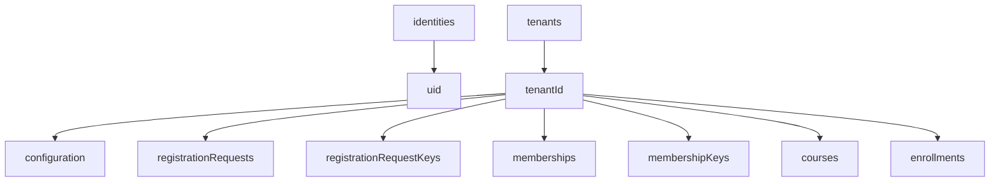
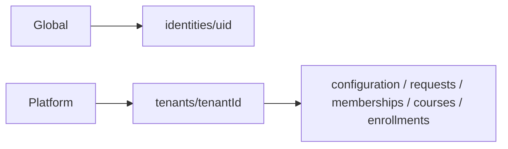
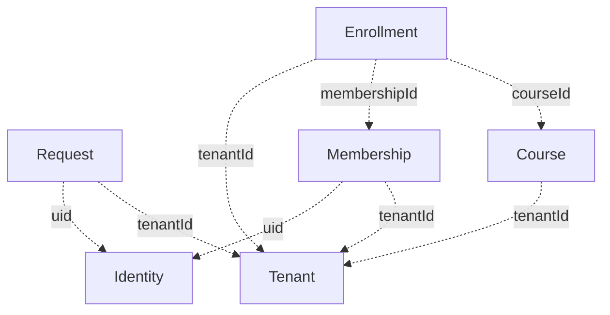
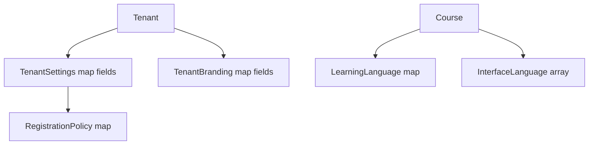
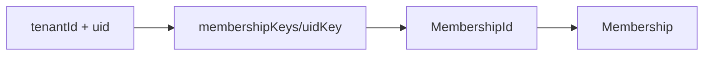
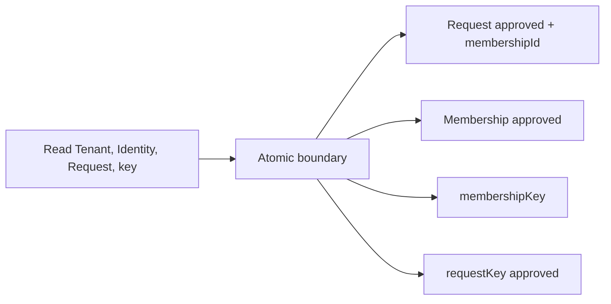
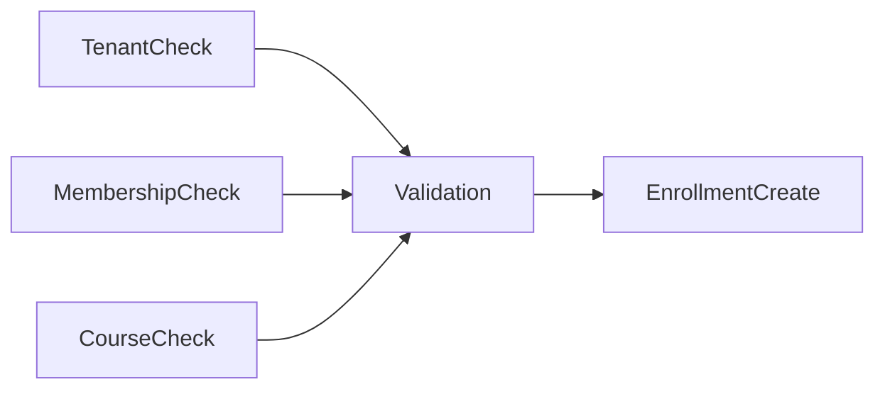
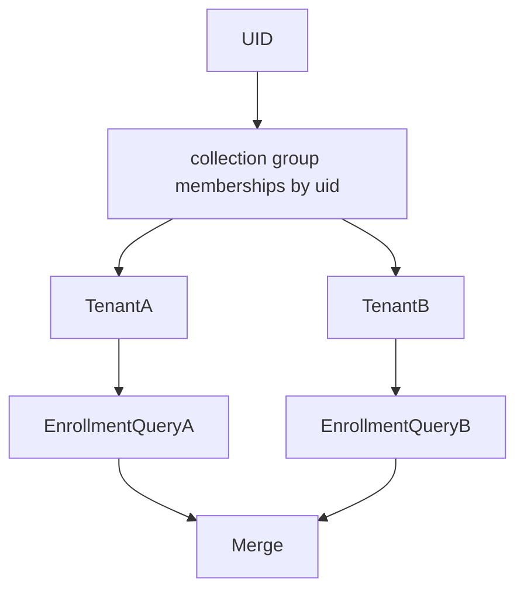
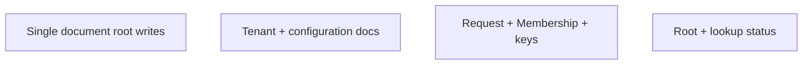
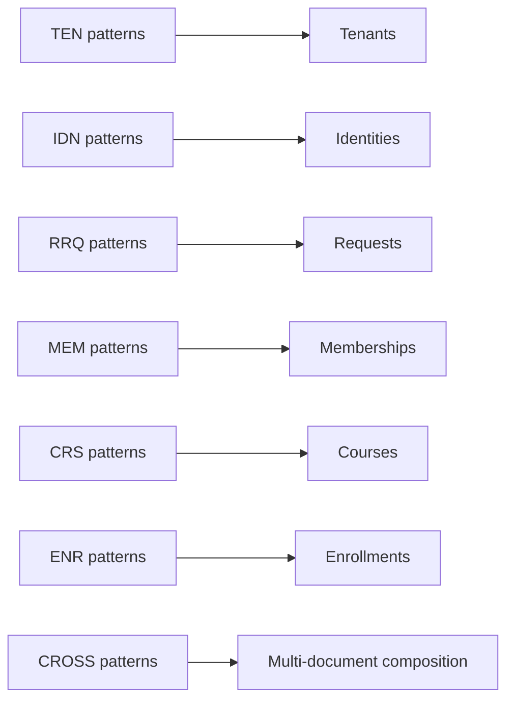

# Topología física canónica de Firestore

## 1. Alcance

SaaS-02B.2 partió de Domain 1.0.0 y 68 patrones; la topología permanece
compatible con Domain 1.2.0 y los 70 patrones vigentes. Traduce el modelo lógico
de acceso a una topología física documental. Define paths, shapes, IDs,
referencias escalares, Value Objects, constraints y fronteras atómicas. No
implementa queries, repositories, reglas, índices, migraciones ni transacciones.

## 2. Alternativas evaluadas

| Criterio | A. Roots globales tenant-scoped | B. Todo bajo Tenant | C. Híbrida |
|---|---|---|---|
| Aislamiento tenant | Depende siempre de filtros/reglas | Por construcción | Por construcción para contenido; Identity global explícita |
| Acceso self multi-tenant | Directo por uid | Collection group/composición | Collection group/composición controlada |
| Platform Tenant list | Directo | Directo en raíz Tenant | Directo |
| Riesgo de scan global | Alto | Bajo | Bajo |
| Rules futuras | Muchos filtros tenant | Paths naturales | Paths naturales y reglas globales sólo para Identity |
| Cross-root approval | Roots globales dispersos | Documentos bajo mismo Tenant | Request/Membership/constraint bajo Tenant; Identity global validada |
| Duplicación | Baja, pero scope débil | Baja | Baja; sin Identity duplicada |
| Índices | Globales con tenantId obligatorio | Tenant/collection-group | Tenant/collection-group |
| Migración legacy | Simple sólo superficialmente | Requiere clasificación tenant | Requiere clasificación tenant, preserva identidad global |
| Mantenibilidad | Riesgo alto de omitir tenantId | Clara, salvo Identity | Frontera organizacional explícita |

La alternativa A se rechaza porque facilita AP-MEM/AP-CRS/AP-ENR globales que
podrían filtrar tenant en cliente. B se rechaza porque Identity es global y no
debe duplicarse. Se selecciona **C, topología híbrida**.

## 3. Topología canónica

```text
identities/{uid}
tenants/{tenantId}
tenants/{tenantId}/configuration/settings
tenants/{tenantId}/configuration/branding
tenants/{tenantId}/registrationRequests/{requestId}
tenants/{tenantId}/registrationRequestKeys/{uidKey}
tenants/{tenantId}/memberships/{membershipId}
tenants/{tenantId}/membershipKeys/{uidKey}
tenants/{tenantId}/courses/{courseId}
tenants/{tenantId}/enrollments/{enrollmentId}
```

`configuration`, `registrationRequestKeys` y `membershipKeys` son detalles
físicos, no nuevos Aggregate Roots. No se aprueba todavía un constraint para
Enrollment equivalente.

### 3.1 Colecciones y scope

| Collection | Path | Scope | Root/documento | Motivo y patrones directos | No soporta directamente / riesgo |
|---|---|---|---|---|---|
| identities | `identities/{uid}` | global/self/platform | Identity | IDN-001–007 | No concede Tenant; PII global |
| tenants | `tenants/{tenantId}` | tenant/platform | Tenant shell | TEN-001/002/004/007/008 | No expone configuración privada automáticamente |
| configuration | `tenants/{tenantId}/configuration/{kind}` | tenant | Settings/Branding VO docs | TEN-003/005/006 | Dos lecturas para bundle completo; field visibility futura |
| registrationRequests | `tenants/{tenantId}/registrationRequests/{requestId}` | self/tenant | RegistrationRequest | RRQ reads/writes; collection group self | Self query exige uid y reglas estrictas |
| registrationRequestKeys | `tenants/{tenantId}/registrationRequestKeys/{uidKey}` | tenant/system | lookup auxiliar | RRQ-004/011 | Derivado; riesgo de drift |
| memberships | `tenants/{tenantId}/memberships/{membershipId}` | self/tenant | Membership | MEM-001/003/004/006–010; collection group self | tenant+uid point requiere lookup |
| membershipKeys | `tenants/{tenantId}/membershipKeys/{uidKey}` | tenant/system | constraint/lookup | MEM-002/005/011, CROSS-001 | Debe escribirse atómicamente |
| courses | `tenants/{tenantId}/courses/{courseId}` | tenant | Course | CRS-001–013 | Visibilidad pública no definida |
| enrollments | `tenants/{tenantId}/enrollments/{enrollmentId}` | self/tenant | Enrollment | ENR-001–013 | Self multi-membership requiere composición |

No hay colecciones canónicas `users`, `levels`, `temas`, `missions` ni
`userTests` en este modelo.

## 4. Identificadores físicos

| Root | Document ID | Generación | Offline | Determinismo/idempotencia | Exposición/cambio |
|---|---|---|---|---|---|
| Tenant | tenantId | Autoridad platform antes de CreateTenant | No necesaria | Opaco aleatorio; no es idempotency key externa | Puede exponerse; inmutable |
| Identity | uid | Autoridad de autenticación | No | Externo al modelo; no email | Self-visible; inmutable |
| RegistrationRequest | requestId | Generador opaco antes de comando | Puede pregenerarse; escritura requiere validación online | Aleatorio; clave de idempotencia de approval | Self/admin visible; inmutable |
| Membership | membershipId | Durante approval autorizada | No | Aleatorio; repetición del request reutiliza el mismo | Visible en contexto; inmutable |
| Course | courseId | Antes de CreateCourse | Puede pregenerarse; commit validado online | Opaco aleatorio | Tenant-visible; inmutable |
| Enrollment | enrollmentId | Antes de CreateEnrollment | Puede pregenerarse; commit validado online | Opaco aleatorio; no compuesto | Scoped-visible; inmutable |

`uidKey` es una codificación determinística, reversible o verificable y sin
colisiones del `uid`, válida como document ID. No sustituye `membershipId` ni
`requestId`; su algoritmo concreto queda en FPM-001.

## 5. Shapes canónicos

Todos los timestamps físicos son Firestore Timestamp UTC establecidos por una
autoridad confiable. El boundary de dominio continúa exponiendo ISO 8601.
`createdAt` es inmutable; `updatedAt` cambia en escrituras válidas. Timestamps de
transición son nulos antes de la transición y quedan inmutables al establecerse.

### 5.0 Matriz de timestamps transversales

| Root | Siempre | Condicional por lifecycle | No se persiste |
|---|---|---|---|
| Tenant | createdAt, updatedAt | suspendedAt (última suspensión), archivedAt | removedAt, completedAt |
| Identity | createdAt, updatedAt | ninguno | lifecycle tenant timestamps |
| RegistrationRequest | requestedAt | reviewedAt, cancelledAt, expiredAt | approvedAt/rejectedAt separados; reviewedAt cubre la resolución institucional |
| Membership | createdAt, updatedAt, approvedAt | suspendedAt (última suspensión), removedAt | rejectedAt/cancelledAt |
| Course | createdAt, updatedAt | archivedAt | suspendedAt/removedAt |
| Enrollment | enrolledAt, updatedAt | completedAt, cancelledAt | archivedAt/suspendedAt |

`createdBy` y `updatedBy` no se añaden transversalmente porque Domain 1.0.0 no
los exige. `approvedBy` y `reviewedBy` sí se conservan por contrato y auditoría.

### 5.1 Tenant

Path `tenants/{tenantId}`; ID igual a `tenantId`.

| Campo | Tipo | Regla física |
|---|---|---|
| tenantId | string | Obligatorio, igual al ID, inmutable |
| tenantType | enum string | Obligatorio |
| displayName, shortName | string | Obligatorios, mutables |
| country | string | ISO 3166-1 alpha-2, mutable por operación autorizada |
| locale | string | BCP 47, mutable |
| timezone | string | IANA, mutable |
| status | enum string | active/suspended/archived |
| createdAt, updatedAt | timestamp | Servidor; createdAt inmutable |
| suspendedAt | timestamp/null | Requerido cuando status suspended; puede quedar histórico tras restore |
| archivedAt | timestamp/null | Requerido e inmutable cuando archived |

Prohibidos: memberships/courses embebidos, roles, billing, owner user,
`institutionId`, slug/searchTokens y settings/branding privados.

### 5.2 TenantSettings y RegistrationPolicy

Path fijo `tenants/{tenantId}/configuration/settings`.

| Campo | Representación |
|---|---|
| tenantId | string igual al parent, inmutable |
| defaultLocale | BCP 47 string |
| registrationPolicy | embedded map con cuatro booleanos canónicos |
| featureFlags | map string→boolean |
| supportEmail, supportUrl | string/null |
| updatedAt | server timestamp técnico |

### 5.3 TenantBranding

Path fijo `tenants/{tenantId}/configuration/branding`.

| Campo | Representación |
|---|---|
| tenantId | string igual al parent, inmutable |
| displayName | string/null |
| logoUrl, faviconUrl | string/null; referencias externas |
| colors | embedded map `{primary, secondary, accent}` |
| updatedAt | server timestamp técnico |

Settings y Branding se crean siempre con Tenant mediante una frontera atómica
de CreateTenant y se materializan completos, no como mapas vacíos. Defaults se
resuelven antes de la escritura. No son roots independientes ni aceptan ausencia
en estado válido. Esto cierra PIO-004/ARB-FR-008 y PM-006 para Tenant.

AP-TEN-002 usa una lectura del Tenant shell. AP-TEN-003 realiza tres point reads
sólo cuando necesita el bundle completo, evitando exponer Settings o pagar esas
lecturas en cada navegación.

### 5.4 Identity

Path `identities/{uid}`.

| Campo | Tipo/regla |
|---|---|
| uid | string igual al ID, inmutable |
| email | normalized string, mutable sólo tras sincronización confiable |
| displayName | string |
| photoURL | string/null |
| emailVerified | boolean snapshot sincronizado; Auth sigue siendo autoridad para autorización |
| interfaceLocale | BCP 47 string, autoritativo del dominio |
| createdAt, updatedAt | server timestamps |

No contiene tenantId, role, Membership, Enrollment, progreso ni permisos.
Aunque email/displayName/photoURL puedan originarse en Authentication, se
persisten porque pertenecen al contrato Identity y permiten experiencia e
historial; `emailVerified` nunca autoriza por sí solo. Una sesión Auth sin
documento Identity entra en estado de bootstrap/reconciliación y no obtiene
acceso tenant hasta crear el documento de manera sincronizada futura.

### 5.5 RegistrationRequest

Path `tenants/{tenantId}/registrationRequests/{requestId}`.

| Campo | Tipo/regla |
|---|---|
| requestId | string igual al ID, inmutable |
| tenantId | string igual al parent, inmutable |
| uid | string, inmutable, referencia a Identity |
| requestedRole | MembershipRole string, inmutable |
| status | RequestStatus string |
| requestedAt | server timestamp, inmutable |
| reviewedAt, reviewedBy | timestamp/string o null; juntos para approved/rejected |
| approvedMembershipId | string/null; resultado técnico idempotente de approval |
| cancelledAt, expiredAt | timestamp/null, sólo para estado correspondiente |

`approvedMembershipId` no cambia el contrato de Membership; preserva el outcome
de requestId. No se añade `approvedAt`/`rejectedAt`: `reviewedAt` es la marca
canónica de resolución institucional. La consulta self usa collection group
filtrada por uid; bandejas operan dentro del Tenant.

### 5.6 Membership

Path `tenants/{tenantId}/memberships/{membershipId}`.

| Campo | Tipo/regla |
|---|---|
| membershipId | string igual al ID, inmutable |
| tenantId | string igual al parent, inmutable |
| uid | string, Identity ref, inmutable |
| role | MembershipRole, mutable por workflow |
| status | approved/suspended/removed |
| originRequestId | string/null, inmutable; request canónico de origen |
| createdAt, approvedAt, updatedAt | timestamps |
| approvedBy | uid, inmutable |
| suspendedAt, removedAt | timestamp/null según lifecycle |

No contiene perfil Identity ni Enrollment embebido. `originRequestId` es
trazabilidad física explícita; Approval conserva además el enlace inverso en
`approvedMembershipId`.

### 5.7 Course

Path `tenants/{tenantId}/courses/{courseId}`.

| Campo | Tipo/regla |
|---|---|
| courseId | string igual al ID, inmutable |
| tenantId | string igual al parent, inmutable |
| displayName, description | string, mutable |
| learningLanguage | embedded map `{languageCode, displayName}` |
| supportLanguageCode | BCP 47 scalar string |
| interfaceLanguages | array de maps `{locale, displayName}` |
| cefrLevel | enum string |
| status | draft/active/archived |
| createdAt, updatedAt | timestamps |
| archivedAt | timestamp/null; requerido en archived |

`learningLanguage.languageCode` permanece nested y consultable; no se duplica
aplanado porque Firestore soporta filtros por nested field. InterfaceLanguages
es un array de Value Objects; no se convierte en subcolección. La visibilidad
pública permanece abierta y no se crea catálogo público.

### 5.8 Enrollment

Path `tenants/{tenantId}/enrollments/{enrollmentId}`.

| Campo | Tipo/regla |
|---|---|
| enrollmentId | string igual al ID, inmutable |
| tenantId | string igual al parent, inmutable |
| membershipId, courseId | scalar string refs, inmutables |
| status | pending/active/completed/cancelled |
| enrolledAt, updatedAt | timestamps |
| completedAt, cancelledAt | timestamp/null según terminal state |

No incluye uid, perfil, Course snapshot ni progreso. El Course archivado no
modifica Enrollments: históricos siguen legibles; nuevos Enrollment exigen
Course active; transiciones futuras sobre Enrollment existente se rigen por el
workflow y política técnica posterior. PM-009/ARB-REL-003 queda cerrado en
topología y Deferred para reglas operativas específicas.

## 6. Referencias físicas

Se usan strings escalares, no `DocumentReference`: facilitan queries, reglas y
adaptadores, no implican lecturas y mantienen independencia del dominio.

| Source.field | Obligatorio/inmutable | Validación y query | Historia/anonimización |
|---|---|---|---|
| Request.tenantId | Sí/sí | parent Tenant y reglas | Tenant retained |
| Request.uid | Sí/sí | Identity exists; self collection group | uid preservado o tombstone futuro |
| Request.reviewedBy | Condicional/sí tras set | Identity/actor autorizado | uid mínimo retenido |
| Request.approvedMembershipId | Condicional/sí | Membership bajo mismo Tenant | correlación retenida |
| Membership.tenantId | Sí/sí | parent Tenant | Tenant retained |
| Membership.uid | Sí/sí | Identity exists; self query | uid/tombstone |
| Membership.originRequestId | Condicional/sí | Request mismo Tenant | Request retained |
| Membership.approvedBy | Sí/sí | Identity actor | uid mínimo retenido |
| Course.tenantId | Sí/sí | parent Tenant | Tenant retained |
| Enrollment.tenantId | Sí/sí | parent Tenant | Tenant retained |
| Enrollment.membershipId | Sí/sí | Membership mismo Tenant | Membership retained |
| Enrollment.courseId | Sí/sí | Course mismo Tenant | Course retained |

No se aprueba snapshot completo de Identity. PIO-005 sigue Deferred hasta
definir anonimización y minimización.

## 7. Constraints y lookups auxiliares

### 7.1 Membership uniqueness

Path conceptual `tenants/{tenantId}/membershipKeys/{uidKey}`.

```json
{
  "tenantId": "<tenantId>",
  "uid": "<uid>",
  "membershipId": "<membershipId>",
  "status": "approved|suspended",
  "originRequestId": "<requestId>",
  "updatedAt": "<server timestamp>"
}
```

Fuente autoritativa: Membership. Approval crea/valida lookup y Membership en la
misma frontera atómica. Leave/Remove elimina el lookup auxiliar dentro de la
misma escritura lógica; una Membership histórica no se elimina. Un repair
futuro reconstruye desde Memberships y reporta colisiones, nunca elige en
silencio.

### 7.2 RegistrationRequest vigente

Path `tenants/{tenantId}/registrationRequestKeys/{uidKey}`.

```json
{
  "tenantId": "<tenantId>",
  "uid": "<uid>",
  "requestId": "<requestId>",
  "status": "pending|approved|rejected|cancelled|expired",
  "updatedAt": "<server timestamp>"
}
```

Fuente autoritativa: RegistrationRequest. CreateRequest reserva/reemplaza el key
sólo cuando la política permite una nueva solicitud; toda transición actualiza
el lookup atómicamente con Request. Permite RRQ-004 sin scan. La semántica de
“resolución vigente” se conserva explícita, no se deduce por orden global.

### 7.3 Enrollment equivalente

No se aprueba constraint físico mientras PIO-001 no resuelva reinscripción.
AP-ENR-013 se soporta mediante query tenant-scoped por membershipId+courseId.
Un futuro key compuesto sólo será auxiliar; nunca reemplazará enrollmentId.

### 7.4 Idempotencia

Approval usa requestId, status y approvedMembershipId; no necesita una colección
de comandos adicional. Otros comandos idempotentes usan ID+target state mientras
no haya side effects externos. PIO-002 queda Deferred para auditoría/eventos.

## 8. Operaciones cross-root

### 8.1 ApproveRegistrationRequest

Lecturas conceptualmente consistentes:

1. Tenant root y status.
2. Request por requestId.
3. Identity por uid.
4. membershipKey por uidKey.
5. Membership indicada si existe un replay.

Escrituras en una frontera atómica:

1. Request: status approved, reviewedAt/by, approvedMembershipId.
2. Membership nueva approved con originRequestId, o reutilización exacta en replay.
3. membershipKey apuntando al membershipId.
4. registrationRequestKey reflejando approved.

Si request ya está approved, el mismo `approvedMembershipId` se devuelve sin
duplicar. Conflictos de key, cambio de status o Tenant no operativo abortan todo.
La autoridad cliente/backend queda Deferred; la frontera física requerida queda
cerrada.

### 8.2 CreateEnrollment

Lee Tenant, Membership y Course por paths del mismo Tenant; valida Tenant active,
Membership approved, Course active e igualdad de tenantId. Opcionalmente ejecuta
AP-ENR-013, sin imponer unicidad. Sólo entonces crea Enrollment pending. El
snapshot consistente o mecanismo transaccional se decide al implementar; ningún
target se actualiza y no existen cascadas.

## 9. Denormalización y proyecciones

| Candidato | Decisión | Fuente | Razón/riesgo |
|---|---|---|---|
| Tenant shell | Approved canonical | Tenant root | TEN-002 muy alto; sólo campos institucionales básicos |
| Branding | Rejected como duplicación; documento VO separado | TenantBranding | Actualización y visibilidad propias; no copiar al shell todavía |
| Actor histórico mínimo | Deferred | Identity | PII/anonimización sin política |
| Request inbox summary | Rejected inicialmente | Request | Query/index debe probarse antes de duplicar |
| Workspace summary | Deferred | Membership+Tenant | MEM-003 funciona por collection group; medir primero |
| Course catalog summary | Rejected inicialmente | Course | Documento Course ya es acotado y queryable |
| Enrollment counters/summaries | Deferred | Enrollment | Drift y sincronización no diseñados |
| AccessState | Rejected | Source roots | Nunca persistir autoridad derivada |

No se diseñan triggers ni sincronización.

## 10. Visibilidad, búsqueda y ordenamiento

### 10.1 Visibilidad

La topología separa Identity global, Tenant shell, configuración, contenido
tenant y lookups internos. FAP-004 permanece Deferred: no existe colección
pública canónica ni se declara Course público. Una proyección pública futura
podrá añadirse sin mover roots autoritativos.

### 10.2 Búsqueda textual

FAP-003 permanece Deferred. No se añaden slug, normalizedName o searchTokens.
Exact lookup usa tenantId; listados pueden ordenar por displayName. Full-text
requerirá decisión de producto/servicio posterior.

### 10.3 Orden estable

| Listado | Orden canónico |
|---|---|
| Tenants platform | createdAt desc, tenantId tie-breaker; displayName opcional |
| Requests | requestedAt + requestId; resueltas reviewedAt + requestId |
| Memberships | createdAt + membershipId |
| Courses | displayName + courseId; históricos updatedAt + courseId |
| Enrollments | enrolledAt + enrollmentId; históricos updatedAt + enrollmentId |

Todos usan campos vigentes y document ID como desempate. FAP-001 queda Closed;
cursores e índices JSON se aplazan.

## 11. Accesos self multi-tenant

Membership self usa collection group `memberships`, filtro obligatorio `uid ==
auth.uid`, paginado por createdAt/membershipId. Cada resultado conserva tenantId
y requiere autorización self.

Enrollment self se compone en dos pasos: obtener Memberships propias y consultar
`tenants/{tenantId}/enrollments` por membershipId para cada contexto autorizado.
Los streams se paginan individualmente y se fusionan por enrolledAt/enrollmentId.
No hay scan global ni copia de uid en Enrollment. FAP-002 queda Closed para
topología; FPM-004 conserva el diseño exacto de cursor/repository para la fase de
implementación.

## 12. Mapeo de los 70 Access Patterns

Clasificaciones: `Direct`, `Lookup`, `Composition`, `Deferred`, `Not supported`.
“Index” indica expectativa, no un índice creado.

| Patterns | Path/document | Fields / auxiliary | Index | Atomicity | Denorm | Scope | Support |
|---|---|---|---|---|---|---|---|
| TEN-001/002/008 | Tenant root | tenantId/status/shell | none | read | shell approved | tenant | Direct |
| TEN-003 | Tenant + configuration docs | Settings/Branding/Policy | none | multi-read | none | tenant | Composition |
| TEN-004 | tenants | status/type/createdAt/displayName | composite likely | read | shell | platform | Direct |
| TEN-005/006 | configuration fixed doc | VO fields | none | single doc | none | tenant_admin | Direct |
| TEN-007 | Tenant root | status/timestamps | none | single root | none | platform | Direct |
| TEN-009/010 | Tenant root | field-owned profile/platform metadata | none | single root | none | tenant/platform | Direct |
| IDN-001–006 | Identity root | uid/profile/locale | none | single root/read | none | self/platform | Direct |
| IDN-007 | Identity root | uid/minimized fields | none | read | snapshot deferred | audit | Direct |
| RRQ-001 | Request + requestKey | request fields/uidKey | none | multi-doc required | none | self | Lookup |
| RRQ-002 | Request tenant path | requestId+uid | none | read | none | self | Direct |
| RRQ-003 | collection group Requests | uid/tenant/status/date | composite likely | read | none | self | Direct |
| RRQ-004 | requestKey + Request | uidKey/requestId | none | read | lookup | self/tenant | Lookup |
| RRQ-005/006 | Tenant Requests | status/dates | composite likely | read | summary rejected | tenant_admin | Direct |
| RRQ-007/011 | Request+Membership+keys | outcome correlation | none | cross-root atomic | none | tenant_admin | Lookup |
| RRQ-008–010 | Request + requestKey | status/review timestamps | none | multi-doc required | none | scoped/system | Lookup |
| MEM-001 | Tenant Membership | membershipId | none | read | none | self/tenant | Direct |
| MEM-002/005/011 | membershipKey + Membership | uidKey/membershipId/status | none | consistent read/write | lookup | tenant | Lookup |
| MEM-003 | collection group Memberships | uid/status/createdAt | composite likely | read | workspace deferred | self | Direct |
| MEM-004/010 | Tenant Memberships | status/role/dates | composite likely | read | none | tenant_admin/self | Direct |
| MEM-006/007 | Membership (+key for status) | role/status/timestamps | none | multi-doc when status | none | tenant_admin | Lookup |
| MEM-008/009 | Membership+membershipKey | removedAt/status | none | multi-doc | none | self/admin | Lookup |
| CRS-001 | Tenant Course | courseId | none | read | none | tenant | Direct |
| CRS-002–007/013 | Tenant Courses | status/languages/order | composite likely | read | summary rejected | tenant | Direct |
| CRS-008–011 | Tenant Course | root+VO/status | none | single root | none | teacher/admin | Direct |
| CRS-012 | Tenant Course | status | none | read | none | tenant | Direct |
| ENR-001–004/006/007/012 | Tenant Enrollments | IDs/status/dates | composite likely | read | none | self/tenant | Direct |
| ENR-005 | Membership collection group + per-tenant Enrollment | uid→membershipId | composite likely | multi-query | self projection deferred | self | Composition |
| ENR-008 | Tenant/Membership/Course + Enrollment | all refs/status | none | consistent validation+write | none | tenant | Composition |
| ENR-009–011 | Enrollment | status/timestamps | none | single root | none | self/admin | Direct |
| ENR-013 | Tenant Enrollments | membershipId+courseId | composite likely | read | constraint deferred | tenant | Direct |
| CROSS-001 | Request/Membership/keys + validation roots | IDs/status/outcome | none | cross-root atomic | none | tenant_admin | Lookup |
| CROSS-002 | Identity/Tenant/Request/Membership | status facts | model-dependent | read-only | prohibited | tenant | Composition |
| CROSS-003 | Tenant/Membership/Course/Enrollment | IDs/status | none | consistent validation | none | tenant | Composition |
| CROSS-004 | Tenant then scoped root | Tenant.status | none | read gate | no cascade | tenant | Composition |
| CROSS-005 | Course + historical Enrollments | status/refs | composite likely | reads | none | tenant | Composition |

Los 70 IDs quedan cubiertos por rangos exhaustivos. Ningún patrón queda `Not
supported`. Deferred aplica sólo a capacidades adicionales (publicidad,
full-text, proyecciones), no a los patrones canónicos mínimos.

## 13. Ejemplos JSON conceptuales

Los placeholders distinguen valores de dominio y timestamps técnicos.

### Tenant

```json
{"tenantId":"<tenantId>","tenantType":"university","displayName":"<name>","shortName":"<short>","country":"<CC>","locale":"<bcp47>","timezone":"<iana>","status":"active","createdAt":"<server timestamp>","updatedAt":"<server timestamp>","suspendedAt":null,"archivedAt":null}
```

### Identity

```json
{"uid":"<uid>","email":"<normalized email>","displayName":"<name>","photoURL":null,"emailVerified":false,"interfaceLocale":"<bcp47>","createdAt":"<server timestamp>","updatedAt":"<server timestamp>"}
```

### RegistrationRequest

```json
{"requestId":"<requestId>","tenantId":"<tenantId>","uid":"<uid>","requestedRole":"student","status":"pending","requestedAt":"<server timestamp>","reviewedAt":null,"reviewedBy":null,"approvedMembershipId":null,"cancelledAt":null,"expiredAt":null}
```

### Membership

```json
{"membershipId":"<membershipId>","tenantId":"<tenantId>","uid":"<uid>","role":"student","status":"approved","originRequestId":"<requestId-or-null>","createdAt":"<server timestamp>","approvedAt":"<server timestamp>","approvedBy":"<uid>","updatedAt":"<server timestamp>","suspendedAt":null,"removedAt":null}
```

### Course

```json
{"courseId":"<courseId>","tenantId":"<tenantId>","displayName":"<name>","description":"<description>","learningLanguage":{"languageCode":"<bcp47>","displayName":"<language>"},"supportLanguageCode":"<bcp47>","interfaceLanguages":[{"locale":"<bcp47>","displayName":"<locale>"}],"cefrLevel":"A1","status":"draft","createdAt":"<server timestamp>","updatedAt":"<server timestamp>","archivedAt":null}
```

### Enrollment

```json
{"enrollmentId":"<enrollmentId>","tenantId":"<tenantId>","membershipId":"<membershipId>","courseId":"<courseId>","status":"pending","enrolledAt":"<server timestamp>","updatedAt":"<server timestamp>","completedAt":null,"cancelledAt":null}
```

Los ejemplos de membershipKey y registrationRequestKey están en el apartado 7.

## 14. Diagramas Mermaid

### 14.1 Topología general



### 14.2 Paths globales y tenant



### 14.3 Referencias escalares



### 14.4 Value Objects



### 14.5 Membership constraint



### 14.6 Approval



### 14.7 CreateEnrollment



### 14.8 Self multi-tenant



### 14.9 Fronteras atómicas



### 14.10 Patrones a colecciones



## 15. Backlog actualizado

### 15.1 PM

| ID | Estado | Decisión SaaS-02B.2 |
|---|---|---|
| PM-001 | Closed | Topología híbrida canónica seleccionada |
| PM-002 | Closed | IDs físicos iguales a IDs canónicos; generación definida conceptualmente |
| PM-003 | Deferred | Paths/refs definidos; enforcement corresponde a Rules |
| PM-004 | Closed | Frontera física de approval y documentos definidos |
| PM-005 | Deferred | Topología soporta control; mecanismo/versionado se implementará después |
| PM-006 | Closed | VOs materializados en configuration/Course |
| PM-007 | Deferred | Shapes históricos definidos; plazos/borrado pendientes |
| PM-008 | Deferred | URLs escalares; Storage lifecycle posterior |
| PM-009 | Closed | Sin cascada, históricos retenidos, create exige Course active |

### 15.2 PIO

| ID | Estado | Decisión |
|---|---|---|
| PIO-001 | Deferred | Query equivalente soportada; política/constraint no aprobados |
| PIO-002 | Deferred | Approval usa requestId; command keys futuras sólo con side effects |
| PIO-003 | Deferred | Retención física/legal posterior |
| PIO-004 | Closed | Settings/Branding siempre materializados al crear Tenant |
| PIO-005 | Deferred | IDs de actor retenidos; anonimización pendiente |

### 15.3 FAP

| ID | Estado | Decisión |
|---|---|---|
| FAP-001 | Closed | Ordenamientos/tie-breakers canónicos definidos |
| FAP-002 | Closed | Membership collection group + Enrollment queries por contexto |
| FAP-003 | Deferred | Sin campos de búsqueda nuevos |
| FAP-004 | Deferred | Sin colección pública canónica |
| FAP-005 | Deferred | Topología permite Course Enrollments; autorización docente no asumida |

### 15.4 FPM nuevos

| ID | Descripción/evidencia | Impacto/severidad | Patterns | Fase | ¿Bloquea 02B.3? |
|---|---|---|---|---|---|
| FPM-001 | Especificar codificación segura y collision-free de uidKey | Constraint incorrecto / Alta | RRQ-004/011, MEM-002/011 | 02B.3/implementation contract | Sí para implementar constraints |
| FPM-002 | Verificar Rules/indexes para collection group self por uid | Acceso self o fuga / Alta | RRQ-003, MEM-003 | Rules/index phase | No para revisar topología; sí para deploy |
| FPM-003 | Definir límites operativos de featureFlags e interfaceLanguages | Riesgo de crecimiento documental / Baja | TEN-003, CRS-001 | Repository validation | No |
| FPM-004 | Diseñar cursor compuesto para merge Enrollment multi-membership | UX/paginación / Media | ENR-005 | Repository/query phase | No |
| FPM-005 | Definir autoridad técnica de writes cross-root | Seguridad/atomicidad / Crítica | CROSS-001/003 | Backend/application phase | No para 02B.3; sí antes de implementación |

## 16. Decisiones aplazadas

- Rules, field validation y equivalencia de capacidades;
- índices JSON y collection-group indexes;
- autoridad técnica de approval/CreateEnrollment;
- algoritmo uidKey;
- re-enrollment y Enrollment constraint;
- retención, anonimización y Storage;
- visibilidad pública y búsqueda textual;
- repository pagination/fan-out;
- triggers/proyecciones futuras.

## 17. Criterios de cierre

| Criterio | Resultado |
|---|---|
| Topología canónica seleccionada | Cumple |
| Colecciones y paths definidos | Cumple |
| IDs físicos definidos | Cumple |
| Document shapes definidos | Cumple |
| Value Objects materializados | Cumple |
| Referencias físicas definidas | Cumple |
| Aislamiento Tenant soportado | Cumple |
| Patrones self multi-tenant soportados | Cumple |
| Constraints lógicos definidos | Cumple |
| Operaciones cross-root diseñadas | Cumple |
| Access Patterns mapeados | Cumple |
| Decisiones aplazadas identificadas | Cumple |
| Dominio congelado preservado | Cumple |
| Firebase no modificado | Cumple |

**SaaS-02B.2 Firestore physical model = COMPLETE**

SaaS-02B.3 no se inició.

## 18. Trazabilidad hacia SaaS-02B.3

`FIRESTORE_QUERY_AND_INDEX_MODEL.md` define contratos de consulta, índices
documentales, ordenamientos y cursores compatibles con esta topología. No cambia
paths ni shapes. SaaS-02B.4 permanece sin iniciar.

## 19. Autoridad y concurrencia SaaS-02B.4

`FIRESTORE_WRITE_AUTHORITY_AND_CONCURRENCY.md` clasifica writes, transactions,
lookups, reintentos y backend authority sin cambiar paths. SaaS-02C no se inició;
dos gaps de capability bloquean su cierre.
