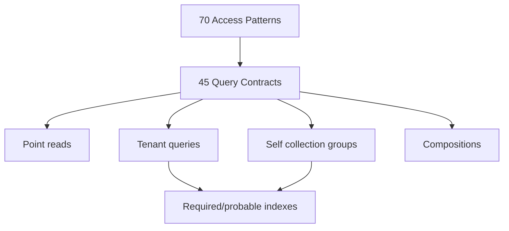
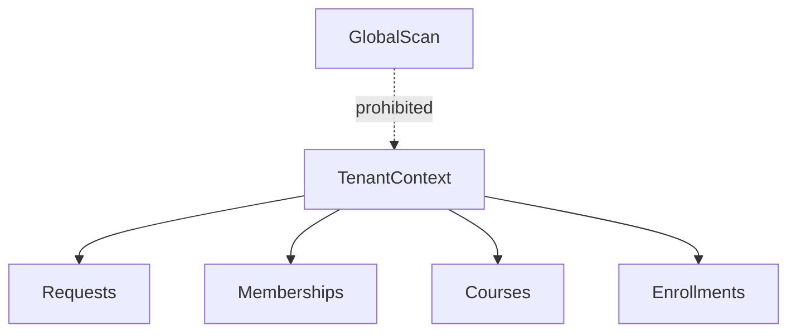
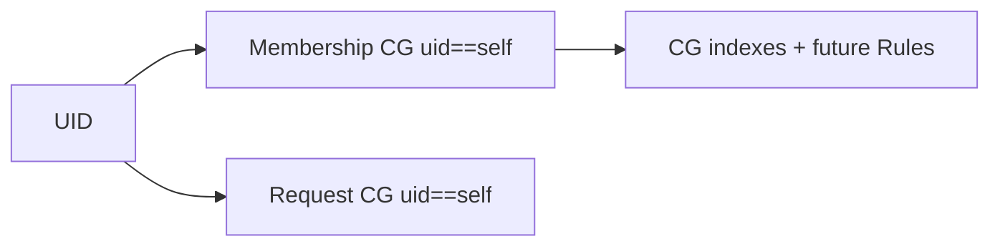
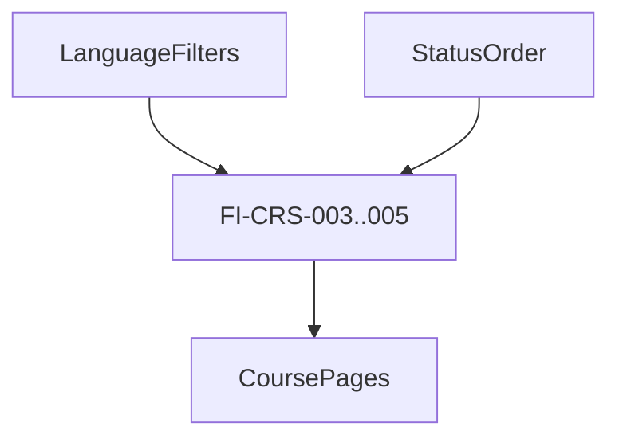
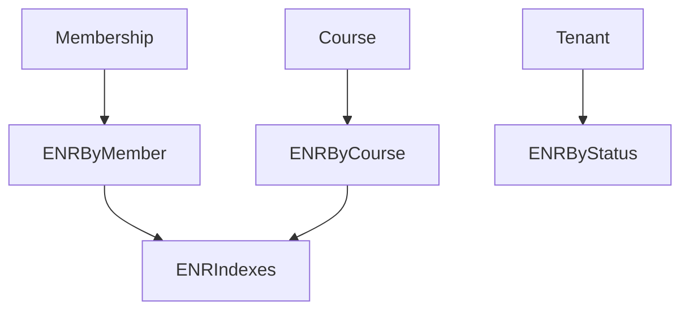
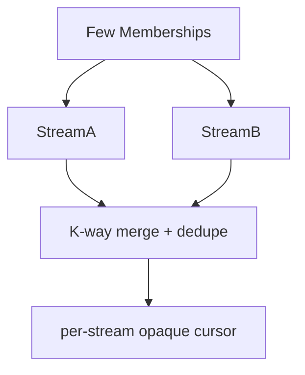
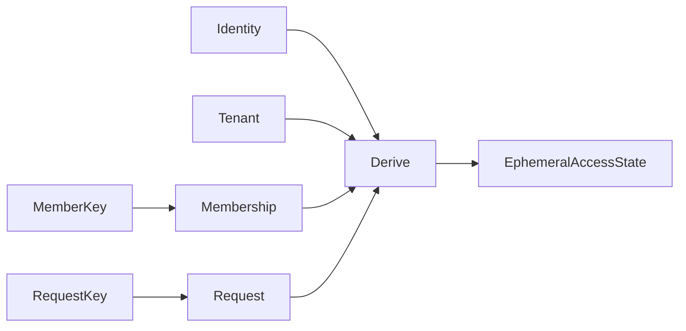
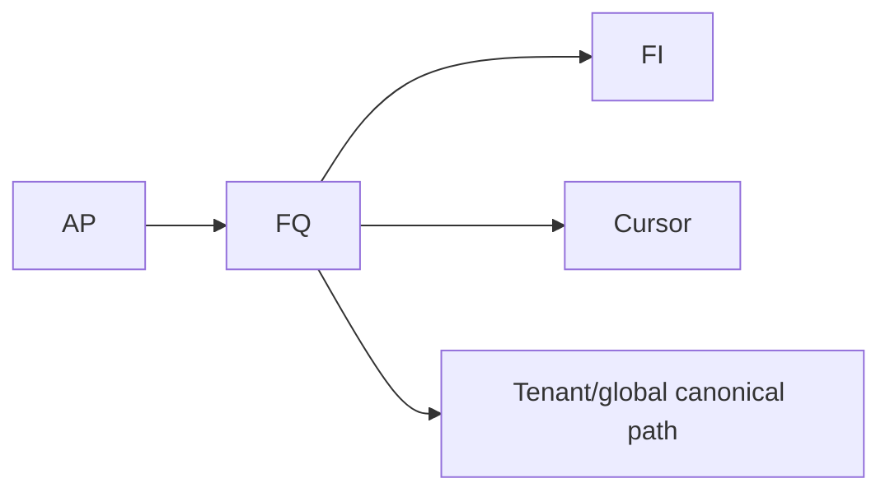
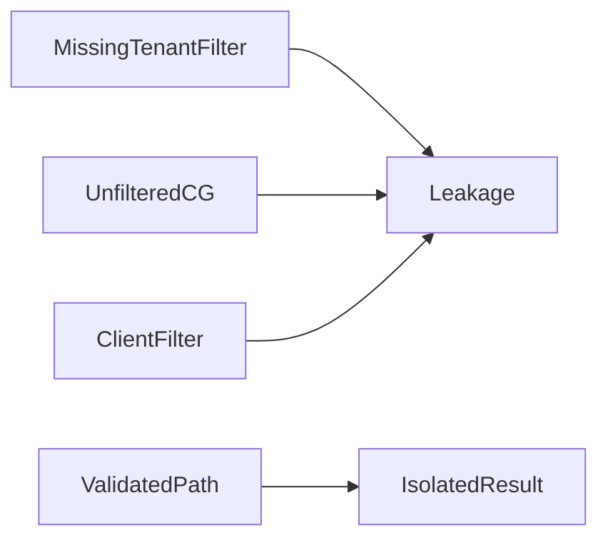
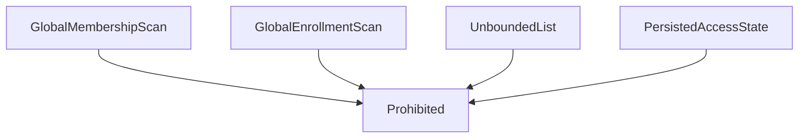

# Arquitectura de consultas, índices y cursores de Firestore

> Course FIX2 amendment: FQ-CRS list shapes prepend exact tenantId equality and
> FI-CRS-001..005 prepend `tenantId ASCENDING`. Cursor v1 remains compatible;
> no collection-group query or index is introduced.

## 1. Alcance y fuentes

SaaS-02B.3 define contratos declarativos de consulta para los 70 Access Patterns
y la topología híbrida aprobada. No contiene SDK calls, repositories, índices
JSON, Rules ni listeners ejecutables.

Fuentes: Domain 1.0.0, modelos lógico/físico de persistencia, catálogo de acceso,
workflows, autorización, baseline Firebase y contratos `src/domain/`. Las
restricciones del motor se verificaron en documentación oficial:

- https://firebase.google.com/docs/firestore/query-data/queries
- https://firebase.google.com/docs/firestore/query-data/index-overview
- https://firebase.google.com/docs/firestore/query-data/query-cursors
- https://firebase.google.com/docs/firestore/query-data/multiple-range-fields

## 2. Restricciones arquitectónicas de Firestore

- Point read cuando se conoce path+ID; no query por un ID ya resuelto.
- Toda query usa índices. Los automáticos cubren campos individuales en scope de
  colección; combinaciones y `collectionGroup` ordenados/filtrados pueden exigir
  índices manuales específicos.
- `or`, `in` y `array-contains-any` están limitados a 30 disyunciones en forma
  normal disyuntiva; `not-in` admite hasta 10 valores y no combina con
  `in`/`array-contains-any`/`or`/`!=` según las restricciones documentadas.
- Máximo un `array-contains` por disyunción y no junto con
  `array-contains-any` en esa disyunción.
- Un filtro de desigualdad implica orden por ese campo y excluye documentos que
  no lo contienen. Los filtros de rango múltiples son posibles, pero su orden e
  índice afectan coste y selectividad.
- La suma de filtros, órdenes y parent path, calculada tras normalizar
  disyunciones, no debe superar el límite documentado de 100.
- No hay joins, unique constraints ni full-text search nativos.
- `collectionGroup` abarca todas las subcolecciones con el mismo nombre; uid y
  Rules futuras son obligatorios para self queries.
- `startAfter` es exclusivo. Cursor y query deben compartir filtros, dirección y
  todos los campos de orden.
- El índice añade `__name__` como orden final; este modelo lo declara
  explícitamente para cursores estables.
- Una query cobra/retorna documentos, no “filas”; fan-out y N+1 deben acotarse.
- Listeners no sustituyen paginación y pueden reordenar resultados concurrentes;
  no se aprueban como default para listados administrativos.
- No puede filtrarse dinámicamente por una lista arbitrariamente grande: `in`
  requiere batching o composición y nunca resuelve cardinalidad ilimitada.

## 3. Estrategias transversales

### 3.1 Aislamiento

Toda query institucional usa una colección bajo `tenants/{tenantId}`. Sólo se
permiten dos collection groups self: `memberships` y `registrationRequests`,
ambos con `uid == currentUid`. Nunca se consulta globalmente y se filtra después.

### 3.2 Orden, cursor y límites

Orden total: campo primario + `documentId`/`__name__` en la misma dirección,
salvo que se indique otra. La futura capa Repository expondrá un **opaque
application cursor**: envelope versionado con Query Contract, fingerprint de
filtros, valores ordenados y full document path. La UI no recibe
DocumentSnapshot; el cursor se valida y no concede autorización.

Categorías sin cantidades numéricas todavía:

- Small page: selecciones self o catálogos pequeños.
- Standard page: catálogos y listados habituales.
- Administrative page: bandejas y auditoría tenant/platform.
- Background batch: expiración/reconciliación system.

Cada categoría tendrá máximo configurable antes de implementar repositories.

Modificación concurrente: `startAfter` evita duplicar el último elemento, pero
inserts/updates pueden aparecer, desaparecer o moverse entre páginas. No se
promete snapshot global entre páginas; deduplicación por path y refresh explícito
son responsabilidad futura. Históricos terminales minimizan este riesgo.

### 3.3 uidKey — cierre FPM-001

Alternativas:

| Alternativa | Colisión/path | Rules/cliente | Privacidad/debug | Decisión |
|---|---|---|---|---|
| uid directo | Sin colisión, pero contrato UID no garantiza por sí solo todos los caracteres de path | Muy simple | Expone uid en path | Rejected |
| Base64URL reversible | Sin colisión si encoding canónico; path-safe | Implementable sin dependencia; Rules valida campo uid, no recalcula | Moderada, depurable | **Approved** |
| Hash determinístico | Colisión teórica y algoritmo/versionado | Rules no recalcula fácilmente; requiere crypto | Mayor ocultación, menor debug | Rejected |

Formato conceptual: `u1_<base64url(UTF-8(uid), no-padding)>`. `u1_` versiona la
codificación. El lookup guarda `uid` autoritativo; writers privilegiados validan
correspondencia. No se implementa el algoritmo en esta fase.

## 4. Catálogo canónico de Query Contracts

Cada contrato declara inputs, filtros, order, cursor, limit, consistencia,
índice, fallos y riesgo. `PR` significa point read.

### 4.1 Tenant — 6 contratos

| ID | AP | Actor/scope | Collection/path | Tipo e inputs | Filters / order / cursor / limit | Index / consistencia / fallo/riesgo |
|---|---|---|---|---|---|---|
| FQ-TEN-001 | TEN-001/002/008 | member/admin/system tenant | `tenants/{tenantId}` | PR tenantId | none | built-in; current; missing/forbidden |
| FQ-TEN-002 | TEN-003/005 | admin tenant | `.../configuration/settings` | PR tenantId | none | built-in; current; missing invalid aggregate |
| FQ-TEN-003 | TEN-003/006 | admin/authorized viewer | `.../configuration/branding` | PR tenantId | none | built-in; current; field visibility |
| FQ-TEN-004 | TEN-003 | authorized tenant | tres PR | tenantId; parallel after Tenant exists | no cursor | composition; failure if Tenant missing; partial config invalid |
| FQ-TEN-005 | TEN-004 | platform_admin | `tenants` | query | order createdAt DESC, __name__ DESC; opaque; Administrative | FI-TEN-001 probable; platform-only |
| FQ-TEN-006 | TEN-004/007 | platform_admin | `tenants` | query status | status==X; createdAt DESC, __name__ DESC; Administrative | FI-TEN-002 required; no name search |

Bundle: Tenant se lee primero; Settings y Branding pueden leerse en paralelo. Si
Tenant no existe, no se leen hijos. Ausencia de cualquiera es inconsistencia a
reconciliar, no default silencioso. Cache queda aplazada.

### 4.2 Identity — 4 contratos

| ID | AP | Actor/scope | Path | Tipo | Orden/limit | Índice/fallo |
|---|---|---|---|---|---|---|
| FQ-IDN-001 | IDN-001/002/003/006 | identity_self | `identities/{uid}` | PR self | n/a | built-in; uid must equal auth uid |
| FQ-IDN-002 | IDN-004 | platform_admin | `identities/{uid}` | PR admin | n/a | built-in; capability required |
| FQ-IDN-003 | IDN-005 | system/scoped admin | `identities/{uid}` | PR existence/minimal result | n/a | built-in; no profile disclosure |
| FQ-IDN-004 | IDN-007 | authorized auditor | multiple point reads by distinct uid | dedupe IDs; bounded parallel/cache future | no index; fail soft to anonymized/unavailable actor |

No Access Pattern autoriza listado global de Identities; no se diseña.

### 4.3 RegistrationRequest — 8 contratos

| ID | AP | Scope | Collection | Filters | Order/cursor/limit | Index / failure / risk |
|---|---|---|---|---|---|---|
| FQ-RRQ-001 | RRQ-001/002/007–011 | self/tenant/system | tenant Request path | PR requestId | n/a | built-in; tenant/uid ownership |
| FQ-RRQ-002 | RRQ-003 | self tenant | tenant Requests | uid==self; optional status | requestedAt DESC,__name__ DESC; Standard | FI-RRQ-001/002; tenant path |
| FQ-RRQ-003 | RRQ-003 | self cross-tenant | collectionGroup `registrationRequests` | uid==self; optional status | requestedAt DESC,__name__ DESC; Standard | FI-CG-003/004 required; high Rules risk |
| FQ-RRQ-004 | RRQ-004/011 | self/admin/system | requestKey path then Request PR | uidKey | none | built-in; stale key/reconciliation |
| FQ-RRQ-005 | RRQ-005 | tenant_admin | tenant Requests | status==pending | requestedAt ASC,__name__ ASC; Administrative | FI-RRQ-003 required |
| FQ-RRQ-006 | RRQ-006 | tenant_admin | tenant Requests | status in 4 terminal values | requestedAt DESC,__name__ DESC; Administrative | FI-RRQ-004 required; within disjunction limit |
| FQ-RRQ-007 | RRQ-010 | platform_system | collectionGroup Requests | status==pending; requestedAt<=externalCutoff | requestedAt ASC,__name__ ASC; Background | FI-CG-005 required; cutoff policy external/deferred |
| FQ-RRQ-008 | RRQ-007/011,CROSS-001 | tenant/system | point-read set | Tenant, Identity, Request, requestKey, membershipKey, optional Membership | n/a | consistent read set required; conflict/idempotent replay |

No query “reviewedBy” se añade: ningún Access Pattern la requiere. Terminales se
resuelven con un `in` acotado y `requestedAt`, campo presente en todos; no se
ordena por nullable reviewedAt. Expiración usa cutoff calculado por política
futura sobre requestedAt, sin inventar `expiresAt`.

### 4.4 Membership — 7 contratos

| ID | AP | Scope | Collection | Filters | Order/cursor/limit | Index / risk |
|---|---|---|---|---|---|---|
| FQ-MEM-001 | MEM-001/006–009 | self/tenant | tenant Membership path | PR membershipId | n/a | built-in; tenant equality |
| FQ-MEM-002 | MEM-002/005/011 | self/system | membershipKey then Membership PR | uidKey | none | built-in; auth-critical/stale key |
| FQ-MEM-003 | MEM-003 | self cross-tenant | collectionGroup memberships; uid==self | optional status/role | createdAt DESC,__name__ DESC; Standard | FI-CG-001/002 required |
| FQ-MEM-004 | MEM-004 | tenant_admin | tenant Memberships; optional status/role | equality combinations | createdAt DESC,__name__ DESC; Administrative | FI-MEM-001–003 depending filters |
| FQ-MEM-005 | MEM-010 | self/admin | scoped Memberships; status in suspended/removed | status in | updatedAt DESC,__name__ DESC; Administrative/Standard | FI-MEM-004 required |
| FQ-MEM-006 | MEM-005 | system | membership PR after key | status/role derived in memory from one doc | none | no query/index; never persist auth result |
| FQ-MEM-007 | MEM-007–009/011 | admin/self/system | Membership+key PRs | membershipId/uidKey | none | atomic key update/delete future; terminal re-entry policy uses current key absence plus retained history |

Collection-group nombre repetido es intencional sólo para canonical Memberships;
Rules futuras deben verificar uid y parent Tenant. No collection group global sin
uid/platform purpose.

### 4.5 Course — 7 contratos

| ID | AP | Scope | Collection | Filters | Order/cursor/limit | Index |
|---|---|---|---|---|---|---|
| FQ-CRS-001 | CRS-001/008–012 | tenant | Course path | PR courseId | n/a | built-in |
| FQ-CRS-002 | CRS-002/003 | tenant | tenant Courses | optional status==active | displayName ASC,__name__ ASC; Standard | FI-CRS-001 required when status |
| FQ-CRS-003 | CRS-004/013 | tenant_admin | tenant Courses | status==X | updatedAt DESC,__name__ DESC; Administrative | FI-CRS-002 required |
| FQ-CRS-004 | CRS-005 | tenant | Courses | active + learningLanguage.languageCode==X | displayName ASC,__name__ ASC; Standard | FI-CRS-003 required |
| FQ-CRS-005 | CRS-006 | tenant | Courses | active + supportLanguageCode==X | displayName ASC,__name__ ASC; Standard | FI-CRS-004 required |
| FQ-CRS-006 | CRS-007 | tenant | Courses | status+learning+support equality | displayName ASC,__name__ ASC; Standard | FI-CRS-005 required |
| FQ-CRS-007 | CRS-013,CROSS-005 | tenant admin/history | Courses archived then Enrollment query | status==archived | updatedAt DESC,__name__ DESC | FI-CRS-002; composition |

No consulta anónima pública canónica mientras FAP-004 siga Deferred.

### 4.6 Enrollment — 8 contratos

| ID | AP | Scope | Collection | Filters | Order/cursor/limit | Index/risk |
|---|---|---|---|---|---|---|
| FQ-ENR-001 | ENR-001/009–011 | self/tenant | Enrollment path | PR enrollmentId | n/a | built-in |
| FQ-ENR-002 | ENR-002 | self/tenant | tenant Enrollments | membershipId; optional status | enrolledAt DESC,__name__ DESC; Standard | FI-ENR-001/002 |
| FQ-ENR-003 | ENR-003/007 | authorized tenant actor | tenant Enrollments | courseId; optional status | enrolledAt DESC,__name__ DESC; Administrative | FI-ENR-003/004; FAP-005 auth deferred |
| FQ-ENR-004 | ENR-004/006 | tenant_admin | tenant Enrollments | optional status | updatedAt DESC,__name__ DESC; Administrative | FI-ENR-005 when status |
| FQ-ENR-005 | ENR-013 | tenant/system | tenant Enrollments | membershipId==X,courseId==Y | enrolledAt DESC,__name__ DESC; Small | FI-ENR-006 required; not uniqueness |
| FQ-ENR-006 | ENR-005 | self | per Membership tenant query | membershipId | enrolledAt DESC,__name__ DESC; Small per stream | FI-ENR-001; Few memberships only |
| FQ-ENR-007 | ENR-012,CROSS-005 | self/admin | scoped Enrollments | terminal status/owner/course | updatedAt DESC,__name__ DESC; Standard/Admin | FI-ENR-007 variants probable |
| FQ-ENR-008 | ENR-008,CROSS-003 | tenant/system | Tenant/Membership/Course PR + optional FQ-ENR-005 | point validations | n/a | consistent read set; archive/suspend conflict |

#### Cursor self multi-membership — cierre FPM-004

Se selecciona **A para Few + D como límite canónico**:

- cada Membership mantiene cursor independiente `(enrolledAt, fullPath)`;
- se pide Small page por stream, merge k-way DESC, dedupe por full path;
- cursor opaco contiene versión, set estable de membershipIds, cursor/agotamiento
  por stream y filter fingerprint;
- un fallo parcial no avanza el cursor global y devuelve error retryable;
- cambios concurrentes pueden mover documentos; dedupe y refresh son explícitos;
- cuando Memberships deja de ser Few, no se amplía `in` ni se duplica uid:
  navegación por Tenant/Membership (alternativa D).

B (`uid` duplicado en Enrollment) y C (proyección self) quedan Deferred/rejected
como modelo canónico por sincronización y PII. No existe paginación global fuerte
entre streams; es una vista compuesta best-effort.

### 4.7 Cross-root — 5 contratos

| ID | AP | Subqueries/reads | Resultado/consistencia |
|---|---|---|---|
| FQ-CROSS-001 | CROSS-001 | FQ-TEN-001, IDN-003, RRQ-001/004, MEM-002, optional MEM-001 | Approval read set; atomic write future |
| FQ-CROSS-002 | CROSS-002 | IDN-001/003, TEN-001, MEM-002, RRQ-004 | DeriveAccessState; point-first; never persisted |
| FQ-CROSS-003 | CROSS-003 | TEN-001, MEM-001/002, CRS-001, optional ENR-005 | CreateEnrollment validation |
| FQ-CROSS-004 | CROSS-004 | TEN-001 before institutional query | Tenant operational gate; no cascade |
| FQ-CROSS-005 | CROSS-005 | CRS-001/007 + ENR-003/007 | Active required for writes; history retained |

## 5. Catálogo de índices documental

Direcciones incluyen `__name__` en la misma dirección del último order. No se
modifica `firestore.indexes.json`.

| ID | Scope/collection | Fields | Queries/AP | Clase | Frecuencia/criticidad |
|---|---|---|---|---|---|
| FI-TEN-001 | collection tenants | createdAt DESC | TEN-005/TEN-004 | Built-in single-field probable | L/admin |
| FI-TEN-002 | collection tenants | status ASC, createdAt DESC | TEN-006/TEN-004 | Composite required | L/admin |
| FI-RRQ-001 | collection Requests | uid ASC, requestedAt DESC | RRQ-002/RRQ-003 | Composite required | L/self |
| FI-RRQ-002 | collection Requests | uid ASC,status ASC,requestedAt DESC | RRQ-002/RRQ-003 | Composite required | L/self |
| FI-RRQ-003 | collection Requests | status ASC,requestedAt ASC | RRQ-005 | Composite required | H/workflow |
| FI-RRQ-004 | collection Requests | status ASC,requestedAt DESC | RRQ-006 | Composite required | L/history |
| FI-MEM-001 | collection Memberships | status ASC,createdAt DESC | MEM-004 | Composite required | M/admin |
| FI-MEM-002 | collection Memberships | role ASC,createdAt DESC | MEM-004 | Composite required | M/admin |
| FI-MEM-003 | collection Memberships | status ASC,role ASC,createdAt DESC | MEM-004 | Composite required | M/admin |
| FI-MEM-004 | collection Memberships | status ASC,updatedAt DESC | MEM-005 | Composite required | L/history |
| FI-CRS-001 | collection Courses | status ASC,displayName ASC | CRS-002 | Composite required | VH/UX |
| FI-CRS-002 | collection Courses | status ASC,updatedAt DESC | CRS-003/007 | Composite required | M/admin |
| FI-CRS-003 | collection Courses | status ASC,learningLanguage.languageCode ASC,displayName ASC | CRS-004 | Composite required | H/UX |
| FI-CRS-004 | collection Courses | status ASC,supportLanguageCode ASC,displayName ASC | CRS-005 | Composite required | M/UX |
| FI-CRS-005 | collection Courses | status ASC,learningLanguage.languageCode ASC,supportLanguageCode ASC,displayName ASC | CRS-006 | Composite required | M/UX |
| FI-ENR-001 | collection Enrollments | membershipId ASC,enrolledAt DESC | ENR-002/006 | Composite required | H/self |
| FI-ENR-002 | collection Enrollments | membershipId ASC,status ASC,enrolledAt DESC | ENR-002 | Composite required | M/self |
| FI-ENR-003 | collection Enrollments | courseId ASC,enrolledAt DESC | ENR-003 | Composite required | H/workflow |
| FI-ENR-004 | collection Enrollments | courseId ASC,status ASC,enrolledAt DESC | ENR-003 | Composite required | H/workflow |
| FI-ENR-005 | collection Enrollments | status ASC,updatedAt DESC | ENR-004 | Composite required | M/admin |
| FI-ENR-006 | collection Enrollments | membershipId ASC,courseId ASC,enrolledAt DESC | ENR-005 | Composite required | L/invariant |
| FI-ENR-007 | collection Enrollments | owner-or-course equality,status ASC,updatedAt DESC | ENR-007 | Composite probable variants | L/history |
| FI-CG-001 | collectionGroup memberships | uid ASC,createdAt DESC | MEM-003 | Composite required CG | H/auth UX |
| FI-CG-002 | collectionGroup memberships | uid ASC,status ASC,createdAt DESC; role variant deferred | MEM-003 | Composite required/probable CG | H/self |
| FI-CG-003 | collectionGroup registrationRequests | uid ASC,requestedAt DESC | RRQ-003 | Composite required CG | L/self |
| FI-CG-004 | collectionGroup registrationRequests | uid ASC,status ASC,requestedAt DESC | RRQ-003 | Composite required CG | L/self |
| FI-CG-005 | collectionGroup registrationRequests | status ASC,requestedAt ASC | RRQ-007 | Composite required CG | background/workflow |

Point reads y lookup reads no necesitan índice compuesto. Índices de variantes
opcionales sólo se incorporarán al JSON cuando un Query Contract implementado
las utilice; no se crean “por si acaso”. FPM-002 queda parcialmente cerrado para
índices y Deferred para Rules.

## 6. Matrices obligatorias

### 6.1 Matriz de contratos

| Query IDs | Access Patterns | Scope | Collection | Filters | Ordering | Cursor | Limit | Index |
|---|---|---|---|---|---|---|---|---|
| TEN-001–006 | TEN-001–008 | tenant/platform | tenants/config | status optional | createdAt/name where applicable | opaque | Admin/none | FI-TEN |
| IDN-001–004 | IDN-001–007 | self/platform | identities | uid point | none | none | none | built-in |
| RRQ-001–008 | RRQ-001–011,CROSS-001 | self/tenant/system | Requests/CG/keys | uid/status/time | requestedAt | opaque | Std/Admin/Batch | FI-RRQ/FI-CG |
| MEM-001–007 | MEM-001–011 | self/tenant | Memberships/CG/keys | uid/status/role | createdAt/updatedAt | opaque | Std/Admin | FI-MEM/FI-CG |
| CRS-001–007 | CRS-001–013 | tenant | Courses | status/languages | displayName/updatedAt | opaque | Std/Admin | FI-CRS |
| ENR-001–008 | ENR-001–013 | self/tenant | Enrollments | member/course/status | enrolledAt/updatedAt | opaque/composite | Small/Std/Admin | FI-ENR |
| CROSS-001–005 | CROSS-001–005 | tenant/system | point/composition | canonical refs | none | composition | none | constituent |

### 6.2 Point reads

| Query | Path | IDs | Purpose | Authorization-critical | Fallback |
|---|---|---|---|---|---|
| TEN-001/002/003 | Tenant/config fixed paths | tenantId | shell/config/gate | Yes | none; reconcile missing config |
| IDN-001/002/003 | identities/uid | uid | self/admin/existence | Yes | unavailable/anonymized history only |
| RRQ-001/004 | Request/key | tenantId,requestId/uidKey | lifecycle/current | Yes | authoritative Request after key |
| MEM-001/002 | Membership/key | tenantId,membershipId/uidKey | context/auth | Yes | no global search |
| CRS-001 | Course | tenantId,courseId | read/active check | Yes for Enrollment | none |
| ENR-001 | Enrollment | tenantId,enrollmentId | read/transition | Yes | none |

### 6.3 Paginación

| Query | Primary order | Tie-breaker | Cursor fields | Category | Concurrent risk |
|---|---|---|---|---|---|
| TEN-005/006 | createdAt DESC | full path DESC | createdAt,path | Administrative | status change removes/moves doc |
| RRQ-002/003/005/006/007 | requestedAt direction | full path same | requestedAt,path | Standard/Admin/Batch | status transition changes result set |
| MEM-003/004 | createdAt DESC | full path DESC | createdAt,path | Standard/Admin | status filter movement |
| MEM-005 | updatedAt DESC | full path DESC | updatedAt,path | Standard/Admin | updates reorder |
| CRS-002/004/005/006 | displayName ASC | full path ASC | displayName,path | Standard | rename reorders |
| CRS-003/007 | updatedAt DESC | full path DESC | updatedAt,path | Administrative | edits reorder |
| ENR-002/003/006 | enrolledAt DESC | full path DESC | enrolledAt,path | Small/Standard | immutable primary minimizes movement |
| ENR-004/007 | updatedAt DESC | full path DESC | updatedAt,path | Administrative | transitions reorder |

Nulls: queries never order on conditional transition timestamps across mixed
states. Estado filtra primero o se usa requestedAt/updatedAt presente.

### 6.4 Collection groups

| Query | Group | Mandatory filter | Optional | Index | Security risk | Alternative |
|---|---|---|---|---|---|---|
| MEM-003 | memberships | uid==self | status/role | FI-CG-001/002 | Critical cross-tenant leakage | known-tenant fan-out |
| RRQ-003 | registrationRequests | uid==self | status | FI-CG-003/004 | Critical leakage | per-known-tenant queries |
| RRQ-007 | registrationRequests | status pending + time cutoff | none | FI-CG-005 | platform_system broad read | scheduled tenant-by-tenant batches |

No otros collection groups aprobados.

### 6.5 Consultas compuestas

| Query | Subqueries | Merge | Global order/cursor | Scalability | Failure handling |
|---|---|---|---|---|---|
| TEN-004 | 1 Tenant + 2 config PR | keyed object | none | constant | Tenant missing aborts; config missing reconcile |
| IDN-004 | distinct actor uid PRs | map uid→minimal actor | none/cache future | bounded only | partial anonymized placeholders |
| RRQ-006 | one `in` query | native ordered result | requestedAt/path | four states fixed | whole query failure |
| ENR-006 | one query per Few Membership | k-way dedupe | per-stream cursor envelope | Few only; otherwise tenant navigation | no cursor advancement on partial failure |
| CROSS-002 | four point/lookup reads | precedence derivation | none | constant | fail closed/null access |
| CROSS-001/003 | bounded point-read set | validation result | none | constant | conflict aborts future write |

### 6.6 Restricciones Firestore

| Query | Limitation | Impact | Resolution | Deferred |
|---|---|---|---|---|
| RRQ-006 | disjunction limit | terminal status list must remain bounded | 4-value `in` | split queries if enum grows |
| RRQ-007 | inequality/order existence | requestedAt mandatory | order requestedAt first | cutoff policy |
| MEM/RRQ CG | group scope index+Rules | could cross tenants | uid mandatory, CG index, future Rules | Rules |
| CRS language | compound equalities+order | composite indexes | FI-CRS-003–005 | JSON creation |
| ENR filters | combinations multiply indexes | index growth | only implemented variants | optional filters |
| ENR self | arbitrary list/fan-out | no unlimited `in` | per-Few stream + tenant fallback | Repository UX |
| all paginated | concurrent movement | no snapshot across pages | deterministic cursor+dedupe | refresh policy |
| Identity history | no joins | N+1 risk | distinct bounded point reads | minimal snapshot deferred |

### 6.7 Trazabilidad de los 70 Access Patterns

| Access Patterns | Query Contract | Index | Cursor | Physical path | Status |
|---|---|---|---|---|---|
| TEN-001/002/008 | TEN-001 | built-in | none | tenants/tenantId | Supported |
| TEN-003 | TEN-004 (+002/003) | built-in | none | Tenant+configuration | Composition |
| TEN-004 | TEN-005/006 | FI-TEN | opaque | tenants | Supported |
| TEN-005/006 | TEN-002/003 point/write validation | built-in | none | configuration | Supported |
| TEN-007 | TEN-001/006 | FI-TEN-002 if listed | none | tenants | Supported |
| TEN-009/010 | TEN-001 | built-in | none | tenants/tenantId | Reused point read; no new query/index |
| IDN-001–003/006 | IDN-001 | built-in | none | identities/uid | Supported |
| IDN-004 | IDN-002 | built-in | none | identities/uid | Supported |
| IDN-005 | IDN-003 | built-in | none | identities/uid | Supported |
| IDN-007 | IDN-004 | built-in | none | identities/uid | Composition |
| RRQ-001/002/007–011 | RRQ-001/008 | built-in/constituent | none | tenant Requests/keys | Supported/Composition |
| RRQ-003 | RRQ-002/003 | FI-RRQ/CG | opaque | Requests/CG | Supported |
| RRQ-004 | RRQ-004 | built-in | none | requestKeys+Request | Lookup |
| RRQ-005 | RRQ-005 | FI-RRQ-003 | opaque | tenant Requests | Supported |
| RRQ-006 | RRQ-006 | FI-RRQ-004 | opaque | tenant Requests | Supported |
| RRQ-010 | RRQ-007 | FI-CG-005 | opaque batch | Request CG | Supported; authority deferred |
| MEM-001/006–009 | MEM-001/007 | built-in | none | tenant Membership/key | Supported |
| MEM-002/005/011 | MEM-002/006/007 | built-in | none | membershipKey+Membership | Lookup |
| MEM-003 | MEM-003 | FI-CG-001/002 | opaque | Membership CG | Supported |
| MEM-004/010 | MEM-004/005 | FI-MEM | opaque | tenant Memberships | Supported |
| CRS-001/008–012 | CRS-001 | built-in | none | tenant Course | Supported |
| CRS-002/003 | CRS-002 | FI-CRS-001 | opaque | tenant Courses | Supported |
| CRS-004/013 | CRS-003/007 | FI-CRS-002 | opaque | tenant Courses | Supported |
| CRS-005/006/007 | CRS-004/005/006 | FI-CRS-003–005 | opaque | tenant Courses | Supported |
| ENR-001/009–011 | ENR-001 | built-in | none | tenant Enrollment | Supported |
| ENR-002 | ENR-002 | FI-ENR-001/002 | opaque | tenant Enrollments | Supported |
| ENR-003/007 | ENR-003 | FI-ENR-003/004 | opaque | tenant Enrollments | Supported; auth deferred |
| ENR-004/006 | ENR-004 | FI-ENR-005 | opaque | tenant Enrollments | Supported |
| ENR-005 | ENR-006 | FI-ENR-001 | composite opaque | per-tenant Enrollments | Composition |
| ENR-008 | ENR-008 | constituent | none | validation roots+Enrollment | Composition |
| ENR-012 | ENR-007 | FI-ENR-007 probable | opaque | tenant Enrollments | Supported |
| ENR-013 | ENR-005 | FI-ENR-006 | small cursor | tenant Enrollments | Supported; uniqueness deferred |
| CROSS-001–005 | CROSS-001–005 | constituent | none/composed | canonical roots | Composition |

Los rangos vigentes son exhaustivos: 10 TEN + 7 IDN + 11 RRQ + 11 MEM + 13 CRS
+ 13 ENR + 5 CROSS = 70. AP-TEN-009 y AP-TEN-010 reutilizan FQ-TEN-001 y no
requieren Query Contracts ni índices compuestos adicionales.

## 7. Pseudocódigo declarativo representativo

```text
Query: FQ-CRS-006
Collection: tenants/{tenantId}/courses
Filters: status == active; learningLanguage.languageCode == X;
         supportLanguageCode == Y
Order: displayName ASC; documentId ASC
Limit: Standard page
Cursor: lastDisplayName + lastFullDocumentPath
Index: FI-CRS-005
```

```text
Query: FQ-MEM-003
Collection group: memberships
Mandatory filter: uid == currentUid
Optional filter: status == requestedStatus
Order: createdAt DESC; documentId DESC
Limit: Standard page
Cursor: lastCreatedAt + lastFullDocumentPath
```

## 8. Consultas prohibidas

- Memberships/Requests collection group sin uid self o autoridad platform expresa.
- Courses o Enrollments globales para filtrar Tenant en cliente.
- Query tenant-scoped fuera de `tenants/{tenantId}`.
- Identity por email como identificador.
- Query `tenantId+uid` como reemplazo de membershipId; usar lookup y point read.
- AccessState persistido o consultado como autoridad.
- Listados Many/Unbounded sin order, cursor y limit.
- Full-text por client scan.
- N+1 histórico ilimitado de Identities.
- `in` con listas arbitrarias de membershipId.

## 9. Diagramas Mermaid























## 10. Backlog

### 10.1 Estado heredado

- PM-001/002/004/006/009: Closed; este modelo no los reabre.
- PM-003: Deferred a Rules; queries/paths ya definidos.
- PM-005: query conflicts identificados; control de escritura queda 02B.4.
- PM-007/008: Deferred a retención/Storage.
- PIO-001: Deferred; FQ-ENR-005 detecta equivalencia sin imponer unicidad.
- PIO-002: Deferred a side effects/command authority.
- PIO-003/005: Deferred a retención/anonimización.
- PIO-004: Closed.
- FAP-001/002: Closed y concretados por order/cursor composition.
- FAP-003/004/005: Deferred a producto/public access/authorization.
- FPM-001: **Closed**, Base64URL versionado.
- FPM-002: índices CG definidos; **Deferred** para Rules.
- FPM-003: Deferred a validation/limits.
- FPM-004: **Closed**, cursor per-stream para Few + tenant navigation fallback.
- FPM-005: Deferred a SaaS-02B.4.

### 10.2 Nuevos FQI

| ID | Evidencia | Query/AP | Impacto/severidad | Fase | ¿Bloquea 02B.4? |
|---|---|---|---|---|---|
| FQI-001 | Valores numéricos de categorías de página aún no configurados | Todos listados; RegistrationRequest resuelto en 03A.3A-R1 con 1/20/50 | Coste/UX / Media | Repository config | Resolved for FQ-RRQ-002/003; abierto para otros roots |
| FQI-002 | `requestedAt` cutoff requiere política de expiración externa | RRQ-007/RRQ-010 | Workflow background / Alta | 02B.4/product policy | No para diseñar autoridad; sí para activar job |
| FQI-003 | Variantes opcionales pueden multiplicar índices | MEM-003/004, ENR-007 | Coste/operación / Media | Index implementation review | No |
| FQI-004 | Cursor opaco necesita integridad/fingerprint y versionado | Todos paginados; RegistrationRequest cursor v1 resuelto en 03A.3A-R1 | Manipulación/compatibilidad / Alta | Repository/API design | Resolved for FQ-RRQ-002/003; abierto para otros roots |
| FQI-005 | Collection-group Rules deben probar parent Tenant y uid | MEM-003,RRQ-003 | Fuga cross-tenant / Crítica | Rules + emulator tests | No para 02B.4; sí para deploy |

## 11. Decisiones aplazadas

- JSON exacto y deployment de índices;
- Rules y pruebas collection-group;
- autoridad de expiración/aprobación/escrituras;
- valores numéricos de límites para roots distintos de RegistrationRequest;
- encoding/firma del cursor para roots distintos de RegistrationRequest;
- listeners y cache;
- política de reinscripción;
- búsqueda pública/full-text;
- snapshots históricos y retención.

## 12. Criterios de cierre

| Criterio | Resultado |
|---|---|
| Los 70 Access Patterns tienen Query Contract | Cumple |
| Point reads definidos | Cumple |
| Queries tenant-scoped definidas | Cumple |
| Queries self definidas | Cumple |
| Collection group queries justificadas | Cumple |
| Filtros y ordenamientos definidos | Cumple |
| Paginación y cursores definidos | Cumple |
| Índices necesarios identificados | Cumple |
| Restricciones Firestore documentadas | Cumple |
| Consultas compuestas evaluadas | Cumple |
| uidKey definido | Cumple |
| Riesgos cross-tenant identificados | Cumple |
| Consultas prohibidas documentadas | Cumple |
| Dominio congelado preservado | Cumple |
| Topología física preservada | Cumple |
| Firebase no modificado | Cumple |

**SaaS-02B.3 Firestore query and index model = COMPLETE**

SaaS-02B.4 no se inició.

## 12.1 RegistrationRequest repository specialization

SaaS-03A.3A-R1 specializes, without changing the original query topology:

- Standard page min/default/max: `1/20/50`;
- FQ-RRQ-002/003 status: omitted or one exact canonical status;
- order: `requestedAt DESC`, `documentId DESC`;
- SDK limit: requested page size plus one lookahead;
- cursor: unsigned, strictly validated, base64url canonical JSON v1;
- query binding: explicit kind, tenant scope, uid, status, order and policy;
- cursor position: ISO requestedAt plus canonical full document path;
- FI-RRQ-001/002 and FI-CG-003/004: required and pending materialization.

For those four future Firebase JSON definitions, only the business fields are
configured. Firestore appends `__name__` in the direction of the final field;
the documented `documentId DESC` tie-break is therefore implicit in the index
representation, but explicit in the query and cursor contract.

These values close FQI-001 and FQI-004 only for RegistrationRequest. Other
repository roots retain their own unresolved configuration work.

### 12.2 Course repository specialization

SaaS-03A.5A-R1 specializes FQ-CRS-001..007 without changing their topology:

- public methods are point get plus separate active, teacher and tenant-admin
  tenant-scoped lists; no generic role/accessMode or collection group;
- active uses `status == active`; teacher uses the fixed
  `status in [draft,active]`; admin uses exact status or the fixed all-canonical
  `status in [draft,active,archived]` proof;
- active/teacher catalogs allow zero or one exact learning/support language
  filter independently or together;
- catalog order is displayName/documentId ASC; admin is
  updatedAt/documentId DESC;
- Standard page is specialized to min/default/max `1/20/50` plus one lookahead;
- Course cursor v1 uses policy `course_standard_v1`, exact query binding,
  catalog position displayName/path or admin position updatedAt/path, canonical
  UTF-8 JSON and unpadded Base64URL, maximum 2048 characters;
- tenant-scoped documentId cursor values use the simple courseId string;
- FI-CRS-001..005 are exactly the five COLLECTION composite definitions already
  listed; equality and `in` share them, with implicit `__name__` direction from
  the final ordered field.

This closes FQI-001 and FQI-004 for Course only. The indexes remain
unmaterialized and undeployed.

The 5B-C1 implementation review preserved these five exact Course index
contracts and introduced no materialization or `firestore.indexes.json` change.

SaaS-03A.5I subsequently materializes FI-CRS-001..005 locally with COLLECTION
scope and the exact field sequences above. Firebase Tools supplies the implicit
`__name__` suffix. Neither deployment nor Emulator validation occurs in 5I.

The 5I-C1 review accepted all five signatures with zero duplicates or
conflicts. The preceding twelve signatures and fieldOverrides remain unchanged;
5R-A is ready but not started.

5R-A prepares explicit runtime trace IDs for FI-CRS-001..005 without changing
the index model or executing the Emulator.

5R-A-C1 reviews 114 runtime IDs and preserves the same five Course index
contracts. No Emulator run, index deployment or index-file change is claimed.

B1 adds an explicit Course runtime gate that consumes these local definitions;
it does not deploy or modify them.

## 13. Trazabilidad hacia SaaS-02B.4

`FIRESTORE_WRITE_AUTHORITY_AND_CONCURRENCY.md` usa estos read sets y contratos
para transactions y validaciones. No modifica queries ni índices. SaaS-02C no se
inició.
