# Autoridad de escritura, atomicidad y concurrencia de Firestore

## 1. Alcance y decisión general

SaaS-02B.4 clasifica las escrituras de Domain 1.2.0 sobre la topología aprobada.
No implementa Rules, Functions, repositories, transacciones ni auditoría física.

Política canónica:

- direct client sólo para mutaciones self, single-document y verificables por
  Rules sin constraints auxiliares;
- toda mutación de role/status institucional, operación platform, lookup,
  auditoría privilegiada o validación cross-root usa trusted backend;
- trusted backend es infraestructura, no actor de negocio;
- Admin SDK futuro no equivale a autorización: el backend revalida actor,
  capability, Tenant, Membership, estado, ownership y referencias;
- no existen cascadas masivas.

Fuentes normativas: Domain Version 1.2.0, modelos Organization/Academic/Identity/
Authorization/Workflow, modelos lógico/físico/query de persistencia, 70 Access
Patterns y 45 Query Contracts.

## 2. Autoridades conceptuales

| Categoría | Origen y scope | Permitido | Prohibido/datos no confiables | Auditoría y futuro |
|---|---|---|---|---|
| identity_self | Auth uid; self y Tenant explícito | Perfil/locale; cancel Enrollment propio | uid/tenant/role/status/timestamps aportados como autoridad | Rules ownership; backend para constraints |
| tenant_member | Membership approved en Tenant | Sólo capacidades del role | Operar otro Tenant o elevar role | Rules leen Membership/Tenant |
| tenant_admin | Membership approved + role/capability | Comandos administrativos del Tenant | platform ops, cross-tenant, actor/timestamps cliente | Backend + audit obligatorio |
| platform_admin | Fuente global futura verificada | Tenant lifecycle/bootstrap/recovery | Acceso tenant privado implícito | Backend, claim+registro persistido futuro, audit/break-glass |
| platform_system | Identidad técnica sin sesión humana | Expiry, repair, reconciliation, retention autorizada | Barrido indiscriminado o asumir rol tenant | Backend/service identity, límites, correlation y audit |
| trusted_backend | Infraestructura confiable | Ejecutar comando ya autorizado | Inventar actor/capability o confiar payload | Admin SDK futuro; write audit autoritativo |

Custom claims serán señal de resolución rápida, nunca única fuente. Membership y
registro platform persistido se revalidan. Rules deniegan writes backend-only al
cliente; backend no depende de Rules para autorizar.

## 3. Matriz de autoridad de escritura

| Operation | Business Actor | Technical Authority | Capability | Scope | Client Allowed | Backend Required | Audit |
|---|---|---|---|---|---|---|---|
| CreateTenant | platform_admin | trusted_backend | platform.tenant_create | platform | No | Sí | Critical |
| UpdateTenantProfile | tenant_admin | trusted_backend | tenant.update | tenant | No | Sí | Privileged |
| PlatformUpdateTenantMetadata | platform_admin | trusted_backend | platform.tenant_update | platform | No | Sí | Critical |
| UpdateTenantSettings | tenant_admin | trusted_backend | tenant.manage_settings | tenant | No | Sí | Privileged |
| UpdateTenantBranding | tenant_admin | trusted_backend | tenant.manage_branding | tenant | No | Sí | Privileged |
| SuspendTenant | platform_admin | trusted_backend | platform.tenant_suspend | platform | No | Sí | Critical |
| RestoreTenant | platform_admin | trusted_backend | platform.tenant_restore | platform | No | Sí | Critical |
| ArchiveTenant | platform_admin | trusted_backend | platform.tenant_archive | platform | No | Sí | Critical |
| CreateIdentity | identity onboarding | trusted_backend/Auth synchronizer | N/A lifecycle bootstrap | self/global | No | Sí | Security |
| UpdateIdentityProfile | identity_self | client+Rules | identity.update_self | self | Sí | No | Basic |
| UpdateInterfaceLocale | identity_self | client+Rules | identity.update_self | self | Sí | No | Basic |
| CreateRegistrationRequest | identity_self | trusted_backend | registration_request.create | self+tenant | No | Sí | Workflow |
| CancelRegistrationRequest | identity_self | trusted_backend | registration_request.cancel_self | self | No | Sí | Workflow |
| ExpireRegistrationRequest | platform_system | trusted_backend | technical actor pending | system | No | Sí | Workflow |
| RejectRegistrationRequest | tenant_admin | trusted_backend | registration_request.review | tenant | No | Sí | Privileged |
| ApproveRegistrationRequest | tenant_admin | trusted_backend | registration_request.review | tenant | No | Sí | Critical |
| ChangeMembershipRole | tenant_admin | trusted_backend | membership.change_role | tenant | No | Sí | Critical |
| SuspendMembership | tenant_admin | trusted_backend | membership.suspend | tenant | No | Sí | Critical |
| RestoreMembership | tenant_admin | trusted_backend | membership.restore | tenant | No | Sí | Critical |
| LeaveMembership | identity_self | trusted_backend | membership.leave_self | self | No | Sí | Workflow |
| RemoveMembership | tenant_admin | trusted_backend | membership.remove | tenant | No | Sí | Critical |
| CreateCourse | teacher/tenant_admin | trusted_backend | course.create | tenant | No | Sí | Privileged |
| UpdateCourse | teacher/tenant_admin | trusted_backend | course.update | tenant | No | Sí | Privileged |
| ActivateCourse | tenant_admin | trusted_backend | course.activate | tenant | No | Sí | Privileged |
| ArchiveCourse | tenant_admin | trusted_backend | course.archive | tenant | No | Sí | Privileged |
| CreateEnrollment | tenant_admin | trusted_backend | enrollment.create | tenant | No | Sí | Critical |
| ActivateEnrollment | tenant_admin | trusted_backend | enrollment.update_status | tenant | No | Sí | Workflow |
| CompleteEnrollment | tenant_admin | trusted_backend | enrollment.update_status | tenant | No | Sí | Workflow |
| CancelEnrollment self | identity_self | client+Rules | enrollment.cancel_self | self | Sí | No | Basic/workflow |
| CancelEnrollment admin | tenant_admin | trusted_backend | enrollment.update_status | tenant | No | Sí | Workflow |

Global Identity lookup es read-only `platform.identity_read`. Create/assign
platform_admin y platform recovery son bootstrap/backend procedures futuros, no
Domain operations nuevas; jamás crean Memberships automáticas.

## 4. Client-authorized contracts

### UpdateIdentityProfile / UpdateInterfaceLocale

- Documento: `identities/{auth.uid}`.
- Permitidos: displayName, photoURL o interfaceLocale según comando, updatedAt.
- Inmutables: uid, email, emailVerified, createdAt.
- Rule-checkable: ownership, changed keys, BCP 47 shape básica, request.time.
- Concurrencia: last-write-wins por campos no solapados; UI puede usar updatedAt
  para advertir conflicto, sin bloquear cambios de preferencia.

### CancelEnrollment self

- Documento: Enrollment del Tenant y membershipId propietario.
- Permitidos: status active/pending→cancelled, cancelledAt=request.time,
  updatedAt=request.time.
- Inmutables: IDs, refs, enrolledAt y demás timestamps.
- Rules deben leer Membership del mismo Tenant, verificar uid/status y transición.
- Repetición cancelled es idempotent no-op conceptual. Si auditoría privilegiada
  se vuelve obligatoria para self cancellation, se migrará a backend.

CreateRequest, CancelRequest y LeaveMembership se enrutan a backend porque
modifican lookups atómicamente. No son direct writes.

### 4.4 CancelRegistrationRequest

- Business actor: `identity_self`; capability:
  `registration_request.cancel_self`; scope: self.
- Trusted backend verifica Request propia (`Request.uid == actor uid`), Tenant
  objetivo y estado origen `pending`; el destino es `cancelled`.
- La autoridad técnica ya adoptada se conserva: no es direct client write.
- Una transacción actualiza Request y `registrationRequestKey`, fija
  `cancelledAt`/`updatedAt` autoritativos y conserva la key terminal.
- Repetir la cancelación devuelve el resultado terminal sin duplicar efectos;
  se auditan actor, capability, Request y transición.

## 5. Operaciones privilegiadas y plataforma

### Tenant field ownership y operaciones de actualización

| Tenant Field | Source Contract | TenantAdmin Editable | PlatformAdmin Editable | Immutable | Dedicated Operation | Reason |
|---|---|---:|---:|---:|---|---|
| tenantId | Tenant | No | No | Sí | CreateTenant | Identidad canónica |
| tenantType | Tenant | No | Sí | No | PlatformUpdateTenantMetadata | Clasificación gobernada por plataforma |
| displayName | Tenant | Sí | No | No | UpdateTenantProfile | Perfil institucional |
| shortName | Tenant | Sí | No | No | UpdateTenantProfile | Perfil institucional |
| country | Tenant | Sí | No | No | UpdateTenantProfile | Dato institucional propio |
| locale | Tenant | Sí | No | No | UpdateTenantProfile | Locale administrativo, no Settings |
| timezone | Tenant | Sí | No | No | UpdateTenantProfile | Contexto operativo institucional |
| status | Tenant | No | No | No | SuspendTenant / RestoreTenant / ArchiveTenant | Lifecycle dedicado |
| createdAt | Tenant | No | No | Sí | CreateTenant | Timestamp autoritativo inmutable |
| updatedAt | Tenant | No | No | No | Derivado por cada write backend | No es input de negocio |

`UpdateTenantProfile` exige tenant_admin aprobado, mismo Tenant y
`tenant.update`; sólo permite displayName, shortName, country, locale y timezone.
`PlatformUpdateTenantMetadata` exige platform_admin y `platform.tenant_update`;
en Domain 1.2.0 sólo permite tenantType. Ambas son single-root backend writes,
usan reread/CAS, timestamps autoritativos y auditoría; no modifican status,
Settings, Branding ni contenido privado.

`RestoreTenant` exige `platform.tenant_restore`, relee Tenant y serializa
`suspended -> active` sin cascadas. Usa tenantId+active para idempotencia: active
devuelve replay, archived rechaza y una modificación incompatible produce
conflict. La auditoría es Critical.

Settings/Branding, lifecycle tenant, Request review, Membership role/status,
Course writes y Enrollment administrativo usan comandos backend. El actor de
negocio sigue siendo teacher/tenant_admin/platform_admin; backend revalida la
capability y escribe timestamps/audit. Teacher sólo crea/actualiza Course; no
activa, archiva ni gestiona Enrollments por inferencia.

CreateTenant requiere transaction que compruebe ausencia y cree Tenant,
Settings y Branding conjuntamente. Suspend/Archive Tenant son single-root
transactions; no escriben hijos. Platform break-glass exige justificación,
correlation ID, credencial reforzada futura y audit crítico. Platform_admin no
obtiene lectura automática de contenido tenant.

## 6. platform_system — cierre conceptual ARB-FR-005

Actor técnico para expiry, repair de keys, reconciliación, maintenance y
retention. Será una identidad de servicio ejecutada exclusivamente por trusted
backend/Admin SDK, con permisos mínimos por job, límites tenant/batch, dry-run
para repair, idempotency/correlation ID y audit. No tiene sesión humana, role
Membership ni wildcard funcional. Rules no autorizan al cliente a representarlo.
Proveedor, cuenta de servicio y scheduler quedan aplazados.

## 7. ApproveRegistrationRequest

### 7.1 Autoridad seleccionada

**Callable Function o comando backend confiable**. Se rechaza client transaction:
debería permitir al cliente crear Membership/key, establecer approver y coordinar
cinco documentos sensibles. Backend simplifica invariantes, idempotencia y audit.

### 7.2 Transaction read set

Tenant, Identity, Request, requestKey, membershipKey y Membership preexistente
cuando un lookup/replay la indique.

Validaciones: Tenant active; Identity existe y email verificado contra autoridad
confiable; Request pending o replay approved; actor Membership approved en el
mismo Tenant y capability review; uid/tenant coherentes; key consistente; no
Membership vigente distinta.

### 7.3 Transaction write set

- Request approved + reviewedAt/by + approvedMembershipId.
- Membership approved con el membershipId preasignado al comando.
- membershipKey creado.
- requestKey actualizado a approved.
- audit append autoritativo en la misma transaction si el sink está en Firestore;
  observabilidad externa se emite después con correlation ID idempotente.

`requestId` es idempotency key. Replay approved devuelve el mismo Membership. Si
existe Membership compatible y correlacionada, devuelve replay; una Membership
distinta o key inconsistente produce `lookup_inconsistent`, sin reparación
automática dentro del comando. Timeout desconocido se reintenta con requestId.
Conflictos de transaction se reintentan de forma limitada por infraestructura.

### 7.1 RestoreMembership

Es un comando tenant-privileged de trusted backend con `membership.restore`.
Requiere tenant_admin aprobado, igualdad de Tenant, estado `suspended` y destino
exclusivo `approved`. La transacción relee Membership y `membershipKey`, cambia
status/updatedAt, mantiene el lookup en el mismo `membershipId` y registra
auditoría. Repetir sobre `approved` es replay idempotente; `removed` nunca se
restaura.

## 8. Lifecycle de lookups

### registrationRequestKeys

1. CreateRequest crea key+Request atómicamente.
2. Pending apunta al request vigente.
3. Cancel/reject/expire/approve conservan el key y actualizan status/requestId.
4. Nueva solicitud reemplaza el key en transaction sólo si la política admite
   nuevo request y el referenciado es terminal.
5. Requests históricos nunca se eliminan.
6. Repair compara key con Requests del uid/Tenant, registra conflicto y requiere
   decisión determinista; no elige por fecha silenciosamente.

### membershipKeys

1. Approval crea key+Membership atómicamente.
2. Suspend/restore conservan key y reflejan status.
3. Leave/remove pasan Membership a removed y eliminan el key auxiliar en la
   misma transaction; Membership histórica permanece.
4. Ausencia de key permite futura Membership sólo mediante nuevo approval válido.
5. Carreras de nueva aprobación vs removal se serializan sobre el mismo key.
6. Repair reconstruye sólo si existe exactamente una Membership no terminal;
   múltiples candidatas producen `lookup_inconsistent` y audit crítico.

Esta estrategia evita duplicados sin mantener tombstone que bloquearía para
siempre una futura pertenencia.

## 9. CreateEnrollment

Autoridad preferida: **trusted backend command con transaction**. Lee Tenant,
Membership, Course y query equivalente cuando la política la requiera; valida
Tenant active, Membership approved, Course active, mismo tenantId, capability y
campos inmutables. Crea sólo Enrollment pending y audit.

`enrollmentId` preasignado es idempotency key técnica: replay exacto devuelve el
mismo documento. PIO-001 sigue abierto: dos IDs distintos para Membership+Course
no se rechazan como duplicado hasta definir reinscripción. Por ello no se crea
constraint auxiliar todavía. La transaction evita archive/suspend races al
releer roots. Direct client y tenant client transaction se rechazan.

## 10. Transiciones single-root y control optimista

| Operation | From→To / actor | Fields | Control |
|---|---|---|---|
| Profile/Locale | n/a self | allowed profile field, updatedAt | Direct; field-level LWW |
| Settings/Branding | n/a tenant_admin | VO fields, updatedAt | Backend transaction + version CAS proposed |
| Suspend Membership | approved→suspended admin | status,suspendedAt,updatedAt | Transaction reread + key update |
| Restore Membership | suspended→approved admin | status,updatedAt | Transaction + membershipKey consistency |
| Leave/Remove | approved/suspended→removed self/admin | status,removedAt,updatedAt | Transaction + key delete |
| UpdateCourse | draft/active teacher/admin | content/VO,updatedAt | Backend transaction + version CAS proposed |
| ActivateCourse | draft→active admin | status,updatedAt | Transaction reread |
| ArchiveCourse | draft/active→archived admin | status,archivedAt,updatedAt | Transaction reread |
| Enrollment transitions | workflow states | status,terminal timestamp,updatedAt | Self cancel direct Rules; admin transaction |

Estrategia por categoría:

- Profile/locale: D, last-write-wins sólo por campo no crítico.
- Settings/Branding y Course content: B, campo técnico entero `version`
  incrementado con compare-and-set dentro de backend transaction.
- Role/status, Requests y Enrollment: C, transaction reread de estado/refs;
  `version` también recomendado para diagnóstico, no como sustituto.
- Cross-root: C, transaction.
- `updatedAt` solo no es token robusto; sirve para UI/audit. Se propone `version`
  como cambio físico técnico no contractual para Tenant configuration,
  Membership, Course, Request y Enrollment antes de implementación.

Batch sólo es apropiado cuando no hay decisiones basadas en lecturas. En este
catálogo, CreateTenant/approval/lookups requieren preconditions y usan
transaction; ningún batch sustituye esas validaciones. Proyecciones externas son
eventuales y nunca autoridad.

## 11. Matriz de concurrencia

| Conflict | Documents | Invariant | Control | Expected result | Retry/audit |
|---|---|---|---|---|---|
| Dos approvals | Request+keys+Membership | one approval/Membership | same transaction/key | one commit, other replay/conflict | requestId retry; critical audit |
| Dos Requests vigentes | Request+requestKey | one current | transact on uidKey | one key owner | retry/new policy |
| Dos Memberships | Membership+memberKey | one nonterminal | transact key | one created | conflict audit |
| Leave vs suspend | Membership+key | terminal wins only by valid serialization | transaction state reread | one succeeds; other invalid transition | refresh/no blind retry |
| Restore vs remove | Membership+key | removed terminal | transaction | remove then restore fails | audit |
| Role vs remove | Membership | no role update removed | transaction/version | serialized; removed blocks role | refresh |
| Archive Course vs enroll | Course+Enrollment | active required | CreateEnrollment transaction reads Course | archive or enroll serializes | retry only on conflict |
| Dos equivalent Enrollments | Enrollments | policy unresolved | ID idempotency only | distinct IDs may exist | PIO-001 audit/monitor |
| Suspend Tenant vs create | Tenant+child | active required | child command transaction reads Tenant | one wins; suspended blocks create | retry conflict |
| Settings concurrent | settings | no lost update | version CAS | stale editor conflict | user refresh/audit |
| Timeout after command | target+audit | no duplicate effects | idempotency key/correlation | replay existing result | safe retry |
| Lookup inconsistent | root+key | lookup mirrors authority | fail closed, repair command | no business mutation | critical audit/manual repair |
| RestoreTenant vs ArchiveTenant | Tenant (+ future audit record) | archived is terminal; restore cannot make an archived Tenant active | both trusted-backend commands transactionally reread Tenant and enforce their source-state precondition | if archive commits first, restore fails; if restore commits first, archive rereads and may proceed only through an existing transition | unknown timeout requires point read; audit winner, rejected command, observed/final state, correlation ID and conflict |
| SuspendTenant vs RestoreTenant | Tenant | only the transition matching the authoritative reread state may apply | transactional reread + source-state precondition + one authoritative write; never last-write-wins | active permits suspend only; suspended permits restore only; incompatible command fails | reread and distinguish replay from incompatible concurrency; audit both requests and authoritative result |
| UpdateTenantProfile vs PlatformUpdateTenantMetadata | Tenant | each authority changes only its owned fields | field-scoped patch updates; never replace Tenant from a stale copy | disjoint patches may both commit without lost updates; authoritative updatedAt records each write | retry only the authorized patch; audit both commands; reject foreign fields |

No compensación se usa para una transaction fallida: no hay efectos parciales.
Si observabilidad externa falla después del commit, se reenvía por correlation ID;
no se revierte la operación autoritativa.

## 12. Idempotencia

| Operation | Key | Replay result | Prevented effects | Storage |
|---|---|---|---|---|
| ApproveRequest | requestId | same approvedMembershipId | duplicate Membership/key/audit | Request outcome |
| CreateTenant | tenantId | existing equivalent Tenant bundle | duplicate Tenant/config | entity documents |
| CreateEnrollment | enrollmentId | same Enrollment | technical retry duplicate | Enrollment |
| ArchiveTenant | tenantId+target state | archived result | repeated transition/audit | Tenant state+correlation |
| RestoreTenant | tenantId+target state | active result | repeated transition/audit | Tenant state+correlation |
| SuspendTenant | tenantId+targetState(suspended) | idempotent_replay when the same command already produced suspended; archived is invalid | repeated transition/audit, timestamp rewrite and child cascades | Tenant state + correlation/command identity |
| ArchiveCourse | courseId+target | archived result | repeated transition | Course |
| SuspendMembership | membershipId+target | suspended result | repeated transition | Membership/key |
| RestoreMembership | membershipId+targetState(approved) | idempotent_replay when the same command already restored approved; removed is invalid | new Membership, membershipId/role change, duplicate membershipKey | Membership/key + correlation/command identity |
| LeaveMembership | membershipId+target | removed result | duplicate key delete/audit | Membership |
| CancelRegistrationRequest | requestId+targetState(cancelled) | idempotent_replay when the same command already cancelled; another terminal state conflicts | duplicate Request, cross-root effects, mutation of resolved Request | Request/requestKey + correlation/command identity |
| Settings/Course edit | explicit commandId + expectedVersion | prior result/conflict | duplicate audit/side effects | future command/audit record |

PIO-002 se cierra para operaciones catalogadas: natural entity ID o requestId
cubre lifecycle; comandos editables con audit usan commandId explícito.

Un replay es la repetición del mismo comando correlacionado. Una nueva orden
posterior que busque el mismo estado no hereda automáticamente esa identidad:
por ejemplo, después de RestoreTenant, una suspensión histórica no puede
reaplicarse sin un nuevo comando o correlation ID válido. Ninguna de estas
operaciones crea cascadas sobre roots hijos ni reescribe timestamps de estado
en un replay.

## 13. Auditoría

Recomendación **híbrida**:

- campos embebidos para estado/timestamps/actor contractual;
- log append-only dedicado, path definitivo aplazado hasta la pausa de seguridad;
- observabilidad externa para métricas/fallos, correlacionada sin ser autoridad.

Sólo trusted backend/platform_system escribe audit autoritativo. Evento mínimo:
actor uid/role, tenantId, capability, operation, target type/ID, before/after
state minimizados, authoritative timestamp, correlationId, commandId, result,
failure reason y source. Operaciones platform, role/status, approval, repair y
break-glass requieren nivel Critical/Privileged. Direct self genera audit básico
mediante infraestructura/telemetría futura; el cliente nunca declara éxito.

## 14. Error model

| Error | Category/operations | Retryable | User-visible | Sensitive | Audit |
|---|---|---:|---:|---:|---|
| unauthenticated | all | No | Sí | No | security metric |
| email_not_verified | request/access | No | Sí | No | optional |
| tenant_context_required | tenant ops | No | Sí | No | optional |
| tenant_not_found | tenant ops | No | neutral | Sí | security |
| tenant_suspended | tenant writes | No | Sí | No | workflow |
| tenant_archived | tenant writes | No | Sí | No | workflow |
| membership_not_found | tenant/self | No | neutral | Sí | security |
| membership_not_approved | tenant ops | No | Sí | Sí | security |
| insufficient_capability | privileged | No | neutral | Sí | security |
| cross_tenant_operation | all tenant | No | No/neutral | Sí | Critical |
| invalid_state_transition | lifecycle | No | Sí | No | workflow |
| conflict | transaction | Sí, bounded | Sí | No | operational |
| already_exists | create | Usually no | Sí | No | workflow |
| idempotent_replay | commands | No error | Optional | No | correlation |
| reference_not_found | cross-root | No | neutral | Sí | data integrity |
| lookup_inconsistent | lookup commands | No automatic | neutral | Sí | Critical |
| validation_failed | writes | No | Sí | context-dependent | optional |
| concurrent_modification | CAS | After refresh | Sí | No | operational |
| operation_not_supported | capability/product gap | No | Sí | No | required if attempted |

## 15. Rules/backend/application boundary

| Validation | Rules | Backend | Application | Reason |
|---|---:|---:|---:|---|
| Auth/self ownership | Yes | Yes | UX | Rules suitable |
| tenantId equals path/immutable IDs | Yes | Yes | UX | local document validation |
| Membership role/status/Tenant status | Yes via reads | Yes authoritative | UX | both; backend bypasses Rules |
| Allowed changed fields/simple transition | Yes | Yes | UX | suitable for direct self |
| Cross-root state/reference snapshot | Limited | Required | UX | transaction authority |
| Uniqueness lookup | Deny client writes | Required | No | constraint privileged |
| Idempotency/outcome | Limited read validation | Required | correlation only | multi-document |
| Audit append | Deny client | Required | No | authoritative evidence |
| platform_admin/platform_system | Deny direct client | Required | No | global/service authority |
| Server timestamps | request.time comparison | Required for backend | display only | trusted time |
| Collection-group self query | Query compatible + ownership Rules | Backend optional | filters mandatory | Rules phase/test required |

## 16. Matrices complementarias

### 16.1 Atomicidad

| Operation group | Documents | Boundary | Transaction | Batch | Eventual | Reason |
|---|---|---|---:|---:|---:|---|
| Direct profile/locale/self cancel | one root | single | No | No | No | Rules-verifiable |
| Config/Course content | one doc + audit | single logical | Yes recommended | No | external telemetry | CAS/audit |
| Tenant create | Tenant+2 config+audit | cross-doc one aggregate | Yes | No | telemetry | absence/preconditions |
| Request create/terminal | Request+requestKey+audit | cross-doc | Yes | No | telemetry | lookup consistency |
| Approval | 4 writes + validation docs+audit | cross-root | Yes | No | telemetry only | invariants/idempotency |
| Membership status terminal | Membership+key+audit | cross-doc | Yes | No | access projection | uniqueness |
| CreateEnrollment | validation roots+Enrollment+audit | cross-root validation | Yes | No | telemetry | archive/suspend race |
| Other admin state | root+audit | single logical | Yes | No | derived UI | state conflict |

### 16.2 Transiciones

| Operation | Root | From | To | Actor | Capability | Atomicity |
|---|---|---|---|---|---|---|
| Suspend/Restore/Archive Tenant | Tenant | active/suspended | suspended/active/archived | platform_admin | platform.tenant_suspend/platform.tenant_restore/platform.tenant_archive | root transaction |
| CancelRequest | Request | pending | cancelled | self | registration_request.cancel_self | Request+key transaction |
| Reject/Approve | Request | pending | terminal | tenant_admin | registration_request.review | transaction; approval cross-root |
| Expire | Request | pending | expired | platform_system | technical pending | Request+key transaction |
| Suspend/Restore Member | Membership | approved/suspended | suspended/approved | tenant_admin | membership.suspend/membership.restore | Member+key transaction |
| Leave/Remove | Membership | approved/suspended | removed | self/admin | leave_self/remove | Member+key transaction |
| Activate/Archive Course | Course | draft(/active) | active/archived | tenant_admin | activate/archive | root transaction |
| Enrollment state | Enrollment | workflow | active/completed/cancelled | admin/self cancel | update_status/cancel_self | root transaction/direct self |

SaaS-02B.4C enlaza estas capabilities directamente en los workflows: suspend y
restore Tenant; approve/reject Request; suspend Membership; ambas rutas de
archive Course; activate/complete Enrollment; y cancel Enrollment mediante mapa
actor-capability. No se crean transiciones nuevas salvo la operación declarativa
RestoreTenant sobre la transición ya existente.

### 16.3 Auditoría

| Operations | Actor | Target | Level | Required | Writer |
|---|---|---|---|---|---|
| platform lifecycle/bootstrap | platform_admin | Tenant/platform role | Critical | full event+justification | backend |
| approval/repair | admin/system | Request/Membership/keys | Critical | before/after+correlation | backend/system |
| Membership role/status | tenant_admin/self leave | Membership | Privileged | actor/capability/states | backend |
| Course/Enrollment admin | teacher/admin | Course/Enrollment | Privileged | target/result | backend |
| Settings/Branding | tenant_admin | configuration | Privileged | diff summary | backend |
| direct self | identity_self | Identity/Enrollment | Basic | actor/target/result | future trusted telemetry |

### 16.4 Trazabilidad de operaciones

| Domain Operation | AP / FQ | Physical documents | Authority | Atomicity | Future Rules |
|---|---|---|---|---|---|
| Tenant create/update/lifecycle | TEN-001,005–010 / FQ-TEN-001 | Tenant/config | platform/admin backend | transaction | deny direct; field ownership + dedicated status ops |
| Identity create/update | IDN / FQ-IDN | Identity | backend bootstrap/direct self | single | self field changes |
| Request create/cancel/expire/reject | RRQ / FQ-RRQ | Request+requestKey | backend/system | transaction | deny key direct |
| ApproveRequest | CROSS-001/FQ-CROSS-001 | Tenant,Identity,Request,Membership,keys | backend | cross-root transaction | deny client command writes |
| Membership role/status | MEM/FQ-MEM | Membership+key | backend | transaction | reads/self ownership; writes denied except none direct |
| Course CRUD/lifecycle | CRS/FQ-CRS | Course | backend | transaction/CAS | reads scoped; writes backend-only initially |
| Enrollment create/admin state | ENR/CROSS-003 | validation roots+Enrollment | backend | transaction | scoped reads; backend writes |
| Enrollment cancel self | ENR-011/FQ-ENR-001 | Enrollment + Membership read | client+Rules | single update | ownership/transition/change set |

## 17. Diagramas

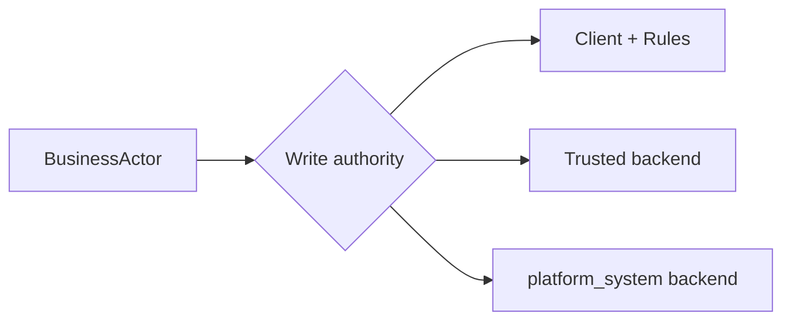

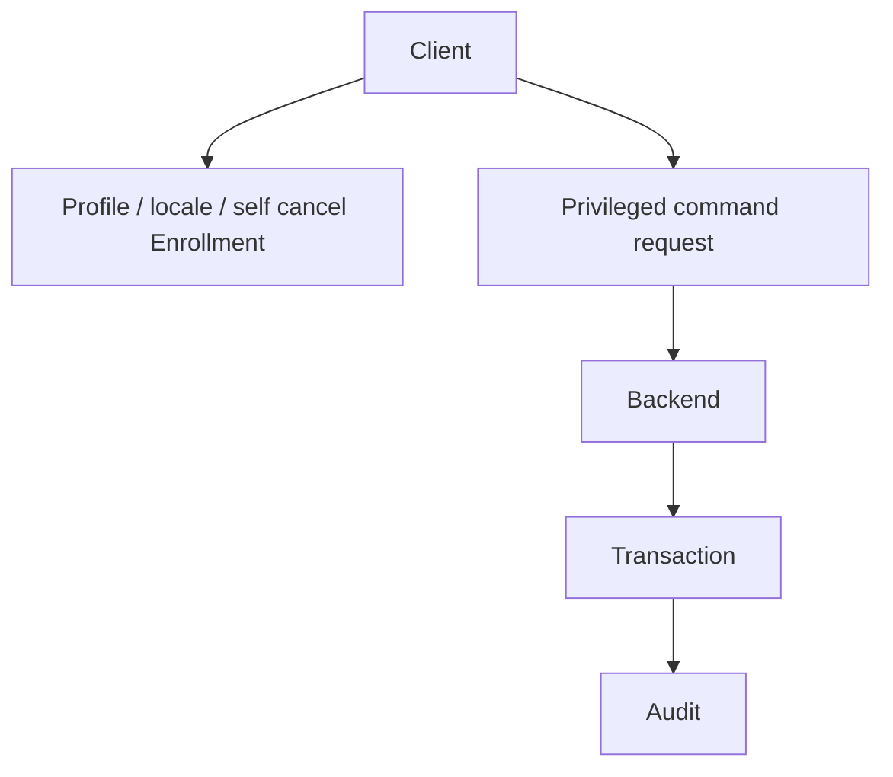

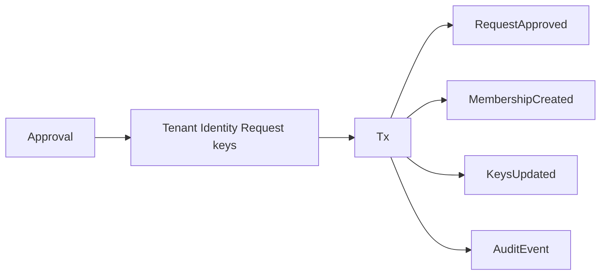

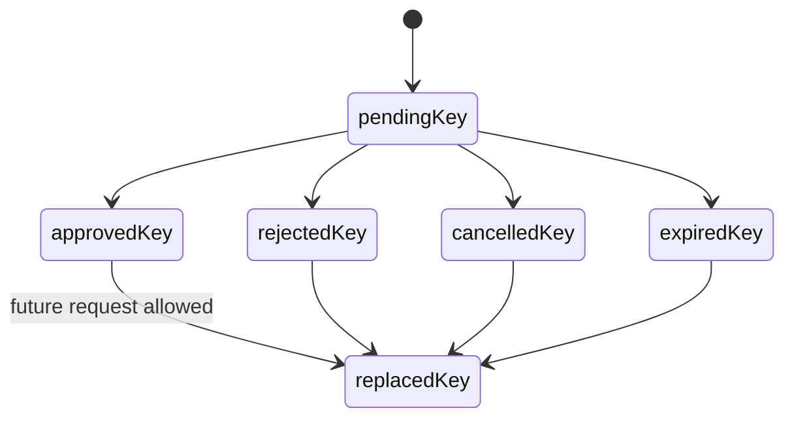

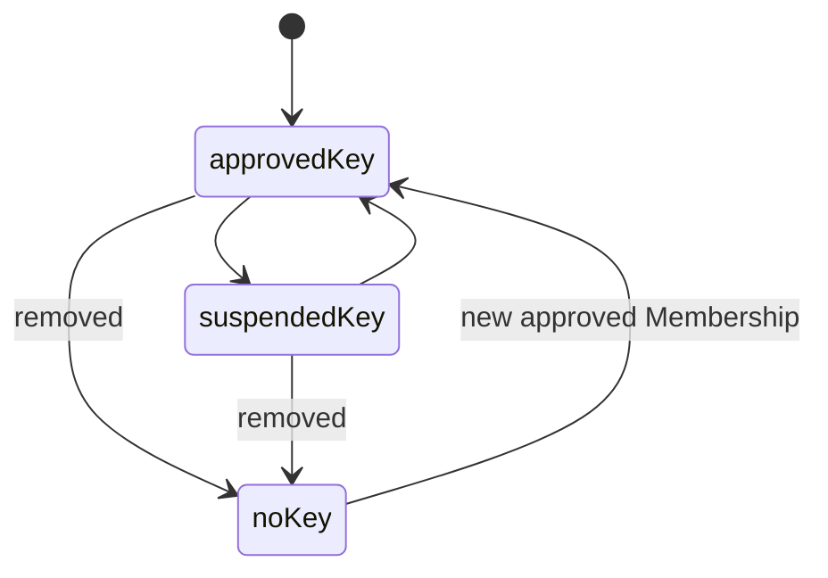

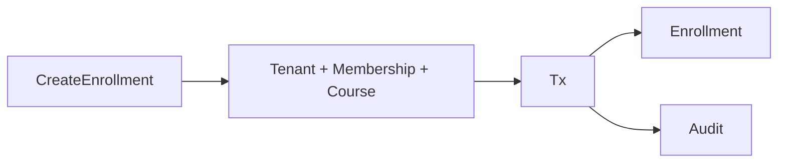

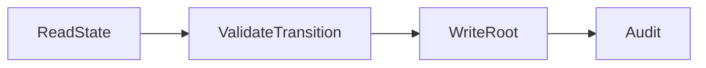

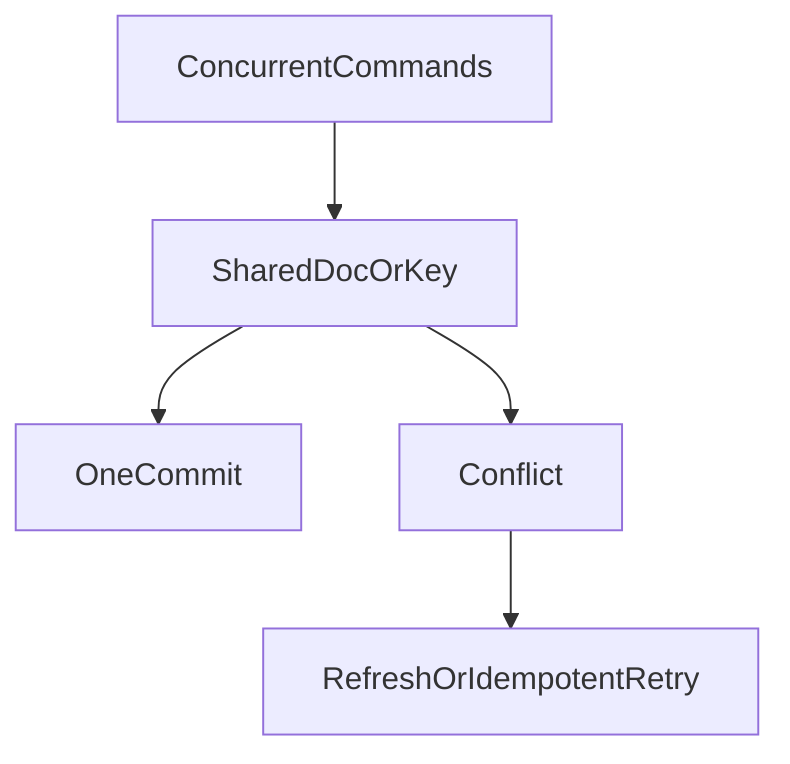

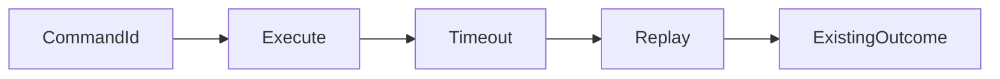

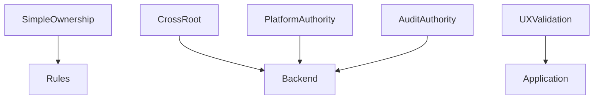

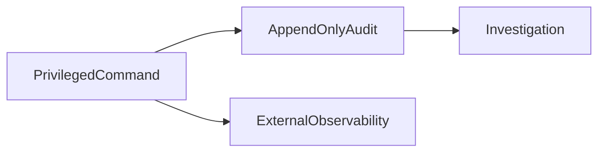

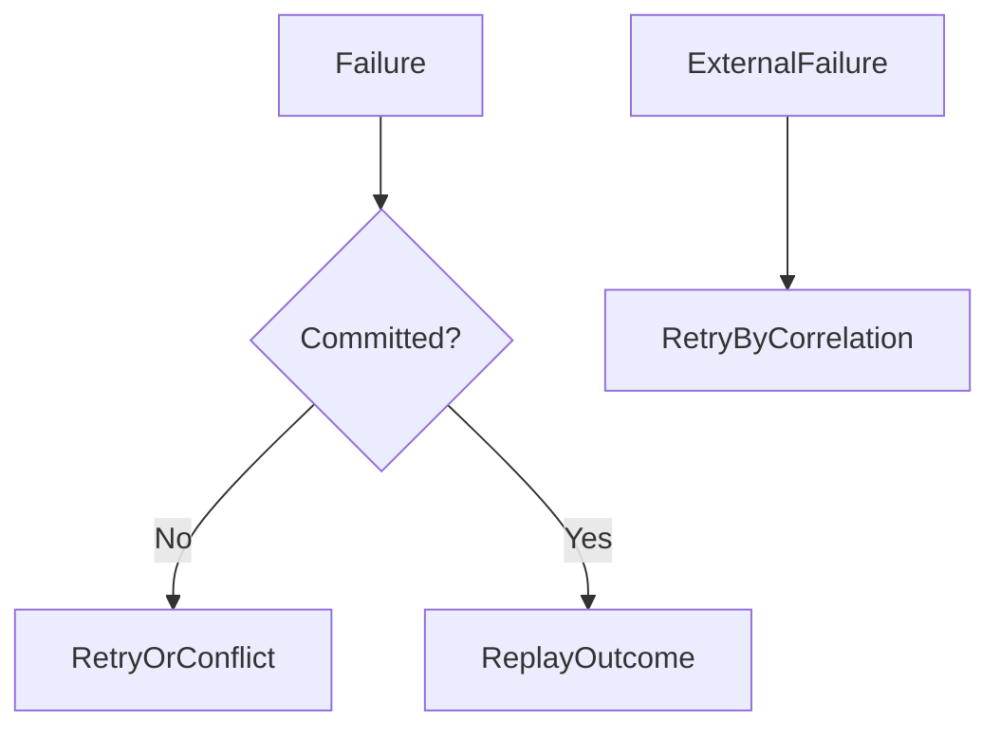

## 18. Backlog

### Estado heredado

- PM-005: **Closed conceptually**; transactions/CAS/conflict outcomes definidos.
  Implementación sigue futura.
- PIO-002: **Closed** para catálogo de comandos.
- FPM-005: **Closed**, backend confiable seleccionado para cross-root.
- FQI-005: Deferred a Rules/emulator tests.
- ARB-FR-005: **Closed conceptually**, platform_system definido.
- PM-003/007/008, PIO-001/003/005, FAP-003/004/005, FPM-002/003 y
  FQI-001–005 permanecen Deferred según sus ámbitos, excepto cierres anteriores.

### Nuevos FWC

| ID | Evidencia | Operations | Impact/severity | Fase | ¿Bloquea SaaS-02C? |
|---|---|---|---|---|---|
| FWC-001 | Workflow permitía self cancel Request sin capability | CancelRegistrationRequest | `resolved_pending_revalidation`: añadida `registration_request.cancel_self` en SaaS-02B.4A; Authorization/Workflow/write model | Revalidación SaaS-02B.4 | Pendiente |
| FWC-002 | Workflow permitía restore sin capability explícita | RestoreMembership | `resolved_pending_revalidation`: añadida `membership.restore` en SaaS-02B.4A; Authorization/Workflow/write model | Revalidación SaaS-02B.4 | Pendiente |
| FWC-003 | Campo técnico version aún no incorporado al shape físico | Config,Membership,Course,Request,Enrollment | CAS contract / Media | revisión física previa a repositories | No, pero sí antes de implementar CAS |
| FWC-004 | Audit log append-only no tiene path/retention aprobados | privileged writes | Evidencia/PII / Alta | Security pause/SaaS-02C prerequisite | Sí para audit implementation, no para diseñar Rules base |
| FWC-005 | PIO-001 deja duplicados semánticos Enrollment posibles | CreateEnrollment | Producto/integridad / Alta | Product reconciliation | No para Rules básicas; sí para unique constraint |

## 19. Criterios de cierre

| Criterio | Resultado |
|---|---|
| Autoridades de escritura definidas | Cumple |
| Cliente vs backend clasificado | Cumple |
| Operaciones cross-root diseñadas | Cumple |
| Atomicidad definida | Cumple |
| Concurrencia definida | Cumple |
| Idempotencia definida | Cumple |
| Lifecycle de lookups definido | Cumple |
| platform_system definido | Cumple |
| Reglas vs backend clasificadas | No cumple |
| Auditoría definida | Cumple |
| Errores definidos | Cumple |
| Trazabilidad completa | Cumple |
| Dominio congelado preservado | Cumple |
| Topología física preservada | Cumple |
| Firebase no modificado | Cumple |

La matriz Rules/backend no puede cerrarse mientras dos transiciones autorizadas
por workflow carezcan de capability canónica.

**SaaS-02B.4 write authority and concurrency model = INCOMPLETE pending revalidation**

SaaS-02C no se inició.

## 20. Cierre definitivo SaaS-02B.4F

La revalidación independiente documentada en
`FIRESTORE_WRITE_MODEL_CLOSURE_REVALIDATION.md` verificó los conteos reales, las
29 operaciones, 37 capabilities, 19 transiciones, 15 escenarios de concurrencia,
12 filas de idempotencia, lookups, audit y frontera Rules/backend.

```text
FWR-005: Closed
FWR-006: Closed
FWR-007: Closed
SaaS-02B.4 write authority and concurrency model = COMPLETE
Mandatory Firebase Security Review Gate = REQUIRED
SaaS-02C = NOT STARTED
```

El resultado INCOMPLETE anterior queda preservado como historial de las
revalidaciones B.4B/B.4D.
