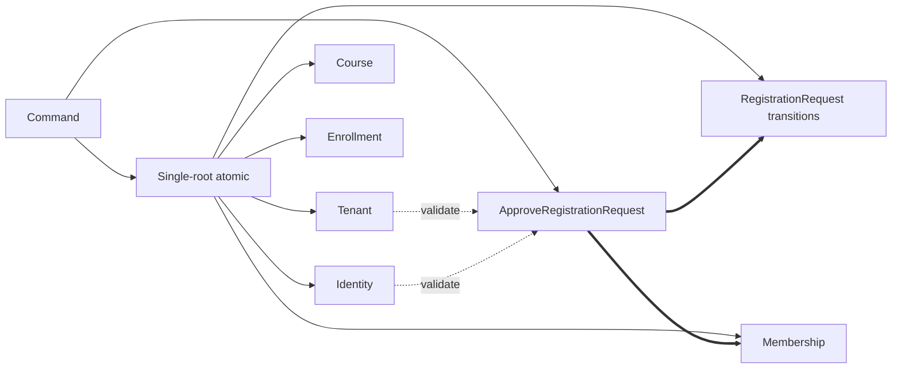
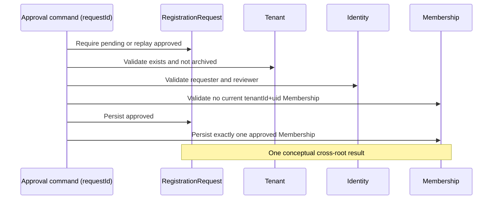
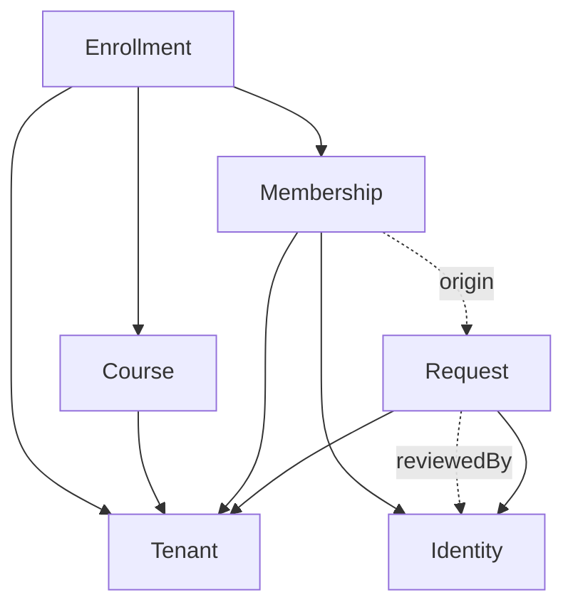
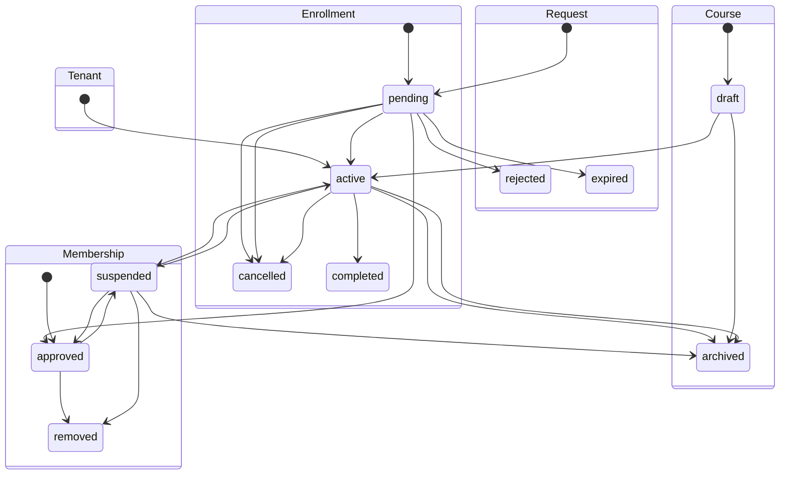
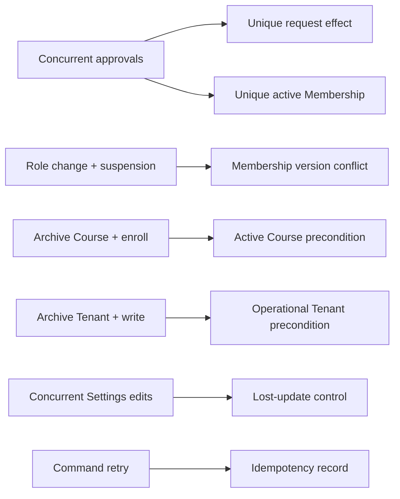

# Invariantes, operaciones y ciclo de vida de persistencia

## 1. Objetivo y alcance

Este documento completa SaaS-02A.2 sobre el modelo lógico definido en
`PERSISTENCE_MODEL.md`. Traduce Domain 1.0.0 a invariantes persistentes,
operaciones declarativas, integridad referencial, retención, idempotencia y
riesgos de concurrencia sin adoptar una tecnología de almacenamiento.

No define colecciones, documentos, paths, índices, consultas, reglas,
transacciones ni código ejecutable. Los Persistence Roots son Tenant, Identity,
RegistrationRequest, Membership, Course y Enrollment. TenantSettings,
TenantBranding, RegistrationPolicy, LearningLanguage e InterfaceLanguage son
Value Objects compuestos y no se convierten en roots.

## 2. Principios persistentes comunes

- Los identificadores canónicos son únicos, estables, opacos e inmutables.
- Una operación inválida no deja efectos parciales observables.
- Las referencias tenant-scoped nunca pueden cruzar tenants.
- Cambiar estado no cambia identidad, ownership ni referencias históricas.
- Un estado terminal no equivale a borrado físico.
- Los Value Objects se validan y escriben dentro de la frontera de su root.
- Ningún root se actualiza implícitamente por modificar otro, salvo el efecto
  conjunto declarado de `ApproveRegistrationRequest`.
- Las referencias inválidas se rechazan antes de persistir; si se descubren en
  datos existentes, el registro se trata como inconsistente, se deniega la
  operación dependiente y se reconcilia sin reasignación silenciosa.

## 3. Invariantes por Persistence Root

### 3.1 Tenant

- `tenantId` es único, estable e inmutable.
- `tenantType`, `status`, país, locale y timezone usan únicamente los contratos
  congelados.
- TenantSettings y TenantBranding pertenecen al mismo `tenantId`; no pueden
  referenciar ni configurarse en nombre de otro Tenant.
- RegistrationPolicy existe sólo como parte de TenantSettings.
- Suspender o archivar conserva identidad, historial y ownership institucional.
- Un Tenant archivado es terminal y no admite operaciones institucionales
  nuevas, excepto lectura histórica o acciones técnicas futuras explícitas.

### 3.2 Identity

- `uid` es único globalmente, estable e inmutable.
- Identity existe independientemente de tenants y Memberships; nunca se duplica
  por tenant.
- `interfaceLocale` pertenece a Identity y conserva semántica BCP 47.
- Cambios de email, verificación, nombre, foto o locale no alteran `uid`.
- Una Identity sin Memberships continúa siendo una Identity válida.
- La desvinculación de un proveedor de autenticación no implica por sí sola
  eliminación del root; la integración queda fuera de este modelo.

### 3.3 RegistrationRequest

- `requestId` es único, estable e inmutable.
- `tenantId` y `uid` existen al crear y no cambian durante el lifecycle.
- Sólo `pending` puede transicionar; approved, rejected, cancelled y expired son
  terminales.
- En `pending`, `reviewedAt` y `reviewedBy` permanecen nulos. Una resolución
  institucional approved/rejected exige ambos; cancelled y expired no inventan
  un revisor institucional.
- Una aprobación conserva el request y produce exactamente una Membership
  approved mediante la frontera `ApproveRegistrationRequest`.
- `requestId` es la clave conceptual de idempotencia de la aprobación; repetirla
  no duplica Membership ni cambia el `membershipId` resultante.
- Toda resolución terminal se conserva como historial.

### 3.4 Membership

- `membershipId` es único, estable e inmutable.
- `tenantId` y `uid` referencian exactamente un Tenant y una Identity y no se
  pueden cambiar para trasladar la Membership.
- No debe existir más de una Membership no terminal para el mismo
  `tenantId + uid`; la forma tecnológica de asegurar esta restricción queda
  aplazada.
- Una Membership nace approved como efecto de una aprobación válida; no nace
  pending ni rejected.
- Sólo roles y estados canónicos son persistibles.
- Suspensión y retirada conservan el root, aprobación, identidad e historial.
- Una operación self exige que el actor tenga el mismo `uid` que la Membership.
- Cuando proviene de una solicitud, el resultado de aprobación debe permitir
  trazar `requestId` hacia el `membershipId` creado. `requestId` permanece en
  RegistrationRequest y no se inventa como campo del contrato Membership; la
  representación física de esa correlación queda aplazada.

### 3.5 Course

- `courseId` es único, estable e inmutable.
- `tenantId` debe existir y no puede cambiarse para transferir el Course.
- LearningLanguage, `supportLanguageCode` e InterfaceLanguage usan etiquetas
  BCP 47 y mantienen significados separados.
- Los Value Objects lingüísticos se escriben con Course y no adquieren lifecycle
  independiente.
- Un Course se crea draft; sólo las transiciones congeladas son válidas.
- Archivar conserva identidad, contenido conceptual e historial.

### 3.6 Enrollment

- `enrollmentId` es único, estable e inmutable.
- `tenantId`, `membershipId` y `courseId` no son reasignables.
- Tenant, Membership y Course deben existir al crear y compartir `tenantId`.
- Sólo pending puede pasar a active/cancelled y active a completed/cancelled.
- completed y cancelled son terminales y se conservan históricamente.
- Retirar Membership o archivar Course no reescribe ni elimina Enrollment.
- Domain 1.0.0 no define si se permiten múltiples Enrollments para la misma
  pareja Membership–Course; no se introduce una unicidad nueva (PIO-001).

## 4. Catálogo declarativo de operaciones

Cada operación representa una intención lógica. “Atómica” describe el resultado
conceptual, no un mecanismo técnico.

### 4.1 Tenant

| Operación | Precondiciones | Efectos y resultado | Fallos esperables |
|---|---|---|---|
| CreateTenant | tenantId no usado; contrato y Value Objects válidos | Crea Tenant active con Settings, Branding y Policy coherentes | ID duplicado, VO inválido |
| UpdateTenantProfile | Tenant active; tenant_admin con `tenant.update`; mismo tenantId | Actualiza displayName, shortName, country, locale y timezone; conserva campos gobernados | Campo prohibido, Tenant no operativo, cross-tenant, conflicto |
| PlatformUpdateTenantMetadata | Tenant no archived; platform_admin con `platform.tenant_update` | Actualiza únicamente tenantType; conserva contenido y ownership | Campo prohibido, Tenant archived, conflicto |
| UpdateTenantSettings | Tenant existe y no está archived | Escribe Settings y Policy dentro del root; conserva tenantId | Tenant inexistente/archived, tenantId ajeno |
| UpdateTenantBranding | Tenant existe y no está archived | Sustituye branding compuesto sin cambiar ownership | Tenant inexistente/archived, referencia externa inválida |
| SuspendTenant | Tenant active o ya suspended | Estado suspended; repetición devuelve el mismo estado | Tenant inexistente/archived |
| RestoreTenant | Tenant suspended o ya active; platform_admin con `platform.tenant_restore` | Estado active sin cascadas; repetición devuelve el mismo estado | Tenant inexistente/archived, conflicto concurrente |
| ArchiveTenant | Tenant active/suspended o ya archived | Estado terminal archived; historial conservado | Tenant inexistente |

`UpdateTenantProfile` es single-root, tenant-scoped y auditada; prohíbe
tenantId, tenantType, status, timestamps aportados por cliente, Settings y
Branding. Su idempotencia usa command/result o versión técnica futura; conserva
todo el historial del Tenant y falla por capability, cross-tenant, campos
prohibidos, estado no operativo o concurrencia.

`PlatformUpdateTenantMetadata` es single-root, platform-scoped y Critical;
permite únicamente tenantType en Domain 1.2.0. Prohíbe status, perfil delegado,
Settings, Branding y contenido. Conserva identidad/historial, usa command/version
para replay y falla por autoridad global, campo prohibido, archived o conflicto.

`RestoreTenant` usa transaction/reread single-root, auditoría Critical e
idempotencia `tenantId + active`. No escribe hijos ni proyecciones autoritativas;
active retorna replay, archived rechaza y concurrencia incompatible retorna
conflict.

### 4.2 Identity

| Operación | Precondiciones | Efectos y resultado | Fallos esperables |
|---|---|---|---|
| CreateIdentity | uid no usado; perfil válido | Crea root global sin tenant | UID duplicado, locale inválido |
| UpdateIdentityProfile | Identity existe | Actualiza campos de perfil permitidos; conserva uid | Identity inexistente, datos inválidos |
| UpdateInterfaceLocale | Identity existe; etiqueta BCP 47 | Actualiza sólo la preferencia personal | Identity inexistente, etiqueta inválida |

### 4.3 RegistrationRequest y Membership

| Operación | Precondiciones | Efectos y resultado | Fallos esperables |
|---|---|---|---|
| CreateRegistrationRequest | requestId libre; Tenant e Identity existen; Tenant no archived | Crea pending sin conceder acceso | Referencia inválida, ID duplicado |
| CancelRegistrationRequest | Request pending; actor es identity_self | Pasa a cancelled; repetición conserva resultado | Actor ajeno, estado incompatible |
| ExpireRegistrationRequest | Request pending; actor conceptual platform_system | Pasa a expired | Estado incompatible, autoridad técnica pendiente |
| RejectRegistrationRequest | Request pending; revisor autorizado | Pasa a rejected y registra revisión | Referencia de revisor inválida, estado incompatible |
| ApproveRegistrationRequest | Request pending; Tenant/Identity válidos; Tenant no archived; actor autorizado; no Membership vigente equivalente | Request approved y exactamente una Membership approved; devuelve requestId y membershipId | Conflicto concurrente, estado/refs/actor inválidos |
| ChangeMembershipRole | Membership approved; rol válido; actor autorizado | Cambia role sin cambiar identidad | Membership no activa, rol/actor inválido |
| SuspendMembership | Membership approved o ya suspended | Pasa a suspended; conserva historial | Membership inexistente/removed |
| RestoreMembership | Membership suspended o ya approved | Pasa a approved | Membership inexistente/removed |
| LeaveMembership | Membership approved/suspended; actor self propietario | Pasa a removed; repetición no duplica efectos | Ownership inválido |
| RemoveMembership | Membership approved/suspended; actor institucional autorizado | Pasa a removed | Membership inexistente, actor inválido |

`CreateMembership` se excluye como comando autónomo: la creación canónica es un
efecto indivisible de `ApproveRegistrationRequest`. Bootstrap y migración legacy
son procesos técnicos futuros, no operaciones del lifecycle canónico.

### 4.4 Course

| Operación | Precondiciones | Efectos y resultado | Fallos esperables |
|---|---|---|---|
| CreateCourse | courseId libre; Tenant active; contrato lingüístico válido | Crea Course draft | ID/referencia/idioma inválido |
| UpdateCourse | Course draft/active; Tenant no suspended/archived | Actualiza atributos permitidos y VOs; conserva IDs | Estado/tenant/datos inválidos |
| ActivateCourse | Course draft o ya active; Tenant active | Pasa a active; repetición conserva resultado | Course archived, Tenant no operativo |
| ArchiveCourse | Course draft/active o ya archived | Pasa a archived; conserva historia | Course inexistente |

### 4.5 Enrollment

| Operación | Precondiciones | Efectos y resultado | Fallos esperables |
|---|---|---|---|
| CreateEnrollment | enrollmentId libre; Tenant active; Membership approved; Course active; mismo tenant | Crea pending y conserva referencias | Referencia/tenant/estado inválido; política de duplicidad pendiente |
| ActivateEnrollment | Enrollment pending o ya active; refs operativas | Pasa a active | Estado incompatible o referencia no operativa |
| CompleteEnrollment | Enrollment active o ya completed | Pasa a completed | Estado incompatible |
| CancelEnrollment | Enrollment pending/active o ya cancelled; actor autorizado | Pasa a cancelled | Estado/actor incompatible |

`SuspendEnrollment` se excluye: EnrollmentStatus y el workflow congelado no
incluyen suspended. Añadirla cambiaría Domain 1.0.0.

`DeriveAccessState` es una derivación read-only, tenant-scoped y no persistente;
no modifica roots ni convierte AccessState en fuente de verdad.

## 5. Clasificación de consistencia e idempotencia

- Single-root atomic: todas las operaciones de creación/actualización/transición
  excepto la aprobación.
- Cross-root atomic: exclusivamente `ApproveRegistrationRequest` en el dominio
  congelado.
- Eventually consistent: proyecciones de acceso y visibilidad derivadas tras
  suspender/archivar roots; nunca el resultado canónico de la operación.
- Read-only derivation: `DeriveAccessState`.
- Idempotent command: ApproveRegistrationRequest (`requestId`), SuspendTenant,
  ArchiveTenant, CancelRegistrationRequest, RejectRegistrationRequest,
  ExpireRegistrationRequest, SuspendMembership, RestoreMembership,
  LeaveMembership, RemoveMembership, ActivateCourse, ArchiveCourse,
  ActivateEnrollment, CompleteEnrollment y CancelEnrollment cuando el root ya
  está en el mismo estado objetivo.

Para transiciones repetibles, la clave conceptual mínima es el identificador del
root más el estado objetivo. Si auditorías, mensajes o side effects futuros
requieren una clave de comando separada, se definirá en SaaS-02B (PIO-002).

## 6. Integridad referencial

- Toda referencia obligatoria existe y se valida antes de crear el source.
- `tenantId` debe coincidir en todas las referencias tenant-scoped.
- Archivar, suspender o retirar no rompe referencias históricas.
- No se permite eliminación física de un target mientras su identidad sea
  necesaria para integridad o trazabilidad; anonimización puede preservar UID.
- Una referencia inválida impide la operación sin efectos parciales. Una
  inconsistencia histórica se marca para reconciliación y falla de forma segura.
- `reviewedBy` es condicional y sólo se exige en resoluciones institucionales;
  `approvedBy` es obligatorio desde la creación de Membership.

## 7. Eliminación, archivado y retención

La política lógica es conservación histórica por defecto. No se establecen
plazos legales ni autorización física:

- Tenant: archival; eliminación lógica; retención histórica.
- Identity: puede existir sola; posible anonimización; eliminación física
  pendiente de política y referencias.
- RegistrationRequest: terminales retenidos; no se borran al resolverse.
- Membership: removed es terminación lógica y retenida.
- Course: archived es terminación operativa y retenida.
- Enrollment: completed/cancelled son terminales retenidos.

No hay cascadas automáticas. Archivar Tenant bloquea nuevas operaciones
institucionales pero no reescribe hijos. Archivar Course no cambia Enrollment.
Retirar Membership no elimina Enrollment. La materialización técnica de estas
garantías permanece en SaaS-02B.

## 8. Carga y escritura conjunta

- Tenant se escribe junto con TenantSettings, TenantBranding y RegistrationPolicy.
- Course se escribe junto con LearningLanguage e InterfaceLanguage[].
- Los demás roots no se embeben ni se actualizan por cascada.
- Identity nunca se carga automáticamente al cargar todos sus tenants.
- Tenant nunca carga automáticamente Memberships, Requests, Courses o Enrollments.
- Enrollment carga sus targets sólo cuando el caso de uso lo exige; conservar
  referencias no obliga a hidratar roots.
- Las creaciones de Request, Membership, Course y Enrollment validan targets
  antes de escribir.
- `ApproveRegistrationRequest` es la única escritura conjunta obligatoria entre
  roots; Identity y Tenant se validan pero no se modifican.

## 9. Matrices obligatorias

### 9.1 Matriz de invariantes

| Persistence Root | Invariant | Protected by | Violation impact | Technology decision pending |
|---|---|---|---|---|
| Tenant | tenantId único/inmutable; VOs del mismo tenant | Create/Update/Suspend/Archive Tenant | Colisión o fuga cross-tenant | Unicidad, versionado, materialización VO |
| Identity | uid global único; no duplicación por tenant; locale BCP 47 | Create/Update Identity | Identidad fragmentada | Fuente técnica, anonimización |
| RegistrationRequest | requestId único; refs inmutables; terminalidad; aprobación idempotente | Request commands | Acceso/efectos duplicados | Control atómico y concurrencia |
| Membership | membershipId único; tenantId+uid no terminal único; ownership self | Approval y Membership commands | Privilegio duplicado/cross-tenant | Constraint físico y command keys |
| Course | courseId único; tenant inmutable; idiomas BCP 47 | Course commands | Transferencia de ownership o ambigüedad | Validación/materialización física |
| Enrollment | IDs/refs inmutables; mismo tenant; workflow válido | Enrollment commands | Inscripción cruzada o historia corrupta | Política de duplicidad Membership–Course |

### 9.2 Matriz de operaciones

| Operation | Primary Root | Related Roots | Consistency Type | Idempotent | Historical Effect |
|---|---|---|---|---|---|
| CreateTenant / UpdateTenantProfile / PlatformUpdateTenantMetadata / UpdateTenantSettings / UpdateTenantBranding | Tenant | VOs embebidos | Single-root atomic | Creación por tenantId; updates por command/version | Crea o actualiza sin perder identidad |
| SuspendTenant / RestoreTenant / ArchiveTenant | Tenant | Roots tenant-scoped por proyección | Single-root atomic; eventual projections | tenantId + target state | Conserva Tenant y dependencias |
| CreateIdentity / UpdateIdentityProfile / UpdateInterfaceLocale | Identity | Ninguno | Single-root atomic | Creación sólo por uid | Conserva identidad global |
| Create/Cancel/Expire/Reject RegistrationRequest | RegistrationRequest | Tenant, Identity, reviewer | Single-root atomic con validación refs | Transiciones terminales: sí | Conserva resolución |
| ApproveRegistrationRequest | RegistrationRequest | Membership; valida Tenant/Identity | Cross-root atomic; idempotent command | Sí, requestId | Conserva request y Membership |
| ChangeRole/Suspend/Restore/Leave/Remove Membership | Membership | Tenant, Identity | Single-root atomic | Transiciones al mismo objetivo: sí | Conserva Membership |
| Create/Update/Activate/Archive Course | Course | Tenant; VOs embebidos | Single-root atomic | Transiciones al mismo objetivo: sí | Conserva Course archivado |
| Create/Activate/Complete/Cancel Enrollment | Enrollment | Tenant, Membership, Course | Single-root atomic con validación refs | Transiciones al mismo objetivo: sí | Conserva terminales |
| DeriveAccessState | Ninguno | Identity, Tenant, Request, Membership | Read-only derivation | Sí | Ninguno |

### 9.3 Matriz de integridad referencial

| Source | Reference | Target | Required on create | Required during lifecycle | Deletion behavior |
|---|---|---|---|---|---|
| RegistrationRequest | tenantId | Tenant | Sí; no archived | Identidad histórica debe permanecer | Sin borrado físico mientras se referencie |
| RegistrationRequest | uid | Identity | Sí | Sí o identidad anonimizada trazable | Preservar uid/tombstone conceptual |
| RegistrationRequest | reviewedBy | Identity | No; condicional al resolver institucionalmente | Referencia histórica | Preservar identificador tras desactivación |
| Membership | tenantId | Tenant | Sí | Sí, incluso archived | Sin cascada ni transferencia |
| Membership | uid | Identity | Sí | Sí o identidad anonimizada trazable | No borrar referencia histórica |
| Membership | approvedBy | Identity | Sí | Referencia histórica | Preservar identificador |
| Approval outcome | requestId → membershipId | RegistrationRequest y Membership | Sí para aprobación canónica | La correlación histórica debe preservarse | Request y Membership retenidos; sin campo nuevo inventado |
| Course | tenantId | Tenant | Sí; active para crear | Sí | Course retenido al archivar Tenant |
| Enrollment | tenantId | Tenant | Sí; active | Sí | Enrollment retenido |
| Enrollment | membershipId | Membership | Sí; approved | Identidad histórica sí; operatividad depende de estado | Sin cascada al removed |
| Enrollment | courseId | Course | Sí; active | Identidad histórica sí | Sin cascada al archived |

### 9.4 Matriz de retención

| Persistence Root | Terminal states | Physical deletion | Historical retention | Pending decision |
|---|---|---|---|---|
| Tenant | archived | No asumida | Sí | Plazo, anonimización y borrado autorizado |
| Identity | Ninguno en Domain 1.0.0 | Undefined pending policy | Sí aun sin Memberships | Erasure/anonymization y referencias |
| RegistrationRequest | approved/rejected/cancelled/expired | No por transición | Sí | Plazo y minimización |
| Membership | removed | Logical deletion only | Sí | Retención de datos personales |
| Course | archived | No por transición | Sí | Tratamiento de contenido/recursos |
| Enrollment | completed/cancelled | No por transición | Sí | Plazo y efecto técnico de Course archived |

### 9.5 Matriz de concurrencia

| Scenario | Roots involved | Risk | Invariant affected | Future control required |
|---|---|---|---|---|
| Dos aprobaciones del mismo Request | Request, Membership | Doble Membership o efecto parcial | requestId idempotente; efectos conjuntos | Exclusión/atomicidad verificable |
| Dos Memberships tenantId+uid | Membership | Acceso duplicado | Unicidad no terminal | Constraint/serialización |
| Dos Enrollments equivalentes | Enrollment | Duplicidad semántica incierta | Política no congelada | Resolver PIO-001 antes del constraint |
| Cambio de role y suspensión simultáneos | Membership | Lost update/privilegio residual | Estado y role coherentes | Control de versión/conflicto |
| ArchiveCourse y CreateEnrollment | Course, Enrollment | Inscripción en Course archivado | Course active al crear | Validación consistente del target |
| ArchiveTenant y operación institucional | Tenant y root hijo | Escritura después del cierre | Tenant operativo | Gate consistente/ordenamiento |
| Edición simultánea de Settings | Tenant | Lost update | VO válido y completo | Versionado/control optimista |
| Reintento de comando idempotente | Cualquier root afectado | Side effects duplicados | Idempotencia | Clave/registro de comando futuro |

## 10. Diagramas conceptuales

### 10.1 Operaciones single-root y cross-root

### 10.2 Aprobación de RegistrationRequest

### 10.3 Integridad referencial

### 10.4 Lifecycle persistente

### 10.5 Riesgos de concurrencia

## 11. Architecture Review Backlog de persistencia

Las entradas PM permanecen abiertas; esta fase las refina, no las resuelve:

| ID | Estado | Evidencia aportada por SaaS-02A.2 | Destino |
|---|---|---|---|
| PM-001 | Open | Seis roots y sus límites lógicos están completos | SaaS-02B: mapeo físico |
| PM-002 | Open | IDs canónicos e inmutables; sin formato físico | SaaS-02B: generación/constraints |
| PM-003 | Open | Refs obligatorias y coincidencia tenant definidas | SaaS-02B: enforcement |
| PM-004 | Open | Approval exige un resultado cross-root indivisible | SaaS-02B: mecanismo atómico |
| PM-005 | Open | Ocho carreras y controles conceptuales identificados | SaaS-02B: concurrencia/versionado |
| PM-006 | Open | VOs y escrituras conjuntas por root definidos | SaaS-02B: materialización |
| PM-007 | Open | Retención histórica por defecto; borrado no asumido | SaaS-02B o fase legal/operativa |
| PM-008 | Open | URLs siguen siendo referencias externas | SaaS-02B/Storage posterior |
| PM-009 | Open | Archive Course no cambia Enrollment | SaaS-02B: comportamiento técnico |

### Nuevas entradas PIO

| ID | Descripción y evidencia | Impacto / severidad | Fase sugerida | ¿Bloquea SaaS-02B? |
|---|---|---|---|---|
| PIO-001 | Domain 1.0.0 no decide si Membership–Course admite reinscripción o exige unicidad | Afecta constraints e idempotencia de CreateEnrollment / Alta | SaaS-02B.1, antes del diseño físico definitivo | No bloquea iniciar 02B.1; sí cerrar el constraint físico |
| PIO-002 | Comandos idempotentes sin requestId propio pueden necesitar command key para deduplicar side effects | Afecta auditoría/eventos futuros / Media | SaaS-02B | No |
| PIO-003 | No hay política de borrado/anonymization ni plazos por root | Afecta compliance y referencias históricas / Alta | SaaS-02B + fase legal | No bloquea el diseño inicial; sí eliminación productiva |
| PIO-004 | CreateTenant requiere materializar VOs iniciales, pero su representación física sigue abierta | Afecta bootstrap y defaults / Media | SaaS-02B | No |
| PIO-005 | reviewedBy/approvedBy necesitan conservar trazabilidad si Identity se anonimiza | Afecta auditoría histórica / Media | SaaS-02B + política de retención | No |

## 12. Decisiones aplazadas para SaaS-02B

- estructura y ubicación física de roots y Value Objects;
- generación, constraints y claves de comandos;
- enforcement de referencias, tenant boundary y unicidad;
- mecanismo de atomicidad de aprobación;
- control de concurrencia y versionado;
- patrones de acceso, consultas e índices;
- política de reinscripción Membership–Course;
- retención, anonimización y eliminación física;
- tratamiento técnico de recursos externos;
- reglas de acceso y aislamiento.

## 13. Evaluación de cierre de SaaS-02A

| Criterio | Resultado |
|---|---|
| Persistence Roots definidos | Cumple |
| Identidades conceptuales definidas | Cumple |
| Invariantes persistentes definidas | Cumple |
| Operaciones lógicas definidas | Cumple |
| Integridad referencial definida | Cumple |
| Fronteras de consistencia definidas | Cumple |
| Idempotencia definida | Cumple |
| Retención lógica definida | Cumple |
| Riesgos de concurrencia identificados | Cumple |
| Independencia tecnológica conservada | Cumple |

**SaaS-02A logical persistence model = COMPLETE**

SaaS-02B no se inicia en esta fase. Las decisiones PIO/PM se resolverán dentro
de sus gates antes de materializar el modelo físico correspondiente.

## 14. Trazabilidad hacia SaaS-02B.1

`FIRESTORE_ACCESS_PATTERNS.md` utiliza estas operaciones, invariantes y riesgos
como fuente para el catálogo de acceso. No cambia el modelo lógico ni resuelve
las decisiones PM/PIO que dependen de la topología física.

## 15. Trazabilidad física SaaS-02B.2

`FIRESTORE_PHYSICAL_MODEL.md` define paths, shapes, referencias escalares,
lookups y fronteras atómicas compatibles con estas invariantes. Las políticas
de Rules, retención y ejecución siguen aplazadas y SaaS-02B.3 no se inició.

## 16. Trazabilidad de consulta SaaS-02B.3

`FIRESTORE_QUERY_AND_INDEX_MODEL.md` conserva las invariantes mediante point
reads, queries tenant-scoped, lookups y composiciones acotadas. La autoridad de
escritura y concurrencia se mantiene para SaaS-02B.4, todavía no iniciada.

## 17. Trazabilidad de escritura SaaS-02B.4

`FIRESTORE_WRITE_AUTHORITY_AND_CONCURRENCY.md` asigna transactions, idempotencia,
CAS y backend authority a estas operaciones. No cambia invariantes ni lifecycle.

SaaS-02B.4C agrega declarativamente `UpdateTenantProfile`,
`PlatformUpdateTenantMetadata` y `RestoreTenant`. Usan point read del Tenant,
trusted backend, single-root atomicity y auditoría; no cambian el Persistence
Root ni su representación física.
