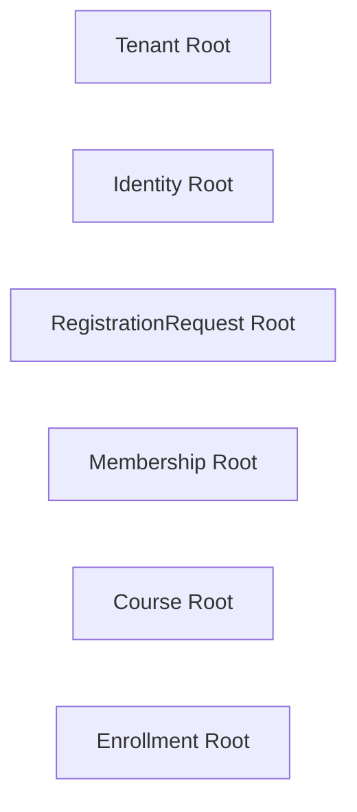
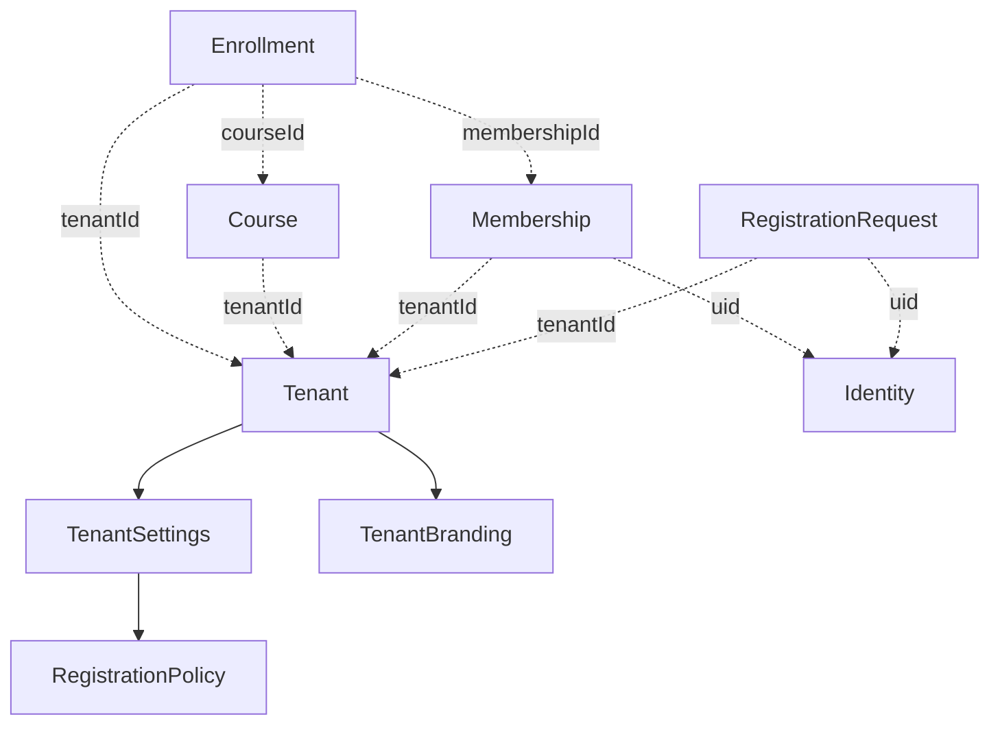
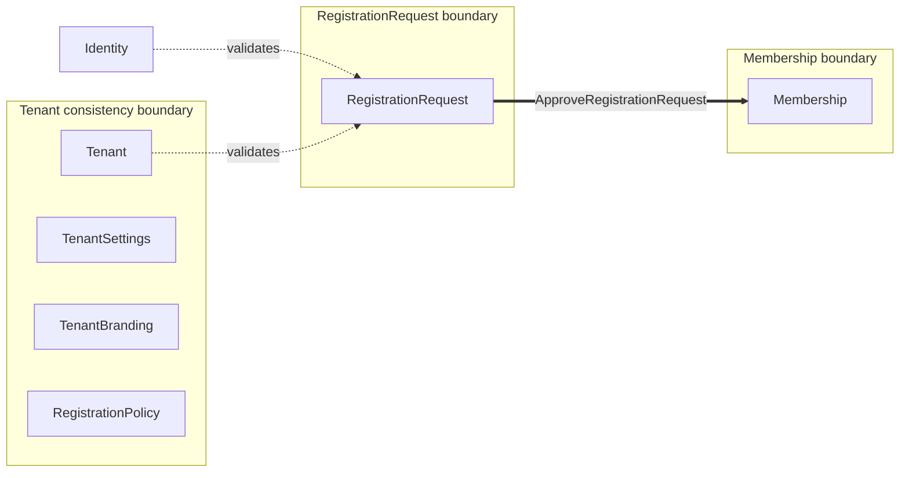
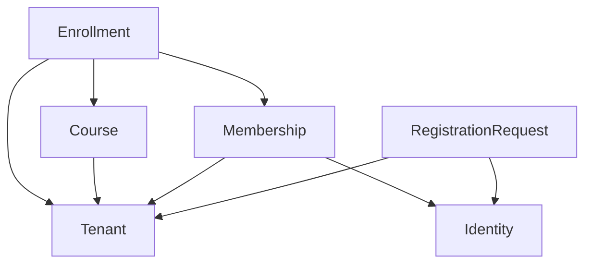

# Modelo lógico de persistencia

## 1. Objetivo y alcance

Este documento traduce el dominio congelado 1.0.0 a un modelo lógico de
persistencia independiente de la tecnología. Define raíces persistentes,
identidades, referencias, fronteras de consistencia, ownership y patrones
conceptuales de carga.

No define colecciones, documentos, paths, índices, consultas, reglas, DTO,
repositorios, adaptadores o mecanismos de transacción. Los contratos del
dominio no se modifican.

## 2. Principios

1. Cada Aggregate Root congelado es una Persistence Root independiente.
2. La composición pertenece a la frontera persistente de su root.
3. Una referencia entre roots no transfiere ownership.
4. `tenantId` conserva la frontera organizacional en toda relación
   institucional.
5. Una referencia no implica carga automática del root referenciado.
6. Suspensión, retirada y archivado preservan historia y no implican borrado
   físico.
7. Las operaciones cross-root se documentan sin elegir un mecanismo técnico.

## 3. Persistence Roots

### 3.1 Tenant

| Aspecto | Decisión lógica |
|---|---|
| Persistence Root | Tenant |
| Identidad canónica | `tenantId` |
| Ownership | Organización institucional; lifecycle gobernado por plataforma |
| Ciclo de vida | `active` → `suspended`/`archived`; `archived` terminal |
| Frontera propia | Tenant, TenantSettings, TenantBranding y RegistrationPolicy |
| Independencia | Puede existir sin otros roots tenant |
| Relaciones | Referenciado por Request, Membership, Course y Enrollment |

TenantSettings y TenantBranding son composiciones 1:1. RegistrationPolicy es
un Value Object compuesto dentro de TenantSettings. Sus cambios pertenecen a
la misma frontera lógica de Tenant.

### 3.2 Identity

| Aspecto | Decisión lógica |
|---|---|
| Persistence Root | Identity |
| Identidad canónica | `uid` |
| Ownership | Plataforma; datos propios actualizables según autorización |
| Ciclo de vida | Independiente de tenants y memberships |
| Frontera propia | Campos de Identity, incluido `interfaceLocale` |
| Independencia | Puede existir sin contexto institucional |
| Relaciones | Referenciada por RegistrationRequest y Membership; también por campos de auditoría |

Identity nunca incorpora sus Memberships o Requests dentro de su frontera.
Eliminar o anonimizar una Identity requerirá una política cross-root futura.

### 3.3 RegistrationRequest

| Aspecto | Decisión lógica |
|---|---|
| Persistence Root | RegistrationRequest |
| Identidad canónica | `requestId` |
| Ownership | Tenant solicitado |
| Ciclo de vida | `pending` hacia un estado terminal |
| Frontera propia | Datos y transición de una solicitud |
| Independencia | Depende lógicamente de Tenant e Identity |
| Relaciones | Referencia `tenantId`, `uid` y actor revisor |

La aprobación cruza su frontera porque debe originar exactamente una
Membership. `requestId` conserva el papel de clave conceptual de idempotencia.

### 3.4 Membership

| Aspecto | Decisión lógica |
|---|---|
| Persistence Root | Membership |
| Identidad canónica | `membershipId` |
| Ownership | Tenant |
| Ciclo de vida | Nace `approved`; puede suspenderse, reactivarse o terminar `removed` |
| Frontera propia | Rol, estado y trazabilidad de una pertenencia |
| Independencia | Depende lógicamente de Tenant e Identity |
| Relaciones | Referencia `tenantId`, `uid` y actor aprobador; es referenciada por Enrollment |

`tenantId + uid` es una restricción lógica de unicidad para Membership no
terminal, no su identidad canónica.

### 3.5 Course

| Aspecto | Decisión lógica |
|---|---|
| Persistence Root | Course |
| Identidad canónica | `courseId` |
| Ownership | Tenant |
| Ciclo de vida | `draft` → `active`/`archived`; `archived` terminal |
| Frontera propia | Datos del curso y estructuras lingüísticas de valor |
| Independencia | Depende lógicamente de Tenant |
| Relaciones | Referencia Tenant; es referenciado por Enrollment |

LearningLanguage e InterfaceLanguage son estructuras de valor cargadas dentro
de Course. `supportLanguageCode` permanece como valor propio del root.

### 3.6 Enrollment

| Aspecto | Decisión lógica |
|---|---|
| Persistence Root | Enrollment |
| Identidad canónica | `enrollmentId` |
| Ownership | Tenant |
| Ciclo de vida | `pending` → `active`/`cancelled`; `active` → `completed`/`cancelled` |
| Frontera propia | Estado y trazabilidad de una inscripción |
| Independencia | Depende de Tenant, Membership y Course |
| Relaciones | Referencia `tenantId`, `membershipId` y `courseId` |

Membership, Course y Enrollment deben pertenecer al mismo `tenantId`.

## 4. Clasificación de referencias

### 4.1 Embedded Value Object

| Root | Valor embebido | Justificación |
|---|---|---|
| Tenant | TenantSettings | Composición 1:1 sin lifecycle independiente |
| Tenant | TenantBranding | Composición 1:1 sin lifecycle independiente |
| Tenant/TenantSettings | RegistrationPolicy | Value Object sin identidad propia |
| Course | LearningLanguage | Describe un valor propio del curso |
| Course | InterfaceLanguage[] | Catálogo de valores propio del curso, sin roots independientes |

### 4.2 Reference

| Origen | Destino | Clave conceptual | Justificación |
|---|---|---|---|
| RegistrationRequest | Tenant | `tenantId` | Request pertenece al Tenant sin formar parte del aggregate Tenant |
| Membership | Tenant | `tenantId` | Membership es root independiente propiedad del Tenant |
| Course | Tenant | `tenantId` | Course es root independiente propiedad del Tenant |
| Enrollment | Tenant | `tenantId` | Conserva frontera y ownership institucional |
| Enrollment | Membership | `membershipId` | Enrollment depende de la Membership sin absorberla |
| Enrollment | Course | `courseId` | Enrollment depende del Course sin absorberlo |

### 4.3 Shared Reference

| Origen | Destino | Clave conceptual | Justificación |
|---|---|---|---|
| RegistrationRequest | Identity | `uid` | Una Identity global puede originar Requests en varios tenants |
| Membership | Identity | `uid` | Una Identity global puede participar en varios tenants |
| RegistrationRequest | Identity revisora | `reviewedBy` | Trazabilidad no propietaria compartida |
| Membership | Identity aprobadora | `approvedBy` | Trazabilidad no propietaria compartida |

### 4.4 External Reference

| Root | Campo | Semántica |
|---|---|---|
| Identity | `photoURL` | Referencia opcional a recurso visual externo a esta frontera |
| TenantBranding | `logoUrl`, `faviconUrl` | Referencias a recursos de branding externos a la frontera lógica |
| TenantSettings | `supportUrl` | Referencia a un recurso web externo |

El vínculo técnico de `uid` con un proveedor de autenticación se definirá
fuera de este modelo. Ninguna External Reference se carga automáticamente.

## 5. Fronteras de consistencia

| Persistence Root | Cambios dentro de la frontera | Cambios cross-root | Consistencia futura relevante |
|---|---|---|---|
| Tenant | Estado, datos institucionales, Settings, Branding y Policy | Efecto operativo sobre roots tenant | Lectura coordinada; no propagar estados automáticamente |
| Identity | Perfil, email verificado e interfaceLocale | Requests, Memberships y anonimización | Integridad referencial y eventual reconciliación |
| RegistrationRequest | Campos y transición de Request | Aprobación crea Membership | Atomicidad o consistencia verificable futura |
| Membership | Rol, estado y trazabilidad | Enrollments y acceso derivado | Validación de referencias; efectos derivados sin cascada |
| Course | Datos, idiomas y estado | Enrollments relacionados | Política eventual para Course archivado |
| Enrollment | Estado y trazabilidad | Validación de Tenant, Membership y Course | Integridad de referencias al crear o cambiar estado |

### 5.1 Operación cross-root especial

`ApproveRegistrationRequest` es la única frontera cross-aggregate congelada
que exige efectos conjuntos:

```text
RegistrationRequest.status = approved
exactamente una Membership.status = approved
```

La operación usa `requestId` para idempotencia. El mecanismo de atomicidad se
aplaza sin cambiar este requisito.

### 5.2 Consistencia eventual

- Suspender o archivar Tenant afecta el acceso efectivo sin reescribir estados
  de Membership, Course o Enrollment.
- Suspender o retirar Membership afecta elegibilidad y acceso sin mutar sus
  Enrollments históricos.
- Archivar Course conserva Enrollments y exige una política técnica futura.
- Cambios de Identity no copian datos de perfil a Membership o Request.

## 6. Patrones conceptuales de carga

### 6.1 Se cargan normalmente juntos

- Tenant con TenantSettings, TenantBranding y RegistrationPolicy.
- Course con LearningLanguage, InterfaceLanguage[] y sus campos lingüísticos.
- Cada root con sus propios campos de estado y trazabilidad.

### 6.2 Se cargan por referencia cuando la operación lo requiere

- Identity desde RegistrationRequest o Membership.
- Tenant desde cualquier root institucional.
- Membership y Course desde Enrollment.
- Actores de auditoría desde `approvedBy` o `reviewedBy`.

### 6.3 Permanecen independientes

- Identity respecto de sus Memberships y Requests.
- Tenant respecto de sus conjuntos relacionados de Memberships, Requests y
  Courses.
- Course y Membership respecto de sus Enrollments.

### 6.4 Nunca deben cargarse automáticamente

- Todas las Memberships, Requests, Courses o Enrollments de un Tenant al cargar
  Tenant.
- Todas las Memberships y Requests de una Identity al cargar su perfil.
- Todos los Enrollments al cargar Course o Membership.
- Los recursos apuntados por URLs externas.
- Roots de otros tenants por compartir `uid`, rol o tipo de recurso.

## 7. Matriz de dependencias

| Persistence Root | Depende de | Puede existir solo | Debe cargarse junto | Referencia |
|---|---|---:|---|---|
| Tenant | Ningún root | Sí | Settings, Branding, RegistrationPolicy | No aplica |
| Identity | Ningún root tenant | Sí | Sus campos propios | No aplica |
| RegistrationRequest | Tenant, Identity | No | Sólo sus campos | Tenant Reference; Identity Shared Reference |
| Membership | Tenant, Identity, aprobación previa | No | Sólo sus campos | Tenant Reference; Identity Shared Reference |
| Course | Tenant | No | LearningLanguage e InterfaceLanguage[] | Tenant Reference |
| Enrollment | Tenant, Membership, Course | No | Sólo sus campos | Tres References tenant-consistent |

## 8. Diagramas

### 8.1 Persistence Roots



### 8.2 Referencias



### 8.3 Fronteras de consistencia



### 8.4 Dependencias



El grafo no contiene dependencias circulares de existencia.

## 9. Decisiones tomadas

- Seis Aggregate Roots congelados se traducen en seis Persistence Roots.
- TenantSettings, TenantBranding y RegistrationPolicy permanecen dentro de la
  frontera Tenant.
- Las estructuras lingüísticas de Course se tratan como valores embebidos.
- Identity se comparte globalmente mediante referencias, sin duplicarse en
  roots tenant.
- Enrollment mantiene referencias explícitas a Tenant, Membership y Course.
- Las relaciones no desencadenan cargas o cascadas automáticas.
- `ApproveRegistrationRequest` mantiene una frontera cross-root idempotente.
- El modelo preserva historial y denegación de acceso mediante estados, no por
  borrado físico implícito.

## 10. Decisiones aplazadas para SaaS-02B

- representación física de cada Persistence Root;
- nombres y jerarquía de contenedores de persistencia;
- formato y generación física de IDs;
- materialización física de Value Objects;
- constraints, claves y verificación de referencias;
- mecanismo de atomicidad de `ApproveRegistrationRequest`;
- estrategia de concurrencia, versionado y reintentos;
- índices y patrones concretos de consulta;
- reglas de acceso y aislamiento;
- retención, anonimizado y eliminación física;
- tratamiento técnico de Enrollment ante Course archivado;
- almacenamiento y lifecycle de recursos externos;
- integración con la autoridad técnica de autenticación y
  `platform_system`.

## 11. Architecture Review Backlog de persistencia

| ID | Tema | Motivo del aplazamiento | Fase destino |
|---|---|---|---|
| `PM-001` | Mapeo físico de roots | Requiere seleccionar estructura tecnológica | SaaS-02B |
| `PM-002` | Generación y unicidad física de IDs | El dominio sólo exige identidad opaca y estable | SaaS-02B |
| `PM-003` | Integridad de referencias tenant-scoped | Requiere mecanismos de almacenamiento y reglas | SaaS-02B |
| `PM-004` | Atomicidad de aprobación | El efecto conjunto está definido, no su mecanismo | SaaS-02B |
| `PM-005` | Concurrencia y consistencia eventual | Requiere capacidades de la tecnología elegida | SaaS-02B |
| `PM-006` | Materialización de Value Objects | No altera composición ni ownership | SaaS-02B |
| `PM-007` | Retención y referencias históricas | Requiere política operativa y física | SaaS-02B |
| `PM-008` | Recursos externos | Requiere definir almacenamiento y lifecycle | SaaS-02B |
| `PM-009` | Course archivado y Enrollment | El dominio preserva historia; falta tratamiento técnico | SaaS-02B |

Ninguna entrada modifica Domain 1.0.0. SaaS-02B deberá resolverlas sin
redefinir entidades, ownership, cardinalidades o workflows congelados.

## 12. Complemento SaaS-02A.2

`PERSISTENCE_INVARIANTS_AND_OPERATIONS.md` completa este modelo con invariantes
persistentes, catálogo de operaciones, integridad referencial, idempotencia,
retención y riesgos conceptuales de concurrencia. Ambos documentos forman el
modelo lógico de persistencia de SaaS-02A y siguen siendo independientes de la
tecnología. Las entradas PM-001 a PM-009 permanecen abiertas para SaaS-02B o la
fase posterior indicada; SaaS-02A.2 no adopta ninguna decisión física.

## 13. Catálogo tecnológico previo al modelo físico

`FIRESTORE_ACCESS_PATTERNS.md` inicia SaaS-02B.1 y cataloga los accesos que deberá
soportar Firestore. El catálogo no decide topología, documentos, paths, índices
ni reglas. SaaS-02B.2 permanece sin iniciar.

## 14. Materialización física SaaS-02B.2

`FIRESTORE_PHYSICAL_MODEL.md` selecciona una topología híbrida: Identity global
y roots institucionales bajo Tenant. Esta materialización no cambia los seis
Persistence Roots ni el ownership lógico. SaaS-02B.3 permanece sin iniciar.

## 15. Consultas SaaS-02B.3

`FIRESTORE_QUERY_AND_INDEX_MODEL.md` documenta queries, índices potenciales y
cursores sin cambiar roots, referencias ni consistencia. SaaS-02B.4 no se inició.

## 16. Autoridad de escritura SaaS-02B.4

`FIRESTORE_WRITE_AUTHORITY_AND_CONCURRENCY.md` documenta autoridad, atomicidad y
concurrencia. El modelo permanece incompleto por dos capabilities ausentes;
SaaS-02C no se inició.
